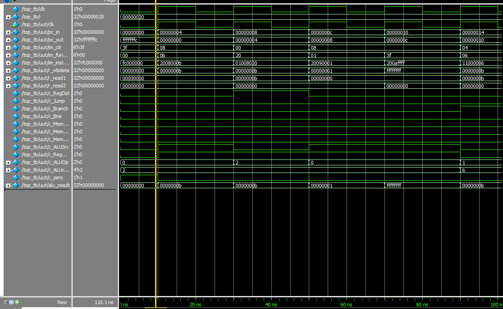
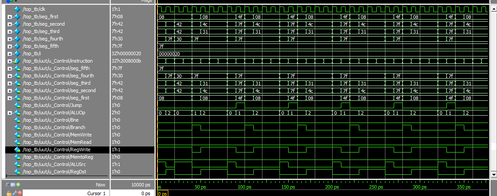
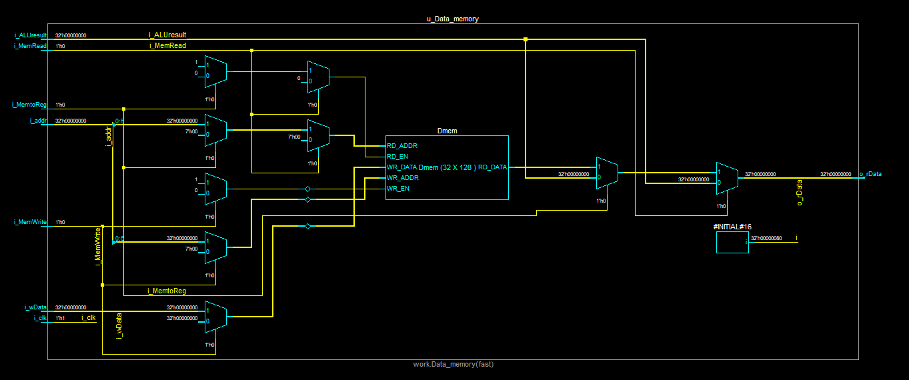
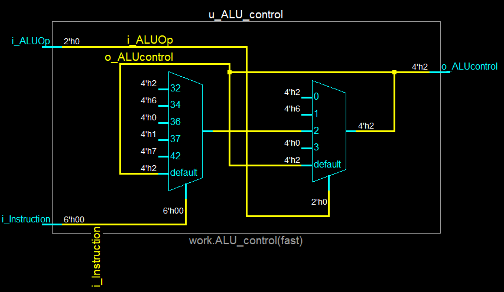
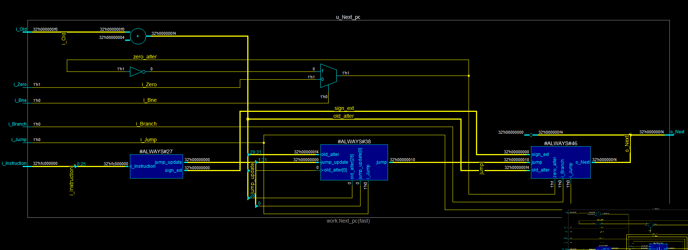
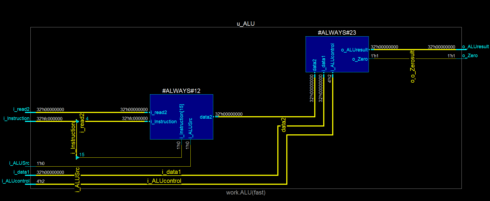
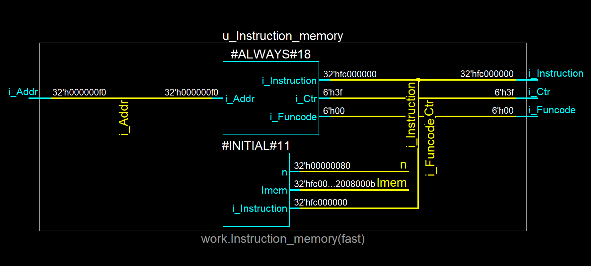
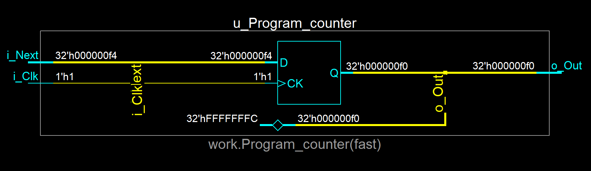
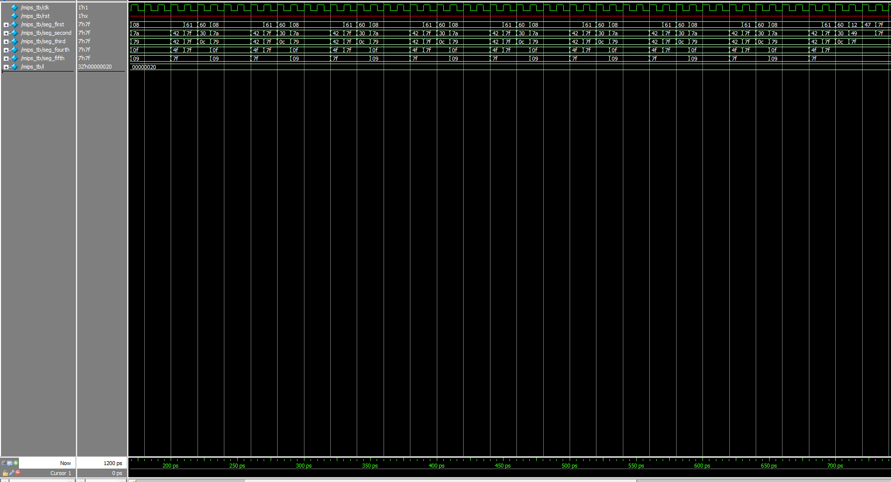

## Proposal

This section contains the proposal that was submitted for the project.

A MIPS processor that can execute a subset of the MIPS instruction set with additional features such as a clock divider, displaying the current instruction on the seven segment displays present on the FPGA board, and the ability to change the frequency of execution of the processor.

More specifically, the processor will be able to execute the following instructions: **LW** **SW** **J** **ADD** **ADDI** **BEQ** **ADDU** **SUBU** **AND** **ANDI** **OR** **ORI** **SUB** **NOR** **BNE** **SLT**

The frequency of execution for the processor will be controlled by a clock divider. The current instruction being executed will be displayed on the seven segment displays present on the FPGA board. The processor will be implemented in Verilog and tested using a test-bench.

## Introduction

The project is a single-cycle MIPS processor that can at a variable speed execute a subset of the MIPS instruction set displaying the current instruction on the seven segment displays present on **EP4CE115F29C7** FPGA board.

<div style="max-width: fit-content; margin-left: auto; margin-right: auto;">

</div>

As a result of this desired function (and it's actualation into reality), the processor can technically be used to do **all** the other projects from other students in the class. As I took this class whilst also taking CPRE381, I additionally decided to compare and contrast the experience writing the same processor in both Verilog and VHDL.

While the overall state machine will be broken down below, the main processor state machine has **five** states:

**Fetch**: In this state, the processor fetches the next instruction from memory.
**Decode**: In this state, the processor decodes the instruction to determine what operation to perform.
**Execute**: In this state, the processor executes the instruction.
**Memory**: In this state, the processor accesses memory to read or write data.
**Write-back**: In this state, the processor writes the results of the instruction to a register.

Supported Instructions: LW SW J ADD ADDI BEQ ADDU SUBU AND ANDI OR ORI SUB NOR BNE

## State Machines

### Single Cycle MIPS Processor Staging

<div style="max-width: fit-content; margin-left: auto; margin-right: auto;">
<svg xmlns="http://www.w3.org/2000/svg" xmlns:xlink="http://www.w3.org/1999/xlink" contentStyleType="text/css" height="1156px" preserveAspectRatio="none" style="width:1047px;height:1156px;background:#FFFFFF;" version="1.1" viewBox="0 0 1047 1156" width="1047px" zoomAndPan="magnify"><defs/><g><text fill="#000000" font-family="sans-serif" font-size="14" font-weight="bold" lengthAdjust="spacing" textLength="446" x="293.875" y="22.9951">MIPS Processor Architecture with Assembly Instructions</text><!--cluster IF--><g id="cluster_IF"><path d="M200.25,220.5969 L377.25,220.5969 A3.5,3.5 0 0 1 380.75,224.0969 L380.75,241.8938 L196.75,241.8938 L196.75,224.0969 A3.5,3.5 0 0 1 200.25,220.5969 " fill="#F1F1F1" style="stroke:#F1F1F1;stroke-width:1.0;"/><rect fill="none" height="101" rx="3.5" ry="3.5" style="stroke:#181818;stroke-width:0.5;" width="184" x="196.75" y="220.5969"/><line style="stroke:#181818;stroke-width:0.5;" x1="196.75" x2="380.75" y1="241.8938" y2="241.8938"/><text fill="#000000" font-family="sans-serif" font-size="14" lengthAdjust="spacing" textLength="116" x="230.75" y="237.592">Instruction Fetch</text></g><!--cluster DC--><g id="cluster_DC"><path d="M230.25,385.5969 L496.25,385.5969 A3.5,3.5 0 0 1 499.75,389.0969 L499.75,406.8938 L226.75,406.8938 L226.75,389.0969 A3.5,3.5 0 0 1 230.25,385.5969 " fill="#F1F1F1" style="stroke:#F1F1F1;stroke-width:1.0;"/><rect fill="none" height="101" rx="3.5" ry="3.5" style="stroke:#181818;stroke-width:0.5;" width="273" x="226.75" y="385.5969"/><line style="stroke:#181818;stroke-width:0.5;" x1="226.75" x2="499.75" y1="406.8938" y2="406.8938"/><text fill="#000000" font-family="sans-serif" font-size="14" lengthAdjust="spacing" textLength="110" x="308.25" y="402.592">Decode/Control</text></g><!--cluster EX--><g id="cluster_EX"><path d="M440.25,558.8669 L655.25,558.8669 A3.5,3.5 0 0 1 658.75,562.3669 L658.75,580.1638 L436.75,580.1638 L436.75,562.3669 A3.5,3.5 0 0 1 440.25,558.8669 " fill="#F1F1F1" style="stroke:#F1F1F1;stroke-width:1.0;"/><rect fill="none" height="260.83" rx="3.5" ry="3.5" style="stroke:#181818;stroke-width:0.5;" width="222" x="436.75" y="558.8669"/><line style="stroke:#181818;stroke-width:0.5;" x1="436.75" x2="658.75" y1="580.1638" y2="580.1638"/><text fill="#000000" font-family="sans-serif" font-size="14" lengthAdjust="spacing" textLength="68" x="513.75" y="575.862">Execution</text></g><!--cluster MEM--><g id="cluster_MEM"><path d="M488.25,899.5269 L625.25,899.5269 A3.5,3.5 0 0 1 628.75,903.0269 L628.75,920.8238 L484.75,920.8238 L484.75,903.0269 A3.5,3.5 0 0 1 488.25,899.5269 " fill="#F1F1F1" style="stroke:#F1F1F1;stroke-width:1.0;"/><rect fill="none" height="101" rx="3.5" ry="3.5" style="stroke:#181818;stroke-width:0.5;" width="144" x="484.75" y="899.5269"/><line style="stroke:#181818;stroke-width:0.5;" x1="484.75" x2="628.75" y1="920.8238" y2="920.8238"/><text fill="#000000" font-family="sans-serif" font-size="14" lengthAdjust="spacing" textLength="109" x="502.25" y="916.522">Memory Access</text></g><!--cluster WB--><g id="cluster_WB"><path d="M693.25,1049.5269 L858.25,1049.5269 A3.5,3.5 0 0 1 861.75,1053.0269 L861.75,1070.8238 L689.75,1070.8238 L689.75,1053.0269 A3.5,3.5 0 0 1 693.25,1049.5269 " fill="#F1F1F1" style="stroke:#F1F1F1;stroke-width:1.0;"/><rect fill="none" height="101" rx="3.5" ry="3.5" style="stroke:#181818;stroke-width:0.5;" width="172" x="689.75" y="1049.5269"/><line style="stroke:#181818;stroke-width:0.5;" x1="689.75" x2="861.75" y1="1070.8238" y2="1070.8238"/><text fill="#000000" font-family="sans-serif" font-size="14" lengthAdjust="spacing" textLength="73" x="739.25" y="1066.522">Write Back</text></g><g id="IF.IM"><rect fill="#F1F1F1" height="50" rx="3.5" ry="3.5" style="stroke:#181818;stroke-width:0.5;" width="152" x="212.75" y="255.5969"/><line style="stroke:#181818;stroke-width:0.5;" x1="212.75" x2="364.75" y1="281.8938" y2="281.8938"/><text fill="#000000" font-family="sans-serif" font-size="14" lengthAdjust="spacing" textLength="132" x="222.75" y="273.592">Instruction Memory</text></g><g id="DC.RF"><rect fill="#F1F1F1" height="50" rx="3.5" ry="3.5" style="stroke:#181818;stroke-width:0.5;" width="105" x="379.25" y="420.5969"/><line style="stroke:#181818;stroke-width:0.5;" x1="379.25" x2="484.25" y1="446.8938" y2="446.8938"/><text fill="#000000" font-family="sans-serif" font-size="14" lengthAdjust="spacing" textLength="85" x="389.25" y="438.592">Register File</text></g><g id="DC.CU"><rect fill="#F1F1F1" height="50" rx="3.5" ry="3.5" style="stroke:#181818;stroke-width:0.5;" width="101" x="243.25" y="420.5969"/><line style="stroke:#181818;stroke-width:0.5;" x1="243.25" x2="344.25" y1="446.8938" y2="446.8938"/><text fill="#000000" font-family="sans-serif" font-size="14" lengthAdjust="spacing" textLength="81" x="253.25" y="438.592">Control Unit</text></g><g id="EX.ALUC"><rect fill="#F1F1F1" height="50" rx="3.5" ry="3.5" style="stroke:#181818;stroke-width:0.5;" width="100" x="542.75" y="593.8669"/><line style="stroke:#181818;stroke-width:0.5;" x1="542.75" x2="642.75" y1="620.1638" y2="620.1638"/><text fill="#000000" font-family="sans-serif" font-size="14" lengthAdjust="spacing" textLength="80" x="552.75" y="611.862">ALU Control</text></g><g id="EX.ALU"><rect fill="#F1F1F1" height="50" rx="3.5" ry="3.5" style="stroke:#181818;stroke-width:0.5;" width="50" x="462.75" y="753.6969"/><line style="stroke:#181818;stroke-width:0.5;" x1="462.75" x2="512.75" y1="779.9938" y2="779.9938"/><text fill="#000000" font-family="sans-serif" font-size="14" lengthAdjust="spacing" textLength="26" x="474.75" y="771.692">ALU</text></g><g id="MEM.DM"><rect fill="#F1F1F1" height="50" rx="3.5" ry="3.5" style="stroke:#181818;stroke-width:0.5;" width="111" x="501.25" y="934.5269"/><line style="stroke:#181818;stroke-width:0.5;" x1="501.25" x2="612.25" y1="960.8238" y2="960.8238"/><text fill="#000000" font-family="sans-serif" font-size="14" lengthAdjust="spacing" textLength="91" x="511.25" y="952.522">Data Memory</text></g><g id="WB.UR"><rect fill="#F1F1F1" height="50" rx="3.5" ry="3.5" style="stroke:#181818;stroke-width:0.5;" width="140" x="705.75" y="1084.5269"/><line style="stroke:#181818;stroke-width:0.5;" x1="705.75" x2="845.75" y1="1110.8238" y2="1110.8238"/><text fill="#000000" font-family="sans-serif" font-size="14" lengthAdjust="spacing" textLength="120" x="715.75" y="1102.522">Update Registers</text></g><path d="M10.5,44.2969 L211,44.2969 A3.5,3.5 0 0 1 214.5,47.7969 L214.5,70.5938 L7,70.5938 L7,47.7969 A3.5,3.5 0 0 1 10.5,44.2969 " fill="#F1F1F1" style="stroke:#F1F1F1;stroke-width:1.0;"/><rect fill="none" height="98.2969" rx="3.5" ry="3.5" style="stroke:#181818;stroke-width:0.5;" width="207.5" x="7" y="44.2969"/><line style="stroke:#181818;stroke-width:0.5;" x1="7" x2="214.5" y1="70.5938" y2="70.5938"/><text fill="#000000" font-family="sans-serif" font-size="14" lengthAdjust="spacing" textLength="118" x="51.75" y="62.292">Program Counter</text><g id="PC.PC_Current"><rect fill="#F1F1F1" height="50" rx="3.5" ry="3.5" style="stroke:#181818;stroke-width:0.5;" width="95" x="19" y="82.5938"/><line style="stroke:#181818;stroke-width:0.5;" x1="19" x2="114" y1="108.8906" y2="108.8906"/><text fill="#000000" font-family="sans-serif" font-size="14" lengthAdjust="spacing" textLength="75" x="29" y="100.5889">Current PC</text></g><g id="PC.PC_Next"><rect fill="#F1F1F1" height="50" rx="3.5" ry="3.5" style="stroke:#181818;stroke-width:0.5;" width="74" x="131.5" y="82.5938"/><line style="stroke:#181818;stroke-width:0.5;" x1="131.5" x2="205.5" y1="108.8906" y2="108.8906"/><text fill="#000000" font-family="sans-serif" font-size="14" lengthAdjust="spacing" textLength="54" x="141.5" y="100.5889">Next PC</text></g><g id="elem_GMN29"><path d="M518.75,413.8269 L518.75,477.3581 A3.5,3.5 0 0 0 522.25,480.8581 L741.25,480.8581 A3.5,3.5 0 0 0 744.75,477.3581 L744.75,420.3269 L734.75,410.3269 L522.25,410.3269 A3.5,3.5 0 0 0 518.75,413.8269 " fill="#7FFFD4" style="stroke:#454645;stroke-width:1.5;"/><path d="M734.75,410.3269 L734.75,418.5769 A1.75,1.75 0 0 0 736.5,420.3269 L744.75,420.3269 L734.75,410.3269 " fill="#7FFFD4" style="stroke:#454645;stroke-width:1.0;"/><text fill="#454645" font-family="sans-serif" font-size="13" lengthAdjust="spacing" textLength="149" x="524.75" y="427.3938">Control Signals Include:</text><text fill="#454645" font-family="sans-serif" font-size="13" lengthAdjust="spacing" textLength="148" x="524.75" y="442.5266">- RegDst, Jump, Branch</text><text fill="#454645" font-family="sans-serif" font-size="13" lengthAdjust="spacing" textLength="205" x="524.75" y="457.6594">- MemRead, MemtoReg, ALUSrc</text><text fill="#454645" font-family="sans-serif" font-size="13" lengthAdjust="spacing" textLength="170" x="524.75" y="472.7922">- RegWrite, MemWrite, Bne</text></g><g id="elem_GMN32"><path d="M675.25,739.3669 L675.25,774.6969 L513,778.6969 L675.25,782.6969 L675.25,818.0309 A3.5,3.5 0 0 0 678.75,821.5309 L852.75,821.5309 A3.5,3.5 0 0 0 856.25,818.0309 L856.25,745.8669 L846.25,735.8669 L678.75,735.8669 A3.5,3.5 0 0 0 675.25,739.3669 " fill="#7FFFD4" style="stroke:#454645;stroke-width:1.5;"/><path d="M846.25,735.8669 L846.25,744.1169 A1.75,1.75 0 0 0 848,745.8669 L856.25,745.8669 L846.25,735.8669 " fill="#7FFFD4" style="stroke:#454645;stroke-width:1.5;"/><text fill="#454645" font-family="sans-serif" font-size="13" lengthAdjust="spacing" textLength="134" x="681.25" y="752.9338">Supports operations:</text><text fill="#454645" font-family="sans-serif" font-size="13" lengthAdjust="spacing" textLength="160" x="681.25" y="768.0666">- ADD, ADDI, SUB, SUBU</text><text fill="#454645" font-family="sans-serif" font-size="13" lengthAdjust="spacing" textLength="133" x="681.25" y="783.1994">- AND, ANDI, OR, ORI</text><text fill="#454645" font-family="sans-serif" font-size="13" lengthAdjust="spacing" textLength="138" x="681.25" y="798.3322">- NOR, SLT, BEQ, BNE</text><text fill="#454645" font-family="sans-serif" font-size="13" lengthAdjust="spacing" textLength="66" x="681.25" y="813.465">- LW, SW, J</text></g><g id="elem_GMN35"><path d="M249.25,69.2469 L249.25,89.4469 L214.95,93.4469 L249.25,97.4469 L249.25,117.6453 A3.5,3.5 0 0 0 252.75,121.1453 L400.75,121.1453 A3.5,3.5 0 0 0 404.25,117.6453 L404.25,75.7469 L394.25,65.7469 L252.75,65.7469 A3.5,3.5 0 0 0 249.25,69.2469 " fill="#7FFFD4" style="stroke:#454645;stroke-width:1.5;"/><path d="M394.25,65.7469 L394.25,73.9969 A1.75,1.75 0 0 0 396,75.7469 L404.25,75.7469 L394.25,65.7469 " fill="#7FFFD4" style="stroke:#454645;stroke-width:1.5;"/><text fill="#454645" font-family="sans-serif" font-size="13" lengthAdjust="spacing" textLength="134" x="255.25" y="82.8138">Sequentially updates</text><text fill="#454645" font-family="sans-serif" font-size="13" lengthAdjust="spacing" textLength="106" x="255.25" y="97.9466">to fetch the next</text><text fill="#454645" font-family="sans-serif" font-size="13" lengthAdjust="spacing" textLength="126" x="255.25" y="113.0794">instruction address.</text></g><!--link PC to IM--><g id="link_PC_IM"><path d="M157.52,143.0969 C192.23,179.1969 233.942,222.5913 261.242,250.9913 " fill="none" id="PC-to-IM" style="stroke:#454645;stroke-width:1.0;"/><polygon fill="#454645" points="265.4,255.3169,262.0467,246.0565,261.935,251.7122,256.2792,251.6005,265.4,255.3169" style="stroke:#454645;stroke-width:1.0;"/><text fill="#000000" font-family="sans-serif" font-size="13" lengthAdjust="spacing" textLength="111" x="216.75" y="185.6638">"Fetch Instruction</text><text fill="#000000" font-family="sans-serif" font-size="13" lengthAdjust="spacing" textLength="88" x="228.25" y="200.7966">(PC Address)"</text></g><!--link IM to RF--><g id="link_IM_RF"><path d="M351.52,305.9669 C366.59,314.1869 381.55,324.6469 392.75,337.5969 C413.32,361.3769 422.211,391.0019 426.881,414.5119 " fill="none" id="IM-to-RF" style="stroke:#454645;stroke-width:1.0;"/><polygon fill="#454645" points="428.05,420.3969,430.2199,410.79,427.0758,415.4927,422.3732,412.3487,428.05,420.3969" style="stroke:#454645;stroke-width:1.0;"/><text fill="#000000" font-family="sans-serif" font-size="13" lengthAdjust="spacing" textLength="109" x="429.75" y="350.6638">"Send Instruction</text><text fill="#000000" font-family="sans-serif" font-size="13" lengthAdjust="spacing" textLength="141" x="413.75" y="365.7966">(OPCode, Addresses)"</text></g><!--link IM to CU--><g id="link_IM_CU"><path d="M287.17,305.8469 C286.6,315.6869 286.03,327.1869 285.75,337.5969 C285.37,351.8169 284.99,355.3969 285.75,369.5969 C286.65,386.5969 287.9688,399.7116 289.7688,414.3716 " fill="none" id="IM-to-CU" style="stroke:#454645;stroke-width:1.0;"/><polygon fill="#454645" points="290.5,420.3269,293.3734,410.9065,289.8907,415.3641,285.433,411.8814,290.5,420.3269" style="stroke:#454645;stroke-width:1.0;"/><text fill="#000000" font-family="sans-serif" font-size="13" lengthAdjust="spacing" textLength="101" x="286.75" y="350.6638">"Control Signals</text><text fill="#000000" font-family="sans-serif" font-size="13" lengthAdjust="spacing" textLength="66" x="304.25" y="365.7966">(OPCode)"</text></g><!--link RF to ALU--><g id="link_RF_ALU"><path d="M417.24,470.8569 C405.87,491.3669 390.97,521.9369 384.75,550.8669 C376.06,591.2769 371.44,604.7369 384.75,643.8669 C400.05,688.8269 432.9256,726.2969 458.1756,750.8169 " fill="none" id="RF-to-ALU" style="stroke:#454645;stroke-width:1.0;"/><polygon fill="#454645" points="462.48,754.9969,458.81,745.8573,458.893,751.5136,453.2367,751.5965,462.48,754.9969" style="stroke:#454645;stroke-width:1.0;"/><text fill="#000000" font-family="sans-serif" font-size="13" lengthAdjust="spacing" textLength="131" x="389.25" y="615.9338">"Data for Operations</text><text fill="#000000" font-family="sans-serif" font-size="13" lengthAdjust="spacing" textLength="138" x="385.75" y="631.0666">(Read Register Data)"</text></g><!--link CU to ALUC--><g id="link_CU_ALUC"><path d="M324.47,470.8769 C335.77,479.0969 348.95,487.8969 361.75,494.5969 C426.3,528.4069 452.99,513.8269 515.75,550.8669 C535.59,562.5669 550.8322,575.4904 565.2622,589.4804 " fill="none" id="CU-to-ALUC" style="stroke:#454645;stroke-width:1.0;"/><polygon fill="#454645" points="569.57,593.6569,565.8926,584.5203,565.9802,590.1765,560.324,590.2641,569.57,593.6569" style="stroke:#454645;stroke-width:1.0;"/><text fill="#000000" font-family="sans-serif" font-size="13" lengthAdjust="spacing" textLength="140" x="498.75" y="523.9338">"Determine Operation</text><text fill="#000000" font-family="sans-serif" font-size="13" lengthAdjust="spacing" textLength="59" x="539.25" y="539.0666">(ALUOp)"</text></g><!--link ALUC to ALU--><g id="link_ALUC_ALU"><path d="M576.57,644.1769 C556.84,673.8369 527.0028,718.681 507.2628,748.361 " fill="none" id="ALUC-to-ALU" style="stroke:#454645;stroke-width:1.0;"/><polygon fill="#454645" points="503.94,753.3569,512.2548,748.0782,506.709,749.1936,505.5935,743.6478,503.94,753.3569" style="stroke:#454645;stroke-width:1.0;"/><text fill="#000000" font-family="sans-serif" font-size="13" lengthAdjust="spacing" textLength="153" x="556.75" y="686.9338">"Execute ALU Operation</text><text fill="#000000" font-family="sans-serif" font-size="13" lengthAdjust="spacing" textLength="91" x="587.75" y="702.0666">(ALU Control)"</text></g><!--link ALU to DM--><g id="link_ALU_DM"><path d="M497.2,804.1869 C510.38,838.3369 531.9711,894.2987 545.1411,928.4487 " fill="none" id="ALU-to-DM" style="stroke:#454645;stroke-width:1.0;"/><polygon fill="#454645" points="547.3,934.0469,547.7937,924.2104,545.5009,929.3818,540.3295,927.089,547.3,934.0469" style="stroke:#454645;stroke-width:1.0;"/><text fill="#000000" font-family="sans-serif" font-size="13" lengthAdjust="spacing" textLength="117" x="526.75" y="864.5938">"Address / Data to</text><text fill="#000000" font-family="sans-serif" font-size="13" lengthAdjust="spacing" textLength="92" x="539.25" y="879.7266">Data Memory"</text></g><!--reverse link PC to ALU--><g id="link_PC_ALU"><path d="M97.6842,148.7218 C89.6642,185.8818 81.75,232.7469 81.75,279.5969 C81.75,279.5969 81.75,279.5969 81.75,619.8669 C81.75,701.9169 373.47,758.2669 462.35,773.5369 " fill="none" id="PC-backto-ALU" style="stroke:#454645;stroke-width:1.0;"/><polygon fill="#454645" points="98.95,142.8569,93.1413,150.8105,97.8952,147.7443,100.9613,152.4982,98.95,142.8569" style="stroke:#454645;stroke-width:1.0;"/><text fill="#000000" font-family="sans-serif" font-size="13" lengthAdjust="spacing" textLength="87" x="101.25" y="442.6638">"Zero Flag for</text><text fill="#000000" font-family="sans-serif" font-size="13" lengthAdjust="spacing" textLength="124" x="82.75" y="457.7966">Branch Operations"</text></g><!--link DM to UR--><g id="link_DM_UR"><path d="M592.91,984.9669 C633.49,1012.3869 693.9583,1053.2579 734.5583,1080.6879 " fill="none" id="DM-to-UR" style="stroke:#454645;stroke-width:1.0;"/><polygon fill="#454645" points="739.53,1084.0469,734.3118,1075.694,735.3869,1081.2478,729.8332,1082.3229,739.53,1084.0469" style="stroke:#454645;stroke-width:1.0;"/><text fill="#000000" font-family="sans-serif" font-size="13" lengthAdjust="spacing" textLength="139" x="659.75" y="1029.5938">"Data to Register File"</text></g><!--reverse link RF to UR--><g id="link_RF_UR"><path d="M466.8857,474.3814 C478.4857,482.8014 487.31,488.1969 500.75,494.5969 C678.68,579.3969 926.75,420.7669 926.75,617.8669 C926.75,617.8669 926.75,617.8669 926.75,960.5269 C926.75,1017.4269 871.39,1059.6769 827.72,1084.1669 " fill="none" id="RF-backto-UR" style="stroke:#454645;stroke-width:1.0;"/><polygon fill="#454645" points="462.03,470.8569,466.9638,479.3808,466.0764,473.794,471.6632,472.9066,462.03,470.8569" style="stroke:#454645;stroke-width:1.0;"/><text fill="#000000" font-family="sans-serif" font-size="13" lengthAdjust="spacing" textLength="112" x="927.75" y="783.2638">"Write Back Data"</text></g><!--link CU to GMN29--><g id="link_CU_GMN29"><path d="M308.71,420.2369 C323.46,397.9769 348.27,367.0969 379.25,353.5969 C421.22,335.3069 438.2,341.1269 482.25,353.5969 C521.25,364.6369 560.08,389.0369 588.39,409.9369 " fill="none" id="CU-GMN29" style="stroke:#454645;stroke-width:1.0;stroke-dasharray:7.0,7.0;"/></g><!--SRC=[TLHTQzim57tthxZBIpT8rlS-318xWPJcO_PCnoWCrRv9H6t9a-IbPUo_xrufJfN00dOidNFkj_J17R15-2sVZL0kST8r2Albje2jqHLQgmrCJNMG3YlN6uIZT0UOMeljS_C6IsMTwIidjR99SWCPxgH28AFG2gdWkT7LYqsi4mvXH2RtHhIGwbuvD2CG5hOf_4c0VYTEsXk3oj7-2Vvvseb9QtoD6RnC_YQ3coWeMA2h3fwtN5mwYbahRBLv2xHLP2d3IjTucshbZ6uydbt5c-DUMae65h91pyWN5_a4BPHAEW-dPUHW_efLpo5uQFxzqlRqeOJODwtJAtpOZso6P61QSViylfglBWrdmeauwInE-j5Gis4cgXUFFSukjMLNy_-GT_1GvcpWXgDLD2Y1QyEm26FqqOBJO0_w23NxtZNwc53h9vClL76uWv5lL3nFJ-eZ4QPrRIYDJwE4QCpE5ymkKDLNvCqsfLwD1mL6chHapT29GkwLQEnPGZmooZokzzsfEZiQ_4s7HlZP9dAEeZvd3SmX8LcUrFgeWZZrQYIyvLDmbfEQq4r70i-AV8K1GB-yuW-j3oelodofJXd2hO-22lkaueO6TjyHV-iZ-e56mw8HUqxgIStef5EftvCR9LceKvcVqwTkNKvsGc0m6ZhmFYK-YX5tdm83fRdn9AyQOUJkpTy5b0M2tW4ASkplX8HvOEJ-u1YWGm5mrI3gRzNqDTuHDE5eCkl6SD-ttHX23XwWhBarO_vmccXZBcPXga7c8_NmwMkcCE7vuH2Igq3uA04KVTTfuopeSv525DCi6_DhEOQYdFbN6O0r0si6DZa_Ix-zvaNny8sSph_IQpttsm-Fj4lF_N_ZsF91B_1NJpUV50rTjRq_TvQsgRWxVrguj8hlFW0PtMOYpCVdi_5_]--></g></svg>
</div>

 
### Execution diagram for each instruction:

<div style="max-width: fit-content; margin-left: auto; margin-right: auto;">
<svg xmlns="http://www.w3.org/2000/svg" xmlns:xlink="http://www.w3.org/1999/xlink" contentStyleType="text/css" height="239.5677px" preserveAspectRatio="none" style="width:364px;height:239px;" version="1.1" viewBox="0 0 364 239" width="364.6227px" zoomAndPan="magnify"><defs><linearGradient id="ghck6es8nt89h0" x1="50%" x2="50%" y1="0%" y2="100%"><stop offset="0%" stop-color="#3A3A3A"/><stop offset="100%" stop-color="#262626"/></linearGradient></defs><g><!--cluster ProgramCounter--><g id="cluster_ProgramCounter"><path d="M67.3352,20.1154 L346.2855,20.1154 A0.4847,0.4847 0 0 1 346.7703,20.6002 L346.7703,23.4847 L66.8505,23.4847 L66.8505,20.6002 A0.4847,0.4847 0 0 1 67.3352,20.1154 " fill="url(#ghck6es8nt89h0)" style="stroke:url(#ghck6es8nt89h0);stroke-width:0.12117737320692108;"/><rect fill="none" height="218.1992" rx="0.4847" ry="0.4847" style="stroke:#262626;stroke-width:0.12117737320692108;" width="279.9197" x="66.8505" y="20.1154"/><line style="stroke:#262626;stroke-width:0.12117737320692108;" x1="66.8505" x2="346.7703" y1="23.4847" y2="23.4847"/><text fill="#FEFEFE" font-family="Verdana" font-size="1.333" lengthAdjust="spacing" textLength="11.3907" x="201.1151" y="22.4433">ProgramCounter</text></g><!--cluster Decode--><g id="cluster_Decode"><path d="M144.8888,27.992 L327.2607,27.992 A0.4847,0.4847 0 0 1 327.7454,28.4767 L327.7454,31.3613 L144.404,31.3613 L144.404,28.4767 A0.4847,0.4847 0 0 1 144.8888,27.992 " fill="url(#ghck6es8nt89h0)" style="stroke:url(#ghck6es8nt89h0);stroke-width:0.12117737320692108;"/><rect fill="none" height="205.4756" rx="0.4847" ry="0.4847" style="stroke:#262626;stroke-width:0.12117737320692108;" width="183.3414" x="144.404" y="27.992"/><line style="stroke:#262626;stroke-width:0.12117737320692108;" x1="144.404" x2="327.7454" y1="31.3613" y2="31.3613"/><text fill="#FEFEFE" font-family="Verdana" font-size="1.333" lengthAdjust="spacing" textLength="5.0894" x="233.53" y="30.3198">Decode</text></g><!--cluster Execution--><g id="cluster_Execution"><path d="M191.7844,53.1254 L307.2664,53.1254 A0.4847,0.4847 0 0 1 307.7511,53.6101 L307.7511,56.4947 L191.2997,56.4947 L191.2997,53.6101 A0.4847,0.4847 0 0 1 191.7844,53.1254 " fill="url(#ghck6es8nt89h0)" style="stroke:url(#ghck6es8nt89h0);stroke-width:0.12117737320692108;"/><rect fill="none" height="175.4951" rx="0.4847" ry="0.4847" style="stroke:#262626;stroke-width:0.12117737320692108;" width="116.4515" x="191.2997" y="53.1254"/><line style="stroke:#262626;stroke-width:0.12117737320692108;" x1="191.2997" x2="307.7511" y1="56.4947" y2="56.4947"/><text fill="#FEFEFE" font-family="Verdana" font-size="1.333" lengthAdjust="spacing" textLength="6.5436" x="246.2536" y="55.4532">Execution</text></g><!--cluster MemoryStage--><g id="cluster_MemoryStage"><path d="M232.3788,140.4252 L264.8544,140.4252 A0.4847,0.4847 0 0 1 265.3391,140.9099 L265.3391,143.7945 L231.8941,143.7945 L231.8941,140.9099 A0.4847,0.4847 0 0 1 232.3788,140.4252 " fill="url(#ghck6es8nt89h0)" style="stroke:url(#ghck6es8nt89h0);stroke-width:0.12117737320692108;"/><rect fill="none" height="60.2033" rx="0.4847" ry="0.4847" style="stroke:#262626;stroke-width:0.12117737320692108;" width="33.445" x="231.8941" y="140.4252"/><line style="stroke:#262626;stroke-width:0.12117737320692108;" x1="231.8941" x2="265.3391" y1="143.7945" y2="143.7945"/><text fill="#FEFEFE" font-family="Verdana" font-size="1.333" lengthAdjust="spacing" textLength="9.4518" x="243.8907" y="142.7531">MemoryStage</text></g><!--cluster WriteBack--><g id="cluster_WriteBack"><path d="M199.1762,209.4745 L208.7492,209.4745 A0.4847,0.4847 0 0 1 209.2339,209.9592 L209.2339,212.8438 L198.6915,212.8438 L198.6915,209.9592 A0.4847,0.4847 0 0 1 199.1762,209.4745 " fill="url(#ghck6es8nt89h0)" style="stroke:url(#ghck6es8nt89h0);stroke-width:0.12117737320692108;"/><rect fill="none" height="14.2989" rx="0.4847" ry="0.4847" style="stroke:#262626;stroke-width:0.12117737320692108;" width="10.5424" x="198.6915" y="209.4745"/><line style="stroke:#262626;stroke-width:0.12117737320692108;" x1="198.6915" x2="209.2339" y1="212.8438" y2="212.8438"/><text fill="#FEFEFE" font-family="Verdana" font-size="1.333" lengthAdjust="spacing" textLength="6.6648" x="200.6303" y="211.8023">WriteBack</text></g><!--cluster NextPC--><g id="cluster_NextPC"><path d="M88.6625,93.6483 L112.6556,93.6483 A0.4847,0.4847 0 0 1 113.1403,94.133 L113.1403,97.0176 L88.1777,97.0176 L88.1777,94.133 A0.4847,0.4847 0 0 1 88.6625,93.6483 " fill="url(#ghck6es8nt89h0)" style="stroke:url(#ghck6es8nt89h0);stroke-width:0.12117737320692108;"/><rect fill="none" height="93.3708" rx="0.4847" ry="0.4847" style="stroke:#262626;stroke-width:0.12117737320692108;" width="24.9625" x="88.1777" y="93.6483"/><line style="stroke:#262626;stroke-width:0.12117737320692108;" x1="88.1777" x2="113.1403" y1="97.0176" y2="97.0176"/><text fill="#FEFEFE" font-family="Verdana" font-size="1.333" lengthAdjust="spacing" textLength="4.8471" x="98.2355" y="95.9762">NextPC</text></g><!--cluster ControlUnit--><g id="cluster_ControlUnit"><path d="M6.383,2.06 L25.7714,2.06 A0.4847,0.4847 0 0 1 26.2561,2.5447 L26.2561,5.4293 L5.8983,5.4293 L5.8983,2.5447 A0.4847,0.4847 0 0 1 6.383,2.06 " fill="url(#ghck6es8nt89h0)" style="stroke:url(#ghck6es8nt89h0);stroke-width:0.12117737320692108;"/><rect fill="none" height="42.2194" rx="0.4847" ry="0.4847" style="stroke:#262626;stroke-width:0.12117737320692108;" width="20.3578" x="5.8983" y="2.06"/><line style="stroke:#262626;stroke-width:0.12117737320692108;" x1="5.8983" x2="26.2561" y1="5.4293" y2="5.4293"/><text fill="#FEFEFE" font-family="Verdana" font-size="1.333" lengthAdjust="spacing" textLength="7.6342" x="12.2601" y="4.3879">ControlUnit</text></g><!--cluster IF--><g id="cluster_IF"><path d="M30.6185,23.0237 L62.4881,23.0237 A0.4847,0.4847 0 0 1 62.9729,23.5084 L62.9729,26.393 L30.1338,26.393 L30.1338,23.5084 A0.4847,0.4847 0 0 1 30.6185,23.0237 " fill="url(#ghck6es8nt89h0)" style="stroke:url(#ghck6es8nt89h0);stroke-width:0.12117737320692108;"/><rect fill="none" height="21.206" rx="0.4847" ry="0.4847" style="stroke:#262626;stroke-width:0.12117737320692108;" width="32.8391" x="30.1338" y="23.0237"/><line style="stroke:#262626;stroke-width:0.12117737320692108;" x1="30.1338" x2="62.9729" y1="26.393" y2="26.393"/><text fill="#FEFEFE" font-family="Verdana" font-size="1.333" lengthAdjust="spacing" textLength="10.7848" x="41.1609" y="25.3516">Instruction Flow</text></g><!--cluster Rtype--><g id="cluster_Rtype"><path d="M43.3421,28.9614 L49.7645,28.9614 A0.4847,0.4847 0 0 1 50.2492,29.4461 L50.2492,32.3307 L42.8574,32.3307 L42.8574,29.4461 A0.4847,0.4847 0 0 1 43.3421,28.9614 " fill="url(#ghck6es8nt89h0)" style="stroke:url(#ghck6es8nt89h0);stroke-width:0.12117737320692108;"/><rect fill="none" height="12.3601" rx="0.4847" ry="0.4847" style="stroke:#262626;stroke-width:0.12117737320692108;" width="7.3918" x="42.8574" y="28.9614"/><line style="stroke:#262626;stroke-width:0.12117737320692108;" x1="42.8574" x2="50.2492" y1="32.3307" y2="32.3307"/><text fill="#FEFEFE" font-family="Verdana" font-size="1.333" lengthAdjust="spacing" textLength="4.2412" x="44.4327" y="31.2893">R-type</text></g><!--cluster Itype--><g id="cluster_Itype"><path d="M53.6422,28.9614 L59.5799,28.9614 A0.4847,0.4847 0 0 1 60.0646,29.4461 L60.0646,32.3307 L53.1575,32.3307 L53.1575,29.4461 A0.4847,0.4847 0 0 1 53.6422,28.9614 " fill="url(#ghck6es8nt89h0)" style="stroke:url(#ghck6es8nt89h0);stroke-width:0.12117737320692108;"/><rect fill="none" height="12.3601" rx="0.4847" ry="0.4847" style="stroke:#262626;stroke-width:0.12117737320692108;" width="6.9071" x="53.1575" y="28.9614"/><line style="stroke:#262626;stroke-width:0.12117737320692108;" x1="53.1575" x2="60.0646" y1="32.3307" y2="32.3307"/><text fill="#FEFEFE" font-family="Verdana" font-size="1.333" lengthAdjust="spacing" textLength="3.7565" x="54.7328" y="31.2893">I-type</text></g><!--cluster Jtype--><g id="cluster_Jtype"><path d="M33.5267,28.9614 L39.4644,28.9614 A0.4847,0.4847 0 0 1 39.9492,29.4461 L39.9492,32.3307 L33.042,32.3307 L33.042,29.4461 A0.4847,0.4847 0 0 1 33.5267,28.9614 " fill="url(#ghck6es8nt89h0)" style="stroke:url(#ghck6es8nt89h0);stroke-width:0.12117737320692108;"/><rect fill="none" height="12.3601" rx="0.4847" ry="0.4847" style="stroke:#262626;stroke-width:0.12117737320692108;" width="6.9071" x="33.042" y="28.9614"/><line style="stroke:#262626;stroke-width:0.12117737320692108;" x1="33.042" x2="39.9492" y1="32.3307" y2="32.3307"/><text fill="#FEFEFE" font-family="Verdana" font-size="1.333" lengthAdjust="spacing" textLength="3.7565" x="34.6173" y="31.2893">J-type</text></g><ellipse cx="124.4098" cy="63.3043" fill="#0060A8" rx="1.2118" ry="1.2118" style="stroke:#262626;stroke-width:0.12117737320692108;"/><g id="ProgramCounter.Fetch"><rect fill="url(#ghck6es8nt89h0)" height="6.3987" rx="0.4847" ry="0.4847" style="stroke:#262626;stroke-width:0.12117737320692108;" width="7.2706" x="130.1051" y="147.405"/><line style="stroke:#262626;stroke-width:0.12117737320692108;" x1="130.1051" x2="137.3758" y1="151.3802" y2="151.3802"/><text fill="#FEFEFE" font-family="Verdana" font-size="1.333" lengthAdjust="spacing" textLength="3.6353" x="131.9228" y="149.8541">Fetch</text></g><ellipse cx="317.4453" cy="38.1709" fill="#0060A8" rx="1.2118" ry="1.2118" style="stroke:#262626;stroke-width:0.12117737320692108;"/><g id="ProgramCounter.Decode.ReadRegisters"><rect fill="url(#ghck6es8nt89h0)" height="6.3987" rx="0.4847" ry="0.4847" style="stroke:#262626;stroke-width:0.12117737320692108;" width="13.5719" x="310.6594" y="60.104"/><line style="stroke:#262626;stroke-width:0.12117737320692108;" x1="310.6594" x2="324.2313" y1="64.0792" y2="64.0792"/><text fill="#FEFEFE" font-family="Verdana" font-size="1.333" lengthAdjust="spacing" textLength="9.9365" x="312.4771" y="62.553">ReadRegisters</text></g><ellipse cx="266.4297" cy="63.3043" fill="#0060A8" rx="1.2118" ry="1.2118" style="stroke:#262626;stroke-width:0.12117737320692108;"/><path d="M252.5403,76.8034 L280.3202,76.8034 A0.4847,0.4847 0 0 1 280.8049,77.2881 L280.8049,80.7786 L252.0556,80.7786 L252.0556,77.2881 A0.4847,0.4847 0 0 1 252.5403,76.8034 " fill="url(#ghck6es8nt89h0)" style="stroke:url(#ghck6es8nt89h0);stroke-width:0.12117737320692108;"/><rect fill="none" height="54.0487" rx="0.4847" ry="0.4847" style="stroke:#262626;stroke-width:0.12117737320692108;" width="28.7493" x="252.0556" y="76.8034"/><line style="stroke:#262626;stroke-width:0.12117737320692108;" x1="252.0556" x2="280.8049" y1="80.7786" y2="80.7786"/><text fill="#FEFEFE" font-family="Verdana" font-size="1.333" lengthAdjust="spacing" textLength="2.5447" x="265.1579" y="79.2525">ALU</text><path d="M253.9944,82.2327 L275.3822,82.2327 A0.4847,0.4847 0 0 1 275.867,82.7175 L275.867,86.2079 L253.5097,86.2079 L253.5097,82.7175 A0.4847,0.4847 0 0 1 253.9944,82.2327 " fill="url(#ghck6es8nt89h0)" style="stroke:url(#ghck6es8nt89h0);stroke-width:0.12117737320692108;"/><rect fill="none" height="33.617" rx="0.4847" ry="0.4847" style="stroke:#262626;stroke-width:0.12117737320692108;" width="22.3572" x="253.5097" y="82.2327"/><line style="stroke:#262626;stroke-width:0.12117737320692108;" x1="253.5097" x2="275.867" y1="86.2079" y2="86.2079"/><text fill="#FEFEFE" font-family="Verdana" font-size="1.333" lengthAdjust="spacing" textLength="4.9683" x="262.2042" y="84.6818">Control</text><ellipse cx="259.8715" cy="88.7527" fill="#0060A8" rx="1.2118" ry="1.2118" style="stroke:#262626;stroke-width:0.12117737320692108;"/><g id="ProgramCounter.Decode.Execution.ALU.Control.Compute"><rect fill="url(#ghck6es8nt89h0)" height="6.3987" rx="0.4847" ry="0.4847" style="stroke:#262626;stroke-width:0.12117737320692108;" width="9.8154" x="254.9639" y="94.448"/><line style="stroke:#262626;stroke-width:0.12117737320692108;" x1="254.9639" x2="264.7792" y1="98.4232" y2="98.4232"/><text fill="#FEFEFE" font-family="Verdana" font-size="1.333" lengthAdjust="spacing" textLength="6.18" x="256.7815" y="96.897">Compute</text></g><g id="ProgramCounter.Decode.Execution.ALU.Control.Result"><rect fill="url(#ghck6es8nt89h0)" height="6.3987" rx="0.4847" ry="0.4847" style="stroke:#262626;stroke-width:0.12117737320692108;" width="7.8765" x="255.9333" y="108.2392"/><line style="stroke:#262626;stroke-width:0.12117737320692108;" x1="255.9333" x2="263.8098" y1="112.2144" y2="112.2144"/><text fill="#FEFEFE" font-family="Verdana" font-size="1.333" lengthAdjust="spacing" textLength="4.2412" x="257.7509" y="110.6882">Result</text></g><!--link *start*Control to Compute--><g id="link_*start*Control_Compute"><path d="M259.8715,90.0056 C259.8715,91.1229 259.8715,92.1565 259.8715,93.6931 " fill="none" id="*start*Control-to-Compute" style="stroke:#303030;stroke-width:0.36353211962076326;"/><polygon fill="#303030" points="259.8715,94.4201,260.3563,93.3295,259.8715,93.8142,259.3868,93.3295,259.8715,94.4201" style="stroke:#303030;stroke-width:0.36353211962076326;"/></g><!--link Compute to Result--><g id="link_Compute_Result"><path d="M259.8715,100.8765 C259.8715,103.0795 259.8715,105.2958 259.8715,107.4964 " fill="none" id="Compute-to-Result" style="stroke:#303030;stroke-width:0.36353211962076326;"/><polygon fill="#303030" points="259.8715,108.2234,260.3563,107.1328,259.8715,107.6175,259.3868,107.1328,259.8715,108.2234" style="stroke:#303030;stroke-width:0.36353211962076326;"/><text fill="#FFFFFF" font-family="Verdana" font-size="1.4541" lengthAdjust="spacing" textLength="13.4507" x="260.5986" y="105.1054">SetControlSignals</text></g><g id="ProgramCounter.Decode.Execution.ALU.UpdateFlags"><rect fill="url(#ghck6es8nt89h0)" height="6.3987" rx="0.4847" ry="0.4847" style="stroke:#262626;stroke-width:0.12117737320692108;" width="12.1177" x="258.6295" y="123.2416"/><line style="stroke:#262626;stroke-width:0.12117737320692108;" x1="258.6295" x2="270.7472" y1="127.2168" y2="127.2168"/><text fill="#FEFEFE" font-family="Verdana" font-size="1.333" lengthAdjust="spacing" textLength="8.4824" x="260.4471" y="125.6906">UpdateFlags</text></g><!--link Control to UpdateFlags--><g id="link_Control_UpdateFlags"><path d="M264.6883,115.897 C264.6883,118.6914 264.6883,120.5696 264.6883,122.477 " fill="none" id="Control-to-UpdateFlags" style="stroke:#303030;stroke-width:0.36353211962076326;"/><polygon fill="#303030" points="264.6883,123.204,265.1731,122.1134,264.6883,122.5981,264.2036,122.1134,264.6883,123.204" style="stroke:#303030;stroke-width:0.36353211962076326;"/><text fill="#FFFFFF" font-family="Verdana" font-size="1.4541" lengthAdjust="spacing" textLength="13.5719" x="265.4154" y="120.1078">ComputeOutcome</text></g><ellipse cx="249.1013" cy="150.6041" fill="#0060A8" rx="1.2118" ry="1.2118" style="stroke:#262626;stroke-width:0.12117737320692108;"/><path d="M236.2262,164.1032 L261.9764,164.1032 A0.4847,0.4847 0 0 1 262.4611,164.588 L262.4611,168.0784 L235.7415,168.0784 L235.7415,164.588 A0.4847,0.4847 0 0 1 236.2262,164.1032 " fill="url(#ghck6es8nt89h0)" style="stroke:url(#ghck6es8nt89h0);stroke-width:0.12117737320692108;"/><rect fill="none" height="33.617" rx="0.4847" ry="0.4847" style="stroke:#262626;stroke-width:0.12117737320692108;" width="26.7196" x="235.7415" y="164.1032"/><line style="stroke:#262626;stroke-width:0.12117737320692108;" x1="235.7415" x2="262.4611" y1="168.0784" y2="168.0784"/><text fill="#FEFEFE" font-family="Verdana" font-size="1.333" lengthAdjust="spacing" textLength="8.6036" x="244.7995" y="166.5523">DataMemory</text><ellipse cx="244.1633" cy="170.6232" fill="#0060A8" rx="1.2118" ry="1.2118" style="stroke:#262626;stroke-width:0.12117737320692108;"/><g id="ProgramCounter.Decode.Execution.MemoryStage.DataMemory.AccessMemory"><rect fill="url(#ghck6es8nt89h0)" height="6.3987" rx="0.4847" ry="0.4847" style="stroke:#262626;stroke-width:0.12117737320692108;" width="13.9354" x="237.1956" y="176.3185"/><line style="stroke:#262626;stroke-width:0.12117737320692108;" x1="237.1956" x2="251.131" y1="180.2937" y2="180.2937"/><text fill="#FEFEFE" font-family="Verdana" font-size="1.333" lengthAdjust="spacing" textLength="10.3001" x="239.0133" y="178.7675">AccessMemory</text></g><g id="ProgramCounter.Decode.Execution.MemoryStage.DataMemory.Return"><rect fill="url(#ghck6es8nt89h0)" height="6.3987" rx="0.4847" ry="0.4847" style="stroke:#262626;stroke-width:0.12117737320692108;" width="8.1189" x="240.1039" y="190.1097"/><line style="stroke:#262626;stroke-width:0.12117737320692108;" x1="240.1039" x2="248.2228" y1="194.0849" y2="194.0849"/><text fill="#FEFEFE" font-family="Verdana" font-size="1.333" lengthAdjust="spacing" textLength="4.4836" x="241.9215" y="192.5587">Return</text></g><!--link *start*DataMemory to AccessMemory--><g id="link_*start*DataMemory_AccessMemory"><path d="M244.1633,171.8761 C244.1633,172.9934 244.1633,174.027 244.1633,175.5636 " fill="none" id="*start*DataMemory-to-AccessMemory" style="stroke:#303030;stroke-width:0.36353211962076326;"/><polygon fill="#303030" points="244.1633,176.2906,244.648,175.2,244.1633,175.6847,243.6786,175.2,244.1633,176.2906" style="stroke:#303030;stroke-width:0.36353211962076326;"/></g><!--link AccessMemory to Return--><g id="link_AccessMemory_Return"><path d="M244.1633,182.747 C244.1633,184.95 244.1633,187.1663 244.1633,189.3669 " fill="none" id="AccessMemory-to-Return" style="stroke:#303030;stroke-width:0.36353211962076326;"/><polygon fill="#303030" points="244.1633,190.0939,244.648,189.0033,244.1633,189.4881,243.6786,189.0033,244.1633,190.0939" style="stroke:#303030;stroke-width:0.36353211962076326;"/><text fill="#FFFFFF" font-family="Verdana" font-size="1.4541" lengthAdjust="spacing" textLength="15.7531" x="244.8904" y="186.9759">MemRead, MemWrite</text></g><ellipse cx="202.8115" cy="219.6534" fill="#0060A8" rx="1.2118" ry="1.2118" style="stroke:#262626;stroke-width:0.12117737320692108;"/><ellipse cx="100.1743" cy="103.8272" fill="#0060A8" rx="1.2118" ry="1.2118" style="stroke:#262626;stroke-width:0.12117737320692108;"/><g id="ProgramCounter.NextPC.EvaluateBranch"><rect fill="url(#ghck6es8nt89h0)" height="6.3987" rx="0.4847" ry="0.4847" style="stroke:#262626;stroke-width:0.12117737320692108;" width="14.2989" x="93.0248" y="147.405"/><line style="stroke:#262626;stroke-width:0.12117737320692108;" x1="93.0248" x2="107.3238" y1="151.3802" y2="151.3802"/><text fill="#FEFEFE" font-family="Verdana" font-size="1.333" lengthAdjust="spacing" textLength="10.6636" x="94.8425" y="149.8541">EvaluateBranch</text></g><g id="ProgramCounter.NextPC.UpdatePC"><rect fill="url(#ghck6es8nt89h0)" height="6.3987" rx="0.4847" ry="0.4847" style="stroke:#262626;stroke-width:0.12117737320692108;" width="10.3001" x="91.1466" y="177.7127"/><line style="stroke:#262626;stroke-width:0.12117737320692108;" x1="91.1466" x2="101.4467" y1="181.6879" y2="181.6879"/><text fill="#FEFEFE" font-family="Verdana" font-size="1.333" lengthAdjust="spacing" textLength="6.6648" x="92.9643" y="180.1617">UpdatePC</text></g><ellipse cx="15.5925" cy="12.2389" fill="#0060A8" rx="1.2118" ry="1.2118" style="stroke:#262626;stroke-width:0.12117737320692108;"/><g id="ControlUnit.ControlSignals"><rect fill="url(#ghck6es8nt89h0)" height="6.3987" rx="0.4847" ry="0.4847" style="stroke:#262626;stroke-width:0.12117737320692108;" width="13.693" x="8.746" y="34.9718"/><line style="stroke:#262626;stroke-width:0.12117737320692108;" x1="8.746" x2="22.439" y1="38.947" y2="38.947"/><text fill="#FEFEFE" font-family="Verdana" font-size="1.333" lengthAdjust="spacing" textLength="10.0577" x="10.5636" y="37.4208">ControlSignals</text></g><ellipse cx="47.0986" cy="38.1709" fill="#0060A8" rx="1.2118" ry="1.2118" style="stroke:#262626;stroke-width:0.12117737320692108;"/><ellipse cx="56.914" cy="38.1709" fill="#0060A8" rx="1.2118" ry="1.2118" style="stroke:#262626;stroke-width:0.12117737320692108;"/><ellipse cx="36.7985" cy="38.1709" fill="#0060A8" rx="1.2118" ry="1.2118" style="stroke:#262626;stroke-width:0.12117737320692108;"/><!--link *start*ProgramCounter to Fetch--><g id="link_*start*ProgramCounter_Fetch"><path d="M124.7527,64.4942 C126.8042,70.9518 137.4679,105.4304 140.7687,134.4875 C140.9214,135.8253 141.0995,136.2118 140.7687,137.5169 C139.8502,141.1401 138.0976,144.2439 136.4133,146.7608 " fill="none" id="*start*ProgramCounter-to-Fetch" style="stroke:#303030;stroke-width:0.36353211962076326;"/><polygon fill="#303030" points="136.0089,147.365,137.0183,146.7282,136.3459,146.8615,136.2126,146.1891,136.0089,147.365" style="stroke:#303030;stroke-width:0.36353211962076326;"/></g><!--link Fetch to Decode--><g id="link_Fetch_Decode"><path d="M136.347,147.3565 C138.2567,144.8639 140.7093,141.1922 141.8593,137.5169 C142.4702,135.566 142.9836,132.9593 143.4143,129.8895 C143.6297,128.3546 143.8244,126.704 144.0003,124.9616 C144.0882,124.0904 144.1714,123.1964 144.2502,122.2824 C144.2895,121.8254 144.3278,121.3634 144.365,120.8968 C144.3742,120.7801 144.3269,121.3881 144.336,121.2709 " fill="none" id="Fetch-to-Decode" style="stroke:#303030;stroke-width:0.36353211962076326;"/><polygon fill="#303030" points="144.3926,120.546,143.8245,121.5955,144.3454,121.15,144.7909,121.671,144.3926,120.546" style="stroke:#303030;stroke-width:0.36353211962076326;"/><text fill="#FFFFFF" font-family="Verdana" font-size="1.4541" lengthAdjust="spacing" textLength="9.573" x="146.2217" y="104.3893">IncrementPC</text></g><!--link *start*Decode to ReadRegisters--><g id="link_*start*Decode_ReadRegisters"><path d="M317.4453,39.4263 C317.4453,43.0592 317.4453,53.7688 317.4453,59.3418 " fill="none" id="*start*Decode-to-ReadRegisters" style="stroke:#303030;stroke-width:0.36353211962076326;"/><polygon fill="#303030" points="317.4453,60.0688,317.93,58.9782,317.4453,59.4629,316.9606,58.9782,317.4453,60.0688" style="stroke:#303030;stroke-width:0.36353211962076326;"/></g><!--link ReadRegisters to Execution--><g id="link_ReadRegisters_Execution"><path d="M315.2084,66.5567 C314.2881,67.7036 313.1202,69.0129 311.7736,70.2073 C311.1003,70.8045 310.3824,71.3729 309.6283,71.8779 C309.2513,72.1304 308.8652,72.3671 308.4712,72.5836 C308.2742,72.6918 308.0752,72.795 307.8744,72.8926 C307.8493,72.9048 307.8241,72.9169 307.799,72.9289 C307.7864,72.935 308.4309,72.6296 308.4183,72.6356 " fill="none" id="ReadRegisters-to-Execution" style="stroke:#303030;stroke-width:0.36353211962076326;"/><polygon fill="#303030" points="307.7612,72.9469,308.9543,72.918,308.3087,72.6875,308.5392,72.0419,307.7612,72.9469" style="stroke:#303030;stroke-width:0.36353211962076326;"/><text fill="#FFFFFF" font-family="Verdana" font-size="1.4541" lengthAdjust="spacing" textLength="11.3907" x="312.3559" y="72.2155">RegisterValues</text></g><!--link *start*Execution to ALU--><g id="link_*start*Execution_ALU"><path d="M266.4297,64.5439 C266.4297,66.6088 266.4297,70.581 266.4297,76.034 " fill="none" id="*start*Execution-to-ALU" style="stroke:#303030;stroke-width:0.36353211962076326;"/><polygon fill="#303030" points="266.4297,76.761,266.9144,75.6704,266.4297,76.1551,265.945,75.6704,266.4297,76.761" style="stroke:#303030;stroke-width:0.36353211962076326;"/></g><!--link ALU to MemoryStage--><g id="link_ALU_MemoryStage"><path d="M261.3644,130.8837 C259.9273,133.4357 258.0963,135.732 255.7661,137.5169 C253.8296,139.0001 235.5888,136.7935 233.8329,138.4863 C233.596,138.7148 233.4028,139.0686 233.246,139.5135 C233.1676,139.736 233.0983,139.9812 233.0372,140.245 C233.0296,140.2779 233.0221,140.3112 233.0147,140.3447 C233.011,140.3615 233.1598,139.6674 233.1562,139.6843 " fill="none" id="ALU-to-MemoryStage" style="stroke:#303030;stroke-width:0.36353211962076326;"/><polygon fill="#303030" points="233.0037,140.3952,233.7063,139.4305,233.1308,139.8028,232.7585,139.2273,233.0037,140.3952" style="stroke:#303030;stroke-width:0.36353211962076326;"/><text fill="#FFFFFF" font-family="Verdana" font-size="1.4541" lengthAdjust="spacing" textLength="7.513" x="259.159" y="136.5643">ALUResult</text></g><!--link ALU to WriteBack--><g id="link_ALU_WriteBack"><path d="M269.5342,130.8691 C271.8366,156.3309 273.2338,192.1485 264.3696,202.5674 C259.1457,208.7074 254.6779,205.5701 246.6777,206.5662 C244.5862,206.8268 210.2506,206.0561 208.7492,207.5356 C208.2815,207.9964 207.9215,208.5254 207.6499,209.0989 C207.6159,209.1706 207.5833,209.243 207.5521,209.316 C207.5365,209.3525 207.7947,208.7155 207.7797,208.7523 " fill="none" id="ALU-to-WriteBack" style="stroke:#303030;stroke-width:0.36353211962076326;"/><polygon fill="#303030" points="207.5063,209.426,208.3655,208.5978,207.7341,208.8646,207.4673,208.2332,207.5063,209.426" style="stroke:#303030;stroke-width:0.36353211962076326;"/><text fill="#FFFFFF" font-family="Verdana" font-size="1.4541" lengthAdjust="spacing" textLength="30.9002" x="271.8826" y="159.5153">RTypeOperation / RegDst, ALUOp, ALUSrc</text></g><!--link *start*MemoryStage to DataMemory--><g id="link_*start*MemoryStage_DataMemory"><path d="M249.1013,151.8668 C249.1013,154.0116 249.1013,158.168 249.1013,163.3217 " fill="none" id="*start*MemoryStage-to-DataMemory" style="stroke:#303030;stroke-width:0.36353211962076326;"/><polygon fill="#303030" points="249.1013,164.0487,249.586,162.9581,249.1013,163.4428,248.6166,162.9581,249.1013,164.0487" style="stroke:#303030;stroke-width:0.36353211962076326;"/></g><!--link DataMemory to WriteBack--><g id="link_DataMemory_WriteBack"><path d="M245.6962,197.7627 C244.2154,201.1993 242.0912,204.419 239.0436,206.5662 C236.2904,208.5063 211.1401,205.1642 208.7492,207.5356 C208.283,207.9979 207.9242,208.5281 207.6534,209.1024 C207.6195,209.1742 207.587,209.2467 207.5559,209.3198 C207.5403,209.3563 207.7975,208.719 207.7826,208.7559 " fill="none" id="DataMemory-to-WriteBack" style="stroke:#303030;stroke-width:0.36353211962076326;"/><polygon fill="#303030" points="207.5102,209.4299,208.3682,208.6005,207.7372,208.8682,207.4695,208.2372,207.5102,209.4299" style="stroke:#303030;stroke-width:0.36353211962076326;"/><text fill="#FFFFFF" font-family="Verdana" font-size="1.4541" lengthAdjust="spacing" textLength="2.06" x="242.9213" y="205.6136">LW</text></g><!--link DataMemory to ProgramCounter--><g id="link_DataMemory_ProgramCounter"><path d="M257.8988,197.7603 C259.3808,199.5731 261.053,201.2393 262.9155,202.5674 C288.6597,220.9318 331.1836,219.5801 331.8574,219.557 " fill="none" id="DataMemory-to-ProgramCounter" style="stroke:#303030;stroke-width:0.36353211962076326;"/><polygon fill="#303030" points="332.584,219.5322,331.4775,219.085,331.9785,219.5529,331.5106,220.0539,332.584,219.5322" style="stroke:#303030;stroke-width:0.36353211962076326;"/><text fill="#FFFFFF" font-family="Verdana" font-size="1.4541" lengthAdjust="spacing" textLength="11.1483" x="268.4897" y="205.6136">SW / MemWrite</text></g><!--link *start*WriteBack to ProgramCounter--><g id="link_*start*WriteBack_ProgramCounter"><path d="M202.694,218.3871 C202.5401,216.069 202.4928,211.0571 204.508,207.5356 C205.5659,205.6865 206.253,205.2575 208.2645,204.5571 C211.214,203.5295 233.2634,204.3135 236.3777,204.5571 C278.5207,207.8434 329.4006,218.9522 331.7963,219.4781 " fill="none" id="*start*WriteBack-to-ProgramCounter" style="stroke:#303030;stroke-width:0.36353211962076326;"/><polygon fill="#303030" points="332.5065,219.634,331.5452,218.9267,331.9147,219.5041,331.3373,219.8736,332.5065,219.634" style="stroke:#303030;stroke-width:0.36353211962076326;"/><text fill="#FFFFFF" font-family="Verdana" font-size="1.4541" lengthAdjust="spacing" textLength="26.659" x="208.9916" y="205.6136">ResultToReg / MemtoReg, RegWrite</text></g><!--link *start*ProgramCounter to NextPC--><g id="link_*start*ProgramCounter_NextPC"><path d="M123.4682,64.1028 C121.1053,65.8696 114.9446,70.8924 112.6556,76.8034 C111.5928,79.5481 111.4589,86.1083 111.5969,92.0633 C111.6056,92.4355 111.6152,92.8053 111.6258,93.1717 C111.6285,93.2633 111.6312,93.3547 111.6339,93.4458 C111.6353,93.4914 111.6142,92.8102 111.6157,92.8556 " fill="none" id="*start*ProgramCounter-to-NextPC" style="stroke:#303030;stroke-width:0.36353211962076326;"/><polygon fill="#303030" points="111.6381,93.5823,112.0889,92.4773,111.6194,92.9767,111.1199,92.5072,111.6381,93.5823" style="stroke:#303030;stroke-width:0.36353211962076326;"/></g><!--link NextPC to Fetch--><g id="link_NextPC_Fetch"><path d="M113.1555,132.4814 C113.3498,133.014 113.5707,133.5361 113.8154,134.0475 C114.3047,135.0702 114.889,136.0502 115.545,136.9859 C116.8569,138.8574 118.4557,140.552 120.1551,142.0584 C123.554,145.0711 126.711,146.9948 129.4266,148.4114 " fill="none" id="NextPC-to-Fetch" style="stroke:#303030;stroke-width:0.36353211962076326;"/><polygon fill="#303030" points="130.0712,148.7476,129.3284,147.8135,129.534,148.4674,128.8801,148.673,130.0712,148.7476" style="stroke:#303030;stroke-width:0.36353211962076326;"/><text fill="#FFFFFF" font-family="Verdana" font-size="1.4541" lengthAdjust="spacing" textLength="22.7813" x="116.2909" y="136.5643">UpdatePC / Jump, Branch, Bne</text></g><!--link *start*ControlUnit to ControlSignals--><g id="link_*start*ControlUnit_ControlSignals"><path d="M15.5925,13.4979 C15.5925,17.2266 15.5925,28.4452 15.5925,34.1853 " fill="none" id="*start*ControlUnit-to-ControlSignals" style="stroke:#303030;stroke-width:0.36353211962076326;"/><polygon fill="#303030" points="15.5925,34.9124,16.0772,33.8218,15.5925,34.3065,15.1078,33.8218,15.5925,34.9124" style="stroke:#303030;stroke-width:0.36353211962076326;"/></g><!--link ControlSignals to Decode--><g id="link_ControlSignals_Decode"><path d="M21.1703,41.4293 C24.642,43.2058 29.2674,45.2585 33.6479,46.2183 C39.5674,47.5149 82.3782,45.4318 88.1777,47.1877 C90.5662,47.9099 90.5165,49.4925 92.9037,50.2171 C93.595,50.4261 106.3331,50.4158 119.0275,50.4796 C125.3747,50.5115 131.711,50.5619 136.525,50.6675 C138.932,50.7203 140.9584,50.7869 142.4153,50.8719 C143.1438,50.9144 143.7299,50.9614 144.15,51.0137 C144.2025,51.0202 144.2524,51.0268 144.2997,51.0335 C144.3233,51.0369 143.6275,50.9311 143.6498,50.9345 " fill="none" id="ControlSignals-to-Decode" style="stroke:#303030;stroke-width:0.36353211962076326;"/><polygon fill="#303030" points="144.3686,51.0436,143.3632,50.4007,143.7696,50.9527,143.2176,51.3591,144.3686,51.0436" style="stroke:#303030;stroke-width:0.36353211962076326;"/><text fill="#FFFFFF" font-family="Verdana" font-size="1.4541" lengthAdjust="spacing" textLength="6.5436" x="93.6307" y="49.2645">SetFlags</text></g><!--link ControlSignals to Execution--><g id="link_ControlSignals_Execution"><path d="M21.3072,41.4136 C24.7717,43.1476 29.3425,45.164 33.6479,46.2183 C39.9395,47.7584 42.0879,45.0113 48.1892,47.1877 C62.1355,52.1608 61.4969,61.2321 75.3329,66.5034 C100.6481,76.1479 108.9318,70.8306 135.9216,73.1681 C139.1074,73.4438 152.3624,73.1969 165.3732,73.4589 C171.8786,73.59 178.323,73.8482 183.4171,74.3627 C185.9642,74.6199 188.1737,74.9411 189.8845,75.3426 C190.3122,75.4429 190.7087,75.5483 191.0716,75.6589 C191.117,75.6727 190.4685,75.4676 190.5128,75.4816 " fill="none" id="ControlSignals-to-Execution" style="stroke:#303030;stroke-width:0.36353211962076326;"/><polygon fill="#303030" points="191.2061,75.7006,190.3121,74.9099,190.6283,75.5181,190.0201,75.8343,191.2061,75.7006" style="stroke:#303030;stroke-width:0.36353211962076326;"/><text fill="#FFFFFF" font-family="Verdana" font-size="1.4541" lengthAdjust="spacing" textLength="9.8154" x="76.06" y="63.8664">ControlPaths</text></g><!--link ControlSignals to MemoryStage--><g id="link_ControlSignals_MemoryStage"><path d="M16.0736,41.399 C18.4632,55.6228 30.4731,114.8192 67.8199,137.5169 C69.7733,138.7033 230.7357,136.8977 232.3788,138.4863 C232.615,138.7145 232.8003,139.0681 232.9438,139.5128 C233.0156,139.7352 233.0769,139.9804 233.1288,140.2441 C233.1353,140.277 233.1417,140.3103 233.1479,140.3438 C233.151,140.3606 233.0258,139.6617 233.0288,139.6786 " fill="none" id="ControlSignals-to-MemoryStage" style="stroke:#303030;stroke-width:0.36353211962076326;"/><polygon fill="#303030" points="233.157,140.3943,233.4418,139.2353,233.0502,139.7979,232.4875,139.4063,233.157,140.3943" style="stroke:#303030;stroke-width:0.36353211962076326;"/><text fill="#FFFFFF" font-family="Verdana" font-size="1.4541" lengthAdjust="spacing" textLength="11.2695" x="24.4384" y="72.2155">MemoryControl</text></g><!--link *start*NextPC to EvaluateBranch--><g id="link_*start*NextPC_EvaluateBranch"><path d="M100.1743,105.0996 C100.1743,111.0118 100.1743,137.3436 100.1743,146.6222 " fill="none" id="*start*NextPC-to-EvaluateBranch" style="stroke:#303030;stroke-width:0.36353211962076326;"/><polygon fill="#303030" points="100.1743,147.3493,100.659,146.2587,100.1743,146.7434,99.6896,146.2587,100.1743,147.3493" style="stroke:#303030;stroke-width:0.36353211962076326;"/></g><!--link EvaluateBranch to UpdatePC--><g id="link_EvaluateBranch_UpdatePC"><path d="M99.7744,153.8298 C99.0304,159.5906 97.5397,171.1545 96.7932,176.9371 " fill="none" id="EvaluateBranch-to-UpdatePC" style="stroke:#303030;stroke-width:0.36353211962076326;"/><polygon fill="#303030" points="96.7001,177.6581,97.3205,176.6386,96.7777,177.0572,96.3591,176.5145,96.7001,177.6581" style="stroke:#303030;stroke-width:0.36353211962076326;"/><text fill="#FFFFFF" font-family="Verdana" font-size="1.4541" lengthAdjust="spacing" textLength="12.4813" x="99.932" y="159.5153">BranchCondition</text></g><!--link EvaluateBranch to Fetch--><g id="link_EvaluateBranch_Fetch"><path d="M107.3747,150.6041 C114.3484,150.6041 123.9142,150.6041 129.3465,150.6041 " fill="none" id="EvaluateBranch-to-Fetch" style="stroke:#303030;stroke-width:0.36353211962076326;"/><polygon fill="#303030" points="130.0736,150.6041,128.983,150.1194,129.4677,150.6041,128.983,151.0888,130.0736,150.6041" style="stroke:#303030;stroke-width:0.36353211962076326;"/><text fill="#FFFFFF" font-family="Verdana" font-size="1.4541" lengthAdjust="spacing" textLength="13.0872" x="112.1709" y="149.2879">DefaultIncrement</text></g><!--link *start*Rtype to Decode--><g id="link_*start*Rtype_Decode"><path d="M47.5845,39.3087 C48.5018,41.0961 50.6782,44.7508 53.7634,46.2183 C56.7734,47.6494 110.4732,46.5612 113.7462,47.1877 C117.4796,47.9014 118.0201,49.4537 121.7439,50.2171 C122.3746,50.3462 127.9336,50.3607 133.4486,50.4569 C136.206,50.505 138.9525,50.5735 141.0663,50.6869 C142.1233,50.7436 143.0221,50.8116 143.6851,50.8938 C143.8508,50.9144 144.0018,50.9359 144.1368,50.9583 C144.2044,50.9694 144.2679,50.9809 144.3273,50.9926 C144.3422,50.9955 143.6446,50.8518 143.6589,50.8548 " fill="none" id="*start*Rtype-to-Decode" style="stroke:#303030;stroke-width:0.36353211962076326;"/><polygon fill="#303030" points="144.3711,51.0014,143.4006,50.3068,143.7776,50.8792,143.2052,51.2563,144.3711,51.0014" style="stroke:#303030;stroke-width:0.36353211962076326;"/></g><!--link Decode to Execution--><g id="link_Decode_Execution"><path d="M145.3819,63.4267 C145.7309,63.5042 156.9774,66.0271 165.1254,70.1387 C167.2327,71.2014 167.2945,72.2944 169.4878,73.1681 C171.9804,74.1612 177.065,74.0603 181.9681,74.216 C184.4197,74.2938 186.8259,74.4359 188.8401,74.8108 C189.3436,74.9046 189.8226,75.0129 190.2717,75.1384 C190.4963,75.2011 190.7134,75.2682 190.9223,75.3398 C191.0268,75.3757 190.4497,75.1539 190.55,75.1921 " fill="none" id="Decode-to-Execution" style="stroke:#303030;stroke-width:0.36353211962076326;"/><polygon fill="#303030" points="191.2295,75.4509,190.3828,74.6098,190.6633,75.2352,190.0378,75.5157,191.2295,75.4509" style="stroke:#303030;stroke-width:0.36353211962076326;"/><text fill="#FFFFFF" font-family="Verdana" font-size="1.4541" lengthAdjust="spacing" textLength="10.4213" x="170.2148" y="72.2155">FunctionCode</text></g><!--link Decode to Execution--><g id="link_Decode_Execution"><path d="M145.3892,63.4254 C146.029,63.4582 166.6256,64.5233 181.8479,70.1387 C182.1944,70.2665 184.9788,71.7734 187.7233,73.3279 C188.4094,73.7166 189.0931,74.1082 189.7355,74.482 C190.0567,74.6689 190.3676,74.8513 190.6634,75.0267 C190.8113,75.1144 190.9554,75.2003 191.0951,75.2842 C191.13,75.3051 191.1647,75.326 191.1991,75.3467 C191.2163,75.357 190.6108,74.9918 190.6278,75.0021 " fill="none" id="Decode-to-Execution-1" style="stroke:#303030;stroke-width:0.36353211962076326;"/><polygon fill="#303030" points="191.2504,75.3776,190.5669,74.3993,190.7316,75.0647,190.0662,75.2294,191.2504,75.3776" style="stroke:#303030;stroke-width:0.36353211962076326;"/><text fill="#FFFFFF" font-family="Verdana" font-size="1.4541" lengthAdjust="spacing" textLength="5.8165" x="188.0279" y="72.2155">Opcode</text></g><!--link Decode to Execution--><g id="link_Decode_Execution"><path d="M145.3735,63.4448 C145.3626,63.8544 145.2535,70.4501 148.7664,73.1681 C152.698,76.2103 162.1453,75.3066 171.4602,74.5486 C176.1177,74.1696 180.742,73.8271 184.6273,74.0324 C186.5699,74.1351 188.3278,74.3747 189.8126,74.8152 C190.1838,74.9254 190.5379,75.048 190.8736,75.1843 C190.9575,75.2183 191.0403,75.2533 191.1219,75.289 C191.1627,75.3069 190.5416,75.0236 190.5818,75.0419 " fill="none" id="Decode-to-Execution-2" style="stroke:#303030;stroke-width:0.36353211962076326;"/><polygon fill="#303030" points="191.2434,75.3433,190.4519,74.4501,190.6921,75.0921,190.05,75.3323,191.2434,75.3433" style="stroke:#303030;stroke-width:0.36353211962076326;"/><text fill="#FFFFFF" font-family="Verdana" font-size="1.4541" lengthAdjust="spacing" textLength="13.9354" x="149.4935" y="72.2155">DecodeInstruction</text></g><!--link Execution to WriteBack--><g id="link_Execution_WriteBack"><path d="M193.8432,103.9593 C193.8141,104.4198 192.8944,119.2313 194.8138,130.8522 C195.0889,132.5159 195.6597,132.8189 195.9044,134.4875 C197.1513,142.9808 196.1904,145.2226 195.9044,153.8032 C195.1228,177.2764 177.0201,189.3518 192.9962,206.5662 C194.9617,208.6844 203.8052,205.6138 205.9622,207.5356 C206.4609,207.9801 206.8719,208.4967 207.2089,209.0612 C207.2511,209.1317 207.2921,209.203 207.3319,209.275 C207.3518,209.311 207.3715,209.3472 207.3909,209.3836 C207.4005,209.4017 207.0733,208.7757 207.0828,208.7939 " fill="none" id="Execution-to-WriteBack" style="stroke:#303030;stroke-width:0.36353211962076326;"/><polygon fill="#303030" points="207.4197,209.4382,207.3439,208.2472,207.139,208.9013,206.4848,208.6964,207.4197,209.4382" style="stroke:#303030;stroke-width:0.36353211962076326;"/><text fill="#FFFFFF" font-family="Verdana" font-size="1.4541" lengthAdjust="spacing" textLength="16.9648" x="196.268" y="159.5153">Add, Sub, And, Or, Nor</text></g><!--link *start*Itype to Decode--><g id="link_*start*Itype_Decode"><path d="M58.1476,38.3151 C64.8184,38.4641 97.2127,39.5705 122.2286,47.1877 C125.155,48.0783 125.4507,49.4379 128.4086,50.2171 C129.2957,50.4504 133.0946,50.3656 136.8323,50.386 C138.7011,50.3962 140.5547,50.4328 142.0213,50.5486 C142.7546,50.6064 143.3912,50.6841 143.8846,50.7883 C144.008,50.8143 144.1223,50.842 144.2271,50.8714 C144.2794,50.8861 143.6387,50.674 143.6862,50.6896 " fill="none" id="*start*Itype-to-Decode" style="stroke:#303030;stroke-width:0.36353211962076326;"/><polygon fill="#303030" points="144.3768,50.9169,143.4924,50.1156,143.8013,50.7275,143.1894,51.0364,144.3768,50.9169" style="stroke:#303030;stroke-width:0.36353211962076326;"/></g><!--link Execution to MemoryStage--><g id="link_Execution_MemoryStage"><path d="M193.8432,103.9666 C193.8129,104.7154 192.835,128.6722 194.8138,130.8522 C198.923,135.3781 216.2295,132.7147 222.0787,134.4875 C225.0064,135.3745 225.3784,136.4869 228.2588,137.5169 C230.0304,138.1507 231.1816,137.0359 232.3788,138.4863 C232.5879,138.7395 232.7528,139.1119 232.8813,139.5705 C232.9456,139.7998 233.0007,140.0506 233.0477,140.3188 C233.0536,140.3524 232.9409,139.6688 232.9465,139.7029 " fill="none" id="Execution-to-MemoryStage" style="stroke:#303030;stroke-width:0.36353211962076326;"/><polygon fill="#303030" points="233.065,140.4202,233.3655,139.2652,232.9663,139.8224,232.4091,139.4232,233.065,140.4202" style="stroke:#303030;stroke-width:0.36353211962076326;"/><text fill="#FFFFFF" font-family="Verdana" font-size="1.4541" lengthAdjust="spacing" textLength="16.8437" x="228.9859" y="136.5643">LW, SW, Addi, Andi, Ori</text></g><!--link Execution to MemoryStage--><g id="link_Execution_MemoryStage"><path d="M193.8444,103.9666 C193.8274,104.7033 193.3088,128.3208 194.8138,130.8522 C197.7875,135.8544 200.4995,135.8786 206.0833,137.5169 C207.4866,137.9289 231.344,137.4539 232.3788,138.4863 C232.6113,138.7181 232.794,139.0745 232.9355,139.5212 C233.0062,139.7446 233.0667,139.9906 233.118,140.255 C233.1244,140.288 233.1307,140.3213 233.1368,140.355 C233.1399,140.3718 233.0164,139.6727 233.0194,139.6896 " fill="none" id="Execution-to-MemoryStage-1" style="stroke:#303030;stroke-width:0.36353211962076326;"/><polygon fill="#303030" points="233.1459,140.4056,233.4335,139.2473,233.0405,139.8089,232.4789,139.4159,233.1459,140.4056" style="stroke:#303030;stroke-width:0.36353211962076326;"/><text fill="#FFFFFF" font-family="Verdana" font-size="1.4541" lengthAdjust="spacing" textLength="13.5719" x="206.8104" y="136.5643">ExecuteOperation</text></g><!--link MemoryStage to WriteBack--><g id="link_MemoryStage_WriteBack"><path d="M231.8721,154.843 C231.8526,154.8787 231.833,154.914 231.8134,154.949 C231.774,155.019 231.7344,155.0879 231.6945,155.1555 C231.6146,155.2909 231.5336,155.4217 231.4515,155.5482 C231.1232,156.0543 230.778,156.4924 230.4225,156.8857 C229.7116,157.6723 228.9599,158.2795 228.2214,158.8919 C226.7444,160.1165 225.3202,161.3616 224.3811,164.1032 C218.8397,180.2756 212.7529,190.0364 224.3811,202.5674 C226.3466,204.6855 235.3816,201.4186 237.3471,203.5368 C238.2632,204.5232 238.2826,205.598 237.3471,206.5662 C235.138,208.8516 211.0043,205.2951 208.7492,207.5356 C208.2835,207.9984 207.925,208.5289 207.6544,209.1035 C207.6206,209.1753 207.5881,209.2478 207.557,209.321 C207.5415,209.3576 207.7984,208.7201 207.7835,208.757 " fill="none" id="MemoryStage-to-WriteBack" style="stroke:#303030;stroke-width:0.36353211962076326;"/><polygon fill="#303030" points="207.5114,209.4312,208.369,208.6013,207.7381,208.8693,207.4701,208.2384,207.5114,209.4312" style="stroke:#303030;stroke-width:0.36353211962076326;"/><text fill="#FFFFFF" font-family="Verdana" font-size="1.4541" lengthAdjust="spacing" textLength="7.9977" x="225.1082" y="181.4739">MemtoReg</text></g><!--link MemoryStage to WriteBack--><g id="link_MemoryStage_WriteBack"><path d="M231.8816,154.3194 C231.8546,154.3435 231.8272,154.3675 231.7993,154.3915 C231.5764,154.5832 231.3249,154.7706 231.0487,154.9537 C230.4961,155.3199 229.8443,155.6691 229.1229,156.0023 C227.6802,156.6686 225.9593,157.2708 224.1981,157.8163 C220.6758,158.9072 216.9923,159.7712 215.0505,160.4679 C210.2409,162.1935 207.1315,159.959 204.1445,164.1032 C199.1471,171.037 198.1923,196.4334 204.1445,202.5674 C206.6492,205.1484 233.9941,200.9557 236.4988,203.5368 C237.4368,204.5026 237.4343,205.598 236.4988,206.5662 C234.3552,208.785 210.9365,205.3605 208.7492,207.5356 C208.2838,207.9987 207.9255,208.5294 207.6551,209.1042 C207.6213,209.176 207.5889,209.2486 207.5578,209.3217 C207.5422,209.3583 207.799,208.7208 207.7841,208.7577 " fill="none" id="MemoryStage-to-WriteBack-1" style="stroke:#303030;stroke-width:0.36353211962076326;"/><polygon fill="#303030" points="207.5121,209.432,208.3696,208.6018,207.7388,208.8701,207.4705,208.2392,207.5121,209.432" style="stroke:#303030;stroke-width:0.36353211962076326;"/><text fill="#FFFFFF" font-family="Verdana" font-size="1.4541" lengthAdjust="spacing" textLength="11.1483" x="204.8716" y="181.4739">AccessMemory</text></g><!--link MemoryStage to ProgramCounter--><g id="link_MemoryStage_ProgramCounter"><path d="M265.684,156.164 C265.8005,156.1525 265.9171,156.1409 266.0337,156.1293 C266.5001,156.083 266.9674,156.036 267.4352,155.9886 C268.3708,155.8938 269.3086,155.7974 270.2464,155.7008 C285.2521,154.1558 300.2781,152.5841 306.7817,157.4385 C323.8205,170.1561 313.7143,183.2771 322.656,202.5674 C326.2731,210.3712 331.9851,218.651 332.1753,218.9273 " fill="none" id="MemoryStage-to-ProgramCounter" style="stroke:#303030;stroke-width:0.36353211962076326;"/><polygon fill="#303030" points="332.5877,219.5261,332.3684,218.353,332.244,219.0271,331.5699,218.9028,332.5877,219.5261" style="stroke:#303030;stroke-width:0.36353211962076326;"/><text fill="#FFFFFF" font-family="Verdana" font-size="1.4541" lengthAdjust="spacing" textLength="6.7859" x="323.383" y="181.4739">Bne, Beq</text></g><!--link *start*Jtype to Decode--><g id="link_*start*Jtype_Decode"><path d="M37.3402,39.3112 C38.3569,41.1009 40.7429,44.7605 43.948,46.2183 C46.8781,47.55 98.6838,46.743 101.8708,47.1877 C107.0596,47.9099 108.0787,49.4585 113.2615,50.2171 C114.1309,50.3444 121.7254,50.2774 129.2587,50.3333 C133.0253,50.3612 136.7767,50.4199 139.6645,50.5489 C141.1083,50.6134 142.3363,50.6955 143.2424,50.8001 C143.6954,50.8524 144.068,50.9104 144.3468,50.9746 C144.3642,50.9786 143.6748,50.8107 143.6915,50.8148 " fill="none" id="*start*Jtype-to-Decode" style="stroke:#303030;stroke-width:0.36353211962076326;"/><polygon fill="#303030" points="144.398,50.9867,143.4529,50.2578,143.8093,50.8434,143.2237,51.1998,144.398,50.9867" style="stroke:#303030;stroke-width:0.36353211962076326;"/></g><!--link Decode to NextPC--><g id="link_Decode_NextPC"><path d="M144.4027,67.0816 C144.3953,67.0892 144.3879,67.0968 144.3804,67.1044 C144.3655,67.1197 144.3502,67.1352 144.3348,67.1509 C144.3038,67.1822 144.2718,67.2143 144.2388,67.247 C144.1728,67.3125 144.1028,67.3807 144.0292,67.4513 C143.882,67.5926 143.7203,67.7437 143.5468,67.9024 C142.8527,68.5374 141.9697,69.2946 141.0717,70.0352 C139.2755,71.5165 137.4188,72.9312 136.891,73.1681 C126.9545,77.6274 119.8378,68.6143 112.6556,76.8034 C111.6855,77.9098 111.5529,84.4443 111.6683,90.7956 C111.6827,91.5896 111.701,92.3806 111.722,93.1578 C111.7247,93.255 111.7273,93.3519 111.7301,93.4486 C111.7314,93.497 111.712,92.8185 111.7134,92.8667 " fill="none" id="Decode-to-NextPC" style="stroke:#303030;stroke-width:0.36353211962076326;"/><polygon fill="#303030" points="111.7342,93.5935,112.1876,92.4895,111.7169,92.9879,111.2185,92.5172,111.7342,93.5935" style="stroke:#303030;stroke-width:0.36353211962076326;"/><text fill="#FFFFFF" font-family="Verdana" font-size="1.4541" lengthAdjust="spacing" textLength="0.3635" x="141.4958" y="72.2155">J</text></g><!--link ProgramCounter to Decode--><g id="link_ProgramCounter_Decode"><path d="M332.5998,219.514 C332.9191,218.7209 343.2419,192.9062 347.5955,161.5252 C349.7723,145.8347 350.4568,128.7526 347.6524,112.7109 C346.2502,104.69 343.9758,96.9293 340.5796,89.7326 C338.8815,86.1342 336.9029,82.6769 334.6127,79.3986 C333.4676,77.7594 332.2446,76.165 330.9398,74.6201 C330.2874,73.8477 329.6145,73.0876 328.9207,72.3405 C328.5738,71.9669 328.729,72.1175 328.3715,71.7505 " fill="none" id="ProgramCounter-to-Decode" style="stroke:#303030;stroke-width:0.36353211962076326;"/><polygon fill="#303030" points="327.8642,71.2296,328.2779,72.3491,328.287,71.6637,328.9724,71.6727,327.8642,71.2296" style="stroke:#303030;stroke-width:0.36353211962076326;"/><text fill="#FFFFFF" font-family="Verdana" font-size="1.4541" lengthAdjust="spacing" textLength="12.3601" x="350.1632" y="151.1662">FetchInstruction</text></g><!--link WriteBack to NextPC--><g id="link_WriteBack_NextPC"><path d="M207.4669,209.4715 C207.3908,209.3257 207.3103,209.1827 207.225,209.0427 C206.8841,208.4827 206.4679,207.972 205.9622,207.5356 C204.7322,206.4753 90.4462,203.5428 89.1472,202.5674 C87.687,201.4707 61.2497,149.236 74.6059,134.4875 C75.9773,132.9731 78.6006,132.361 81.8516,132.2016 C83.4771,132.1219 85.2595,132.1554 87.1208,132.2459 C87.3535,132.2572 87.5873,132.2694 87.8223,132.2824 C87.9398,132.2889 87.3317,132.2533 87.4497,132.2602 " fill="none" id="WriteBack-to-NextPC" style="stroke:#303030;stroke-width:0.36353211962076326;"/><polygon fill="#303030" points="88.1756,132.3025,87.115,131.7552,87.5707,132.2673,87.0587,132.723,88.1756,132.3025" style="stroke:#303030;stroke-width:0.36353211962076326;"/><text fill="#FFFFFF" font-family="Verdana" font-size="1.4541" lengthAdjust="spacing" textLength="12.7236" x="73.1518" y="159.5153">UpdateRegisters</text></g><!--link ControlUnit to ProgramCounter--><g id="link_ControlUnit_ProgramCounter"><path d="M5.8474,19.304 C5.8265,19.3286 5.8056,19.3531 5.785,19.3777 C5.4539,19.7703 5.1518,20.1559 4.8764,20.5361 C4.3255,21.2965 3.8812,22.0354 3.5242,22.7665 C2.8102,24.2287 2.4455,25.6597 2.2766,27.1693 C1.9388,30.1886 2.3842,33.5225 2.3842,38.0497 C2.3842,38.0497 2.3842,38.0497 2.3842,181.0329 C2.3842,200.8988 14.2423,204.8752 31.0167,204.5888 C39.4039,204.4455 49.0202,203.2366 58.9979,202.4153 C61.4923,202.2099 63.2832,202.0674 65.8093,201.9332 " fill="none" id="ControlUnit-to-ProgramCounter" style="stroke:#303030;stroke-width:0.36353211962076326;"/><polygon fill="#303030" points="66.5353,201.8947,65.4205,201.4685,65.9303,201.9268,65.472,202.4365,66.5353,201.8947" style="stroke:#303030;stroke-width:0.36353211962076326;"/><text fill="#FFFFFF" font-family="Verdana" font-size="1.4541" lengthAdjust="spacing" textLength="8.7248" x="3.1112" y="104.3893">ControlFlow</text></g><!--link ControlUnit to Decode--><g id="link_ControlUnit_Decode"><path d="M26.2999,12.4529 C26.3186,12.4547 26.3376,12.4565 26.3567,12.4583 C26.9706,12.517 27.8313,12.6026 28.8938,12.7166 C31.0189,12.9447 33.9511,13.2864 37.3294,13.7544 C44.0861,14.6903 52.6273,16.1311 60.0646,18.1766 C79.5669,23.5411 94.8964,23.5626 108.2886,26.3585 C114.9848,27.7564 121.1965,29.848 127.2034,33.6477 C130.2068,35.5476 133.1591,37.8746 136.095,40.7554 C137.5629,42.1959 139.0268,43.7748 140.491,45.508 C141.2231,46.3746 141.9552,47.2798 142.688,48.2256 C143.0544,48.6985 143.421,49.1815 143.7877,49.6749 C143.9711,49.9216 143.7265,49.5832 143.91,49.8351 " fill="none" id="ControlUnit-to-Decode" style="stroke:#303030;stroke-width:0.36353211962076326;"/><polygon fill="#303030" points="144.338,50.4228,144.0877,49.2559,143.9813,49.9331,143.3041,49.8267,144.338,50.4228" style="stroke:#303030;stroke-width:0.36353211962076326;"/></g><!--link ControlUnit to Execution--><g id="link_ControlUnit_Execution"><path d="M26.3499,12.3598 C26.9723,12.3597 27.8613,12.3596 28.9992,12.3598 C31.275,12.3602 34.5465,12.3615 38.6724,12.3654 C46.9241,12.3731 58.5936,12.3909 72.5508,12.4309 C100.4652,12.5108 137.5304,12.6795 174.7066,13.0344 C249.0589,13.7442 323.855,15.1987 326.776,18.1766 C335.3335,26.9014 335.2972,64.4094 326.776,73.1681 C325.4976,74.4823 322.6396,75.3633 318.5966,75.9192 C316.5751,76.1971 314.2574,76.3937 311.6927,76.5226 C311.0515,76.5548 310.3949,76.5827 309.7236,76.6067 C309.388,76.6186 309.0487,76.6296 308.7058,76.6396 C308.5344,76.6446 309.0888,76.6304 308.9156,76.6349 " fill="none" id="ControlUnit-to-Execution" style="stroke:#303030;stroke-width:0.36353211962076326;"/><polygon fill="#303030" points="308.1888,76.6538,309.2916,77.11,308.7945,76.6381,309.2664,76.1409,308.1888,76.6538" style="stroke:#303030;stroke-width:0.36353211962076326;"/></g><!--link ControlUnit to MemoryStage--><g id="link_ControlUnit_MemoryStage"><path d="M26.3263,12.3575 C26.3947,12.3573 26.4665,12.3571 26.5416,12.3569 C26.6917,12.3566 26.8549,12.3562 27.0311,12.3558 C27.3834,12.355 27.7875,12.3541 28.2418,12.3532 C30.059,12.3494 32.6797,12.3447 36.007,12.3408 C42.6618,12.3329 52.1433,12.3279 63.6773,12.3388 C86.7452,12.3608 118.0229,12.4466 151.3152,12.7009 C217.8999,13.2095 292.5434,14.3922 325.6854,17.086 C328.996,17.355 330.5482,16.0245 333.0772,18.1766 C340.1334,24.1822 339.3784,28.7845 339.3784,38.0497 C339.3784,38.0497 339.3784,38.0497 339.3784,103.9484 C339.3784,124.7448 325.8817,129.2902 306.7817,137.5169 C304.9204,138.3179 235.3137,137.1025 233.8329,138.4863 C233.5926,138.7111 233.3967,139.0622 233.2379,139.5051 C233.1585,139.7266 233.0885,139.971 233.0268,140.2341 C233.0191,140.267 233.0115,140.3001 233.004,140.3336 C233.0003,140.3503 233.1508,139.6566 233.1472,139.6735 " fill="none" id="ControlUnit-to-MemoryStage" style="stroke:#303030;stroke-width:0.36353211962076326;"/><polygon fill="#303030" points="232.9929,140.384,233.698,139.421,233.1215,139.7919,232.7506,139.2154,232.9929,140.384" style="stroke:#303030;stroke-width:0.36353211962076326;"/></g><!--SRC=[fLLRQzim57xthz3oE19Q67l9mw1D6aZ8cf0qoqFPWofhjgajUPAyjep-znrT74bs71Wj54ldyftlt9HFAgSLHKyb9i-JPrPakKeamIL5NxvUevSYLNcII8KLHLl1Cu6h6M-OeWBzJH3yFNx-YIQJRsX15ScDn9oCR4u9JocQeYKZ0g8mjPqbxosSqyOmEuhJ7SqA2H6aqKGIOtFtIacZ2iu0kTNym6L3fGVtDZ7-pVfWxl0rz- -quk9jht2cUO9qHsLJgiZcA0f5Rw4-Ejx3MqqtDHNOW5zf0dEfnjfuKvlFNX3F8yIFcSonmbPhnFxQYxa-dhFeT6EAzaUW0mR6rJFmI77ydh_D_853HXP8wUDOPzY1l3W8z_HLjrcBxD6F1mGvr2aWWF0AhPeA2dOhC2CvV5aGG5VUejhxZ3CbUEbaORGPh-e6kBLoTtUpf1FIbQ7A8UoBZE7I3jPxOXqij7Qmv1ObpYHuEQXDemYl0d917pgpHGYLCkXfA72CL2Fqs89Cp_NuJBySeGChL0V_J0wnA5uwoDgaCcGOhf5JRx7A1-tZLR4tP-RPkvR7nE_-m7Q2rlRQg69HK7rmdhgX0F2qq0I7FDgXcjDV63fzUcKydT6IIIKQOj9SbFnbXB14oqKqNQFTHC5M6zLEdyxCcQtgIUoAt2tZec4cr2oqzGRTnRv9OGBspHCy6mnE6p56zrm4mzacuVajFyHlKvDXPd5_rqUW1l_0iJ3y2asmEFc6rjsyshTZqBZtzi3smnD0V_TpN_dSL_-Tkvl6ALevO1YCJknePSn01IEJ3DJHYaF3IwMqEl-haLogNVI8U4MKZTqK_pCPFXbdo-iCz0BqZ5trkk9JGZrDmFuV]--></g></svg>
</div>

### ADD (R-type instruction)

Name (format, op, function): `add (R,0,32)`

Syntax: `add rd,rs,rt`

Operation: `reg(rd) := reg(rs) + reg(rt);`

#### Instruction Overview:

The following is an overview of the operation of the `add` instruction in a MIPS processor, focusing on the key stages of the processor pipeline.

- **IF:** The instruction is fetched from memory using the program counter (PC).
- **ID:** The instruction bits are decoded to determine it is an ADD operation. Registers specified by the source register fields (`rs` and `rt`) are read.
- **EX:** The ALU performs the addition of the two register values.
- **MEM:** No action (not used by ADD).
- **WB:** The result from the ALU is written back to the destination register (`rd`).

#### Operation Breakdown:

The following provides a detailed breakdown of the operation of the `add` instruction in a MIPS processor, focusing on the key stages of the processor pipeline.

##### Stages of the `add` Instruction:

1. **Instruction Fetch (IF):**
   - The instruction is fetched from memory using the Program Counter (PC).
   - This stage corresponds to reading the instruction code from the instruction memory. The address comes from the PC which points to the location of the next instruction to execute.
  ```verilog
   i_Instruction = Imem[i_Addr>>2];
  ```

2. **Instruction Decode (ID):**
   - The fetched instruction is decoded to determine it is a `add` operation.
   - The opcode part of the instruction (which is `000000` for R-type instructions) is identified, and the source register identifiers (`rs` and `rt`) are used to read the respective registers.
  ```verilog
   rs = i_instruction[25:21];
   rt = i_instruction[20:16];
  ```

3. **Execute (EX):**
   - The ALU (Arithmetic Logic Unit) performs the addition of the values in the source registers (`rs` and `rt`).
   - The values from these registers are fed into the ALU where the addition is performed based on the control signal (`ALUOp`) from the control unit.
  ```verilog
   o_ALUresult = i_data1 + i_data2;
  ```

4. **Memory Access (MEM):**
   - For the `add` instruction, this stage is not utilized as no memory access is required (i.e., no data is read from or written to the memory).
  ```verilog
   // No memory operation required for 'add'
  ```

5. **Write Back (WB):**
   - The result from the ALU is written back into the destination register (`rd`).
   - This is where the output of the ALU operation is stored back into the register file, specifically into the register indicated by the `rd` field of the instruction.
  ```verilog
   Reg[rd] = o_ALUresult;
  ```

##### Example Code Snippet:

Here is a simplified Verilog snippet that captures the essence of the `add` instruction's operation in a MIPS processor, focusing on the key stages of the mips architecture (IF, ID, EX, MEM, WB).

```verilog
module MIPS_Processor(input clk, input reset, ...);
    // Registers and other declarations here
    reg [31:0] PC, ALUResult, Reg[31:0];
    reg [31:0] InstructionRegister, ReadData1, ReadData2;
    integer rd, rs, rt;
    always @(posedge clk) begin
        if (reset) begin
            PC <= 0;  // Reset PC
        end else begin
            // Fetch Instruction
            InstructionRegister <= Imem[PC>>2];
            PC <= PC + 4;
            // Decode Instruction
            rs = InstructionRegister[25:21]; // Extract source register indices
            rt = InstructionRegister[20:16]; // Extract target register indices
            rd = InstructionRegister[15:11]; // Extract destination register index
            ReadData1 <= Reg[rs];
            ReadData2 <= Reg[rt];
            // Execute
            ALUResult <= ReadData1 + ReadData2;
            // Write Back
            Reg[rd] <= ALUResult;
        end
    end
endmodule
```

The `add` instruction demonstrates the typical use of the R-type format in MIPS instruction set architecture, involving fetching the instruction, decoding it, executing the operation in the ALU, skipping memory access, and finally writing back the result to the register file.

### ADDI (I-type instruction)

Name (format, op, function): `add immediate (I,8,na)`

Syntax: `addi rt,rs,imm`

Operation: `reg(rt) := reg(rs) + signext(imm);`

#### Instruction Overview:

- **IF:** Fetch the instruction from memory.
- **ID:** Decode the instruction; read the source register (`rs`).
- **EX:** ALU adds the value in the source register to the immediate value (which is sign-extended).
- **MEM:** No action.
- **WB:** The result is written back to the target register (`rt`).

#### Operation Breakdown:

The following further breaks down the operation of the `ADDI` instruction in a MIPS processor across the various stages of the processor pipeline.

##### Stages of the `ADDI` Instruction

1. **Instruction Fetch (IF):**
   - The processor retrieves the `ADDI` instruction from memory based on the current Program Counter (PC) value.
   - The instruction is then forwarded to the next stage for decoding.

2. **Instruction Decode (ID):**
   - The instruction is decoded to identify that it is a `ADDI` operation.
   - The source register (`rs`) is read to obtain its value. The immediate value (`imm`) is also extracted from the instruction during this phase.

3. **Execute (EX):**
   - The Arithmetic Logic Unit (ALU) performs the addition operation. It adds the value retrieved from the source register (`reg(rs)`) to the sign-extended immediate value (`signext(imm)`).
   - This computation involves extending the immediate value to match the register size (typically 32 bits in MIPS), preserving its sign to handle negative numbers correctly.

4. **Memory Access (MEM):**
   - The `ADDI` instruction does not involve any memory access, so this stage is effectively a no-op (no operation) for this instruction.

5. **Write Back (WB):**
   - The result of the addition from the ALU is written back to the destination register (`reg(rt)`).
   - This step updates the target register with the computed value, completing the execution of the instruction.

##### Explanation of the Code Implementation

The operation of `ADDI` can be modeled in a simulated or actual MIPS processor using the following Verilog-like pseudocode:

```verilog
module addi_instruction(rs, rt, imm, output rt_value);
    input [4:0] rs, rt;       // Source and target register indices (5 bits each)
    input [15:0] imm;         // 16-bit immediate value
    output [31:0] rt_value;   // Output to target register
    wire [31:0] rs_value;     // Value from source register
    wire [31:0] extended_imm; // Sign-extended immediate value
    assign extended_imm = {
      {16{imm[15]}}, imm      // Sign-extend the immediate value
    };
    assign rt_value = rs_value + extended_imm;
endmodule
```

- `rs` and `rt` are inputs representing the source and destination register indices.
- `imm` is the 16-bit immediate value input.
- The immediate value is sign-extended to 32 bits using Verilog's bit replication and concatenation (`{{16{imm[15]}}, imm}`), where `imm[15]` is the most significant bit (MSB) of the immediate value, replicated 16 times to fill the upper half of a 32-bit word.
- The sum of the sign-extended immediate and the source register value is computed and assigned to `rt_value`, which would be written back to the register file in the actual processor hardware.

###  LW (Load Word)

Name (format, op, function): `load word (I,35,na)`

Syntax: `lw rt,imm(rs)`

Operation: `reg(rt) := mem[reg(rs) + signext(imm)];`

#### Instruction Overview:

- **IF:** Fetch the instruction.
- **ID:** Decode the instruction; read the base address register (`rs`).
- **EX:** Calculate the memory address by adding the immediate value (offset) to the base register.
- **MEM:** Access the memory at the computed address and read the word.
- **WB:** Write the loaded word into the target register (`rt`).

#### Operation Breakdown:

The following provides a detailed breakdown of the operation of the `lw` instruction in a MIPS processor, focusing on the key stages of the processor pipeline.

##### Breakdown of `lw` Instruction Execution

1. **Instruction Fetch (IF)**:
   - The processor fetches the `lw` instruction from instruction memory using the program counter (PC).
   - Code snippet showing fetching the instruction from memory:
```verilog
     i_Instruction = Imem[i_Addr>>2];
```

2. **Instruction Decode (ID)**:
   - The fetched instruction is decoded to extract the opcode, source register (`rs`), target register (`rt`), and the immediate value.
   - The base address (content of `rs`) is read from the register file during this phase.
   - Code snippet showing the decoding and reading of the base address:
```verilog
     read_data1 = RegData[i_rs];  // Assume i_rs is the source register index
```

3. **Execute (EX)**:
   - The effective memory address is calculated by adding the sign-extended immediate value to the base address read from `rs`.
   - This calculation typically happens in the ALU.
   - Code snippet that could represent the address calculation in ALU (not specifically shown in your snippets):
```verilog
     address = read_data1 + sign_extend(imm);  // Conceptual code
```

4. **Memory Access (MEM)**:
   - The processor accesses the memory location computed in the Execute stage.
   - The word at this memory address is read.
   - Code snippet showing memory access to read data:
```verilog
     if (i_MemRead == 1) {
       o_rData = Dmem[i_addr];  // Read memory at calculated address
     }
```

5. **Write Back (WB)**:
   - The data retrieved from memory is written into the target register (`rt`).
   - Code snippet showing the write-back to the register:
```verilog
     RegData[i_rt] <= i_wData;  // Assume i_rt is the target register index and i_wData is data read from memory
```

#### SW (Store Word)

Name (format, op, function): store word (I,43,na)

Syntax: `sw rt,imm(rs)`

Operation: `mem[reg(rs) + signext(imm)] := reg(rt);`

#### Instruction Overview:

- **IF:** Fetch the instruction.
- **ID:** Decode the instruction; read the base address register (`rs`) and the register to be stored (`rt`).
- **EX:** Calculate the memory address by adding the immediate value (offset) to the base register.
- **MEM:** Write the value from `rt` into the calculated memory address.
- **WB:** No write-back step for store instructions.

#### Operation Breakdown:

The `SW` instruction in the MIPS architecture is used to store a 32-bit word from a register into memory. Here's an in-depth breakdown of how the `SW` instruction is executed across the various stages in a MIPS processor.

#### Instruction Stages:

1. **IF (Instruction Fetch):**
   - The instruction is fetched from the instruction memory using the current Program Counter (PC).

2. **ID (Instruction Decode):**
   - The instruction is decoded to identify it as a `SW` instruction.
   - The base address register (`rs`) and the register containing data to be stored (`rt`) are identified and read.

3. **EX (Execute):**
   - The effective memory address is calculated by adding the sign-extended immediate (offset) to the value in the base register (`rs`).

4. **MEM (Memory Access):**
   - The data in register `rt` is written to the calculated memory address.

5. **WB (Write Back):**
   - No write-back is performed for the `SW` instruction, as this instruction does not modify any register contents.

##### Verilog Implementation:

**Data Memory Module (`DataMemory.v`):**

Below is a simplified Verilog module for a data memory component that can be used to store and retrieve data in a MIPS processor. This module includes logic for both read and write operations.

```verilog
module DataMemory (
    input clk,
    input memWrite,
    input [31:0] address,
    input [31:0] writeData,
    output reg [31:0] readData
);
    reg [31:0] memory [0:1023];
    always @(posedge clk) begin
        if (memWrite) begin
            memory[address >> 2] <= writeData;  // Write operation
        end else begin
            readData <= memory[address >> 2];   // Read operation
        end
    end
endmodule
```

**Processor Control Logic (`ProcessorControl.v`):**

Below is an extract from the ProcessorControl module that controls the behavior of the processor based on the opcode of the instruction being executed. This snippet shows how the control signals are set for the `SW` instruction.

```verilog
module ProcessorControl (
    input [5:0] opcode,
    output reg memWrite,
    output reg aluSrc,
    output reg regDst,
    output reg memToReg,
    output reg regWrite
);
    always @(*) begin
        case (opcode)
            6'b101011: begin  // Opcode for SW
                memWrite = 1'b1;
                aluSrc = 1'b1;
                regDst = 1'b0;
                memToReg = 1'b0;
                regWrite = 1'b0;
            end
            default: begin
                memWrite = 1'b0;
                aluSrc = 1'b0;
                regDst = 1'b0;
                memToReg = 1'b0;
                regWrite = 1'b0;
            end
        endcase
    end
endmodule
```

**Simplified Top-Level MIPS Module:**
```verilog
module MIPSProcessor (
    input clk,
    input reset,
    output [31:0] pc,
    input [31:0] instruction,
    output [31:0] aluResult,
    output [31:0] writeData,
    output [31:0] readData
);
    wire [5:0] opcode = instruction[31:26];
    wire [4:0] rs = instruction[25:21];
    wire [4:0] rt = instruction[20:16];
    wire [15:0] imm = instruction[15:0];
    wire [31:0] signExtImm = {{16{imm[15]}}, imm};
    wire [31:0] regDataRs, regDataRt;
    wire memWrite, aluSrc, regDst, memToReg, regWrite;
    // Instantiate control logic
    ProcessorControl control(opcode, memWrite, aluSrc, regDst, memToReg, regWrite);
    // ALU operation (assuming already instantiated and connected)
    // Data memory operation
    DataMemory dataMem(clk, memWrite, aluResult, regDataRt, readData);
    // Register file operations and other connections would be defined here
endmodule
```

### BEQ (Branch if Equal)

Name (format, op, function): `branch on equal (I,4,na)`

Syntax: `beq rs,rt,label`

Operation: if reg(rs) == reg(rt) then PC = BTA else NOP;

#### Instruction Overview:

- **IF:** Fetch the instruction.
- **ID:** Decode the instruction; read the two registers (`rs` and `rt`) and compare them.
- **EX:** Calculate the branch target address if the comparison is equal (by adding the sign-extended, shifted immediate to the PC).
- **MEM:** No memory access.
- **WB:** No write-back; update the PC to the branch address if the condition is met, otherwise increment the PC as usual.

#### Operation Breakdown:

The following provides a detailed breakdown of the operation of the `BEQ` instruction in a MIPS processor, focusing on the key stages of the processor pipeline.

The `BEQ` (Branch if Equal) instruction in the MIPS architecture follows a specific flow through the processor stages. Here's a step-by-step walkthrough of each stage using Verilog code examples to illustrate how each part of the instruction's lifecycle is handled in hardware.

##### Instruction Stages for `BEQ`

1. **IF (Instruction Fetch) Stage**:
   - The instruction is fetched from the instruction memory using the current Program Counter (PC).
   - The PC is incremented to point to the next instruction (PC = PC + 4).

  ```verilog
   module InstructionFetch(
       input clk,
       input reset,
       input [31:0] next_pc,
       output reg [31:0] instr,
       output reg [31:0] pc
   );
       always @(posedge clk or posedge reset) begin
           if (reset) begin
               pc <= 32'h00000000; // Reset PC to start
           end else begin
               pc <= next_pc; // Update PC to next PC
               instr <= instruction_memory[pc >> 2]; // Fetch instruction from memory
           end
       end
   endmodule
  ```

2. **ID (Instruction Decode) Stage**:
   - Decode the fetched instruction to identify it as `BEQ`.
   - Read the two source registers (`rs` and `rt`) based on the instruction fields.
   - Set up the control signals for the ALU to perform a subtraction (`rs - rt`).

  ```verilog
   module InstructionDecode(
       input [31:0] instr,
       output reg [4:0] rs,
       output reg [4:0] rt,
       output reg [15:0] immediate
   );
       always @(*) begin
           rs = instr[25:21];
           rt = instr[20:16];
           immediate = instr[15:0]; // For branch offset
       end
   endmodule
  ```

3. **EX (Execute) Stage**:
   - Compute the target address for branching by sign-extending the immediate field and shifting left by 2 bits (since it's word-aligned), then adding this to the PC + 4 (already incremented PC from IF stage).
   - ALU checks if `rs` and `rt` are equal by subtracting and checking if the result is zero.

  ```verilog
   module ALU(
       input [31:0] rs_val,
       input [31:0] rt_val,
       input [31:0] sign_ext_imm,
       input [2:0] alu_control,
       output reg zero,
       output reg [31:0] alu_result
   );
       wire [31:0] branch_target = (sign_ext_imm << 2) + pc_plus_4;
       always @(*) begin
           case(alu_control)
               3'b010: begin // Subtract for BEQ
                   alu_result = rs_val - rt_val;
                   zero = (alu_result == 0) ? 1'b1 : 1'b0;
               end
           endcase
       end
   endmodule
  ```

4. **MEM (Memory Access) Stage**:
   - For `BEQ`, there is no memory access or data memory operation.

5. **WB (Write-Back) Stage**:
   - Update the PC to the branch target if `rs` == `rt` (if zero flag from ALU is true).
   - If `rs` != `rt`, increment the PC to the next instruction (already done in IF).

  ```verilog
   always @(posedge clk) begin
       if (branch_taken) begin
           pc <= branch_target; // Update PC if branch is taken
       end
   endmodule
  ```

##### Example Verilog for Complete BEQ Control

Here's how a simpler control unit might orchestrate these stages just for the `BEQ` instruction in a MIPS processor:

```verilog
module ControlUnit(
    input [5:0] opcode,
    output reg branch,
    output reg alu_src,
    output reg [2:0] alu_control
);
    always @(*) begin
        case(opcode)
            6'b000100: begin // BEQ
                branch = 1'b1;
                alu_src = 1'b0; // Use rs, rt directly
                alu_control = 3'b010; // Set ALU to subtract
            end
            default: begin
                branch = 1'b0;
                alu_src = 1'b0;
                alu_control = 3'b000;
            end
        endcase
    end
endmodule
```

### J (Jump)

Name (format, op, function): `jump (J,2,na)`

Syntax: `j`

Operation: `PC := JTA;`

#### Instruction Overview:

- **IF:** Fetch the instruction.
- **ID:** Decode the instruction.
- **EX:** Calculate the jump target address from the address field of the instruction.
- **MEM:** No memory access.
- **WB:** Update the PC to the jump address.

#### Operation Breakdown:

The following provides a detailed breakdown of the operation of the `J` instruction in a MIPS processor, focusing on the key stages of the processor pipeline.
The J instruction in MIPS is a jump instruction that allows the program to continue execution from a specified address. It is used to alter the flow of control unconditionally.

##### Instruction Format and Operation:

- **Name (format, op, function):** `jump (J,2,na)`
- **Syntax:** `j target`
- **Operation:** `PC := JTA;` where JTA (Jump Target Address) is calculated from the instruction itself.

##### Stages of J Instruction Execution

Here's a breakdown of how the J instruction progresses through each stage of the MIPS pipeline:

1. **IF (Instruction Fetch):**
   - The instruction is fetched from the instruction memory at the current program counter (PC) address.
   - The PC is then incremented by 4 to point to the next sequential instruction (though this increment will be overridden by the jump).

2. **ID (Instruction Decode):**
   - The opcode of the instruction is decoded to identify it as a jump instruction.
   - No registers are read in this stage because the jump instruction does not involve any registers.

3. **EX (Execute):**
   - The jump target address (JTA) is calculated from the address field of the instruction.
   - JTA is formed by taking the upper 4 bits of the PC (from the incremented value that points to the next instruction) and concatenating them with the 26-bit address field from the instruction, shifted left by 2 bits (to word-align the address).

4. **MEM (Memory Access):**
   - There is no memory access for the jump instruction.

5. **WB (Write Back):**
   - The PC is updated to the new address calculated in the Execute stage. This is the jump target address where the program will continue executing.

Verilog Module for Program Counter with just Jump:

```verilog
module ProgramCounter(
    input clk,
    input reset,
    input [31:0] jump_address,  // Jump target address input
    input jump,                // Control signal to indicate a jump
    output reg [31:0] pc       // Program counter output
);
    always @(posedge clk or posedge reset) begin
        if (reset) begin
            pc <= 32'b0;  // Reset the PC to 0 on reset
        end else if (jump) begin
            pc <= jump_address;  // Update PC to the jump address if jump is asserted
        end else begin
            pc <= pc + 4;  // Increment PC by 4 on each clock cycle otherwise
        end
    end
endmodule
```

##### Verilog Module for Jump Address Calculation:

While in this project, this function is done by `NextProgramCounter` module, here is a simplified version of a module that calculates the jump address in a MIPS processor to further illustrate the concept of jump address calculation:

```verilog
module JumpAddressCalculator(
    input [25:0] address_field,  // Address field from the jump instruction
    input [31:0] pc_plus_4,      // PC + 4 (the incremented PC pointing to the next instruction)
    output [31:0] jump_address   // Calculated jump target address
);
    assign jump_address = {pc_plus_4[31:28], address_field << 2};
endmodule
```

- The `ProgramCounter` module handles updating the PC based on whether a jump is taken. If a jump is taken, it sets the PC to the jump address; otherwise, it simply increments the PC.
- The `JumpAddressCalculator` module calculates the full 32-bit jump address by concatenating the upper 4 bits of the incremented PC (PC+4) with the left-shifted 26-bit address from the jump instruction.

These modules collectively illustrate how the J instruction's effect on the program counter can be implemented in hardware using Verilog.

### ADDU (Add Unsigned)

name (format, op, function): `add unsigned (R,0,33)`

Syntax: `addu rd,rs,rt`

Operation: `reg(rd) := reg(rs) + reg(rt);`

#### Instruction Overview:

- **IF (Instruction Fetch):** The instruction is fetched from memory using the program counter (PC).
- **ID (Instruction Decode):** The opcode is decoded; registers rs and rt are read.
- **EX (Execute):** The arithmetic logic unit (ALU) adds the values from registers rs and rt.
- **MEM (Memory Access):** No action needed (pass-through).
- **WB (Write Back):** The result from the ALU is written back to the destination register rd.

#### Operation Breakdown:

The following provides a detailed breakdown of the operation of the `ADDU` instruction in a MIPS processor, focusing on the key stages of the processor pipeline.

The `ADDU` instruction in MIPS is an unsigned addition operation that does not raise exceptions on overflow. Here's a detailed breakdown of how the `ADDU` instruction is executed across the various stages of the processor pipeline.

##### IF (Instruction Fetch)

In this stage, the instruction is fetched from the instruction memory based on the current value of the Program Counter (PC). Here's how you might see this operation in Verilog:

```verilog
// Instruction Fetch module
module InstructionFetch(
    input [31:0] i_PC,            // Program Counter
    output [31:0] o_Instruction   // Fetched instruction
);
    reg [31:0] instruction_memory[255:0]; // Memory array

    // Fetch the instruction
    assign o_Instruction = instruction_memory[i_PC >> 2]; // Word aligned access
endmodule
```

##### ID (Instruction Decode)

During this stage, the opcode of the fetched instruction is decoded, and the register file is accessed to read the contents of registers `rs` and `rt`.

```verilog
// Instruction Decode module
module InstructionDecode(
    input [31:0] i_Instruction,   // Input from IF stage
    output [4:0] o_rs, o_rt, o_rd // Register specifiers
);
    // Decode the instruction
    assign o_rs = i_Instruction[25:21];
    assign o_rt = i_Instruction[20:16];
    assign o_rd = i_Instruction[15:11];
endmodule
```

##### EX (Execute)

The ALU adds the values from registers `rs` and `rt`. Here's a snippet of the ALU performing this addition:

```verilog
// Arithmetic Logic Unit (ALU) module
module ALU(
    input [31:0] i_data1, i_data2,    // Data from registers rs and rt
    input [3:0] i_ALUControl,         // Control signals
    output reg [31:0] o_result        // Result of the ALU operation
);
    always @(i_data1, i_data2, i_ALUControl) begin
        case (i_ALUControl)
            4'b0010: o_result = i_data1 + i_data2; // ADDU operation
            // Other ALU operations...
        endcase
    end
endmodule
```

#### MEM (Memory Access)

This stage is a pass-through for the ADDU instruction since it does not involve memory access.

```verilog
// Memory Access Stage - No action needed for ADDU
module MemoryAccess(
    input [31:0] i_ALUResult,
    output [31:0] o_MemOut
);
    assign o_MemOut = i_ALUResult;  // Direct pass-through
endmodule
```

#### WB (Write Back)

The result from the ALU is written back to the destination register `rd`.

```verilog
// Write Back stage
module WriteBack(
    input [31:0] i_ALUResult,       // Result from ALU
    input [4:0] i_rd,               // Destination register
    output reg [31:0] o_WriteData   // Data to write back
);
    // Write the data back to the register file
    always @(i_ALUResult) begin
        o_WriteData = i_ALUResult;
    end
endmodule
```

### SUB (Subtract)

Name (format, op, function): `subtract (R,0,34)`

Syntax: `sub rd,rs,rt`

Operation: `reg(rd) := reg(rs) [ reg(rt);`

#### Instruction Overview:

- **IF:** Fetch the instruction using the PC.
- **ID:** Decode the instruction; read registers rs and rt.
- **EX:** The ALU subtracts the value in rt from rs.
- **MEM:** No action needed (pass-through).
- **WB:** The ALU result is written back to register rd.

#### Operation Breakdown:

The following provides a detailed breakdown of the operation of the `SUB` instruction in a MIPS processor, focusing on the key stages of the processor pipeline.

1. **Instruction Fetch (IF) Stage:**
   In this stage, the processor fetches the instruction from instruction memory using the Program Counter (PC).

```verilog
// Instruction Fetch (IF) stage
module InstructionFetch(
    input [31:0] i_pc,
    output reg [31:0] o_instruction
);
    // Assume IMem is an array storing instructions
    reg [31:0] IMem[0:1023];

    // Fetch instruction
    always @(i_pc) begin
        o_instruction = IMem[i_pc >> 2]; // Word aligned fetch
    end
endmodule
```

2. **Instruction Decode (ID) Stage:**
   Here, the instruction is decoded, and the relevant registers are read. The operation is identified, and signals are prepared for the execution stage.

```verilog
// Instruction Decode (ID) stage
module InstructionDecode(
    input [31:0] i_instruction,
    output reg [4:0] o_rs, o_rt, o_rd,
    output reg [5:0] o_opcode, o_funct
);
    always @(i_instruction) begin
        o_opcode = i_instruction[31:26];
        o_rs = i_instruction[25:21];
        o_rt = i_instruction[20:16];
        o_rd = i_instruction[15:11];
        o_funct = i_instruction[5:0];
    end
endmodule
```

3. **Execution (EX) Stage:**
   The ALU performs the subtraction based on the decoded instruction. The operands are taken from the registers identified in the ID stage.

```verilog
// Execution (EX) stage - ALU for SUB operation
module ALU(
    input [31:0] i_data1, i_data2,
    input [3:0] i_ALUcontrol,
    output reg [31:0] o_result
);
    always @(*) begin
        case(i_ALUcontrol)
            4'b0110: o_result = i_data1 - i_data2; // SUB operation
            // Additional cases for other ALU operations
        endcase
    end
endmodule
```

4. **Memory (MEM) Stage:**
   For the `SUB` instruction, there is no memory operation needed. This stage can be passed through or handled with a control signal that disables memory operations.

```verilog
// Memory (MEM) stage pass-through for SUB
module MemoryStage(
    input i_MemRead, i_MemWrite,
    input [31:0] i_address, i_writeData,
    output reg [31:0] o_readData
);
    // Memory array
    reg [31:0] DMem[0:1023];

    always @(*) begin
        if (i_MemWrite) DMem[i_address >> 2] = i_writeData;
        if (i_MemRead) o_readData = DMem[i_address >> 2];
    end
endmodule
```

5. **Write Back (WB) Stage:**
   The result of the ALU operation is written back to the register file, particularly in the register specified by `rd`.

```verilog
// Write Back (WB) Stage
module WriteBack(
    input [31:0] i_ALUresult,
    input [4:0] i_rd,
    input i_RegWrite,
    output reg [31:0] o_writeData
);
    always @(i_ALUresult) begin
        if (i_RegWrite) begin
            o_writeData = i_ALUresult;
        end
    end
endmodule
```

### SUBU (Subtract Unsigned)

Name (format, op, function): `subtract unsigned (R,0,35)`

Syntax: `subu rd,rs,rt`

Operation: `reg(rd) := reg(rs) [ reg(rt);`

#### Instruction Overview:

- **IF:** Fetch the instruction using the PC.
- **ID:** Decode the instruction; read registers rs and rt.
- **EX:** The ALU subtracts the value in rt from rs.
- **MEM:** No action needed (pass-through).
- **WB:** The ALU result is written back to register rd.

#### Operation Breakdown:

1. **Instruction Fetch (IF)**
   - The instruction is fetched from the instruction memory using the Program Counter (PC).
   - Verilog snippet:
```verilog
     // IF Stage
     always @(posedge clk) begin
         if (reset)
             pc <= 0;
         else if (pc_src)
             pc <= pc_next;
         else
             pc <= pc + 4;
     end
```

2. **Instruction Decode (ID)**
   - The fetched instruction is decoded to identify the operation as `SUBU` and the source (`rs`, `rt`) and destination (`rd`) registers are identified.
   - Verilog snippet:
```verilog
     // ID Stage
     reg [31:0] instruction;
     wire [4:0] rs, rt, rd;
     assign rs = instruction[25:21];
     assign rt = instruction[20:16];
     assign rd = instruction[15:11];
```

3. **Execution (EX)**
   - The actual subtraction of the contents of the registers `rs` and `rt` is performed. The result does not account for overflow because it is unsigned.
   - Verilog snippet:
```verilog
     // EX Stage
     reg [31:0] reg_data[31:0];  // Register file
     wire [31:0] rs_value, rt_value, result;
     assign rs_value = reg_data[rs];
     assign rt_value = reg_data[rt];
     assign result = rs_value - rt_value;
```

4. **Memory Access (MEM)**
   - `SUBU` does not require a memory operation, so this stage can be considered a pass-through.
   - No action required for SUBU

5. **Write Back (WB)**
   - The result of the subtraction is written back to the destination register `rd`.
   - Verilog snippet:
```verilog
     // WB Stage
     always @(posedge clk) begin
         if (reg_write)
             reg_data[rd] <= result;
     end
```

```verilog
module MIPS_Processor(input clk, input reset, output [31:0] pc);
    reg [31:0] pc, next_pc;
    reg [31:0] reg_file[31:0];  // Register file

    // Instruction Fetch
    always @(posedge clk) begin
        if (reset)
            pc <= 0;
        else
            pc <= next_pc;
    end

    // Instruction Decode
    reg [31:0] instruction;
    wire [4:0] rs, rt, rd;
    wire [5:0] opcode;
    assign opcode = instruction[31:26];
    assign rs = instruction[25:21];
    assign rt = instruction[20:16];
    assign rd = instruction[15:11];
    // Execute
    wire [31:0] rs_value, rt_value, alu_result;
    assign rs_value = reg_file[rs];
    assign rt_value = reg_file[rt];
    assign alu_result = (opcode == 6'b000000) ? (rs_value - rt_value) : 32'b0;  // SUBU Opcode assumed
    // Memory Access
    // No memory access for SUBU
    // Write Back
    always @(posedge clk) begin
        if (opcode == 6'b100011)  // SUBU Opcode
            reg_file[rd] <= alu_result;
    end
    // Program Counter Update
    always @(*) begin
        next_pc = pc + 4;  // Simple sequential execution
    end
endmodule
```
In this example, `opcode == 6'b100011'` is the actual opcode for `SUBU`.

### AND

- **IF:** Instruction is fetched.
- **ID:** Instruction is decoded. For AND, rs and rt are read; for ANDI, rs is read, and the immediate value is zero-extended.
- **EX:** The ALU performs an AND operation between operands.
- **MEM:** No action needed.
- **WB:** Result is written back to rd (AND) or rt (ANDI).

#### Instruction Breakdown

The AND instruction performs a bitwise AND operation between two operands and stores the result in a destination register.

1. **Instruction Fetch (IF) stage:**
   - The Program Counter (PC) contains the address of the AND instruction.
   - The Instruction Memory module (`InstructionMemory.v`) fetches the instruction from the memory location pointed to by the PC.
   - The fetched instruction is passed to the next stage.

2. **Instruction Decode (ID) stage:**
   - The Control Unit module (`ControlUnit.v`) decodes the opcode of the AND instruction.
   - Based on the opcode, the Control Unit generates the appropriate control signals for the data-path components.
   - The Register File module reads the values of the source registers specified in the AND instruction.

3. **Execution (EX) stage:**
   - The ALU module (`ALU.v`) performs the bitwise AND operation between the values of the source registers.
   - The ALU control signal generated by the Control Unit determines the specific operation to be performed (AND in this case).

4. **Memory Access (MEM) stage:**
   - The AND instruction does not require any memory access, so this stage is a pass-through.

5. **Write Back (WB) stage:**
   - The result of the AND operation from the ALU is written back to the destination register specified in the AND instruction.
   - The RegWrite control signal generated by the Control Unit enables the writing of the result to the Register File.

Within the control unit, the AND instruction is identified by its opcode, and the appropriate control signals are set to execute the AND operation.

The ALU module performs the bitwise AND operation between the source register values, and the result is written back to the destination register.

Here's an example of how the AND instruction flows through the different stages of the single-cycle MIPS processor starting within the control unit.

```verilog
// Control Unit
always @(i_instruction) begin
  case (i_instruction[31:26])
    // ...
    6'b001100: begin   // andi
      o_RegDst = 0;    // Destination register is rt
      o_ALUSrc = 1;    // Second operand is immediate value
      o_MemtoReg = 0;  // ALU result is written to register
      o_RegWrite = 1;  // Write to register file
      o_MemRead = 0;   // No memory read
      o_MemWrite = 0;  // No memory write
      o_Branch = 0;    // No branch
      o_Bne = 0;       // No branch if not equal
      o_ALUOp = 2'b11; // ALU operation is AND
      o_Jump = 0;      // No jump
      // ...
    end
    // ...
  endcase
end

// ALU
always @(i_data1, data2, i_ALUcontrol) begin
  case (i_ALUcontrol)
    // ...
    4'b0000:  // AND
      o_ALUresult = i_data1 & data2;
    // ...
  endcase
  // ...
end
```

In the Control Unit module, when the opcode of the instruction matches the AND opcode (`6'b001100` in this case), the appropriate control signals are set.

The `ALUSrc` signal is set to 1 to select the immediate value as the second operand, and the `ALUOp` signal is set to indicate an AND operation.

In the ALU module, when the `ALUcontrol` signal matches the AND operation (4'b0000), the bitwise AND operation is performed between the two input operands (i_data1 and data2), and the result is assigned to `o_ALUresult`.

### ANDI (AND Immediate)

`and immediate (I,12,na)`

`andi rt,rs,imm`

`reg(rt) := reg(rs) & zeroext(imm);`

#### Instruction Overview:

- **IF:** Instruction is fetched.
- **ID:** Opcode decoded. Registers rs and rt are read for AND; rs and immediate for ANDI.
- **EX:** ALU performs an AND operation.
- **MEM:** No memory access.
- **WB:** Result written to rd (AND) or rt (ANDI).

#### Instruction Breakdown

The ANDI (AND Immediate) instruction performs a bitwise AND operation between a register value and an immediate value.

Here's an explanation of how the ANDI instruction goes through each stage of the MIPS processor pipeline:

1. **Instruction Fetch (IF):**
   - The Program Counter (PC) contains the address of the ANDI instruction in the Instruction Memory.
   - The instruction is fetched from the Instruction Memory using the PC value.
   - Example code in the Instruction Memory module (`InstructionMemory.v`):

```verilog
     always @(i_Addr) begin
       if (i_Addr == -4) begin         // init
         i_Instruction = 32'b11111100000000000000000000000000;
       end else begin
         i_Instruction = Imem[i_Addr>>2];
       end
       i_Ctr = i_Instruction[31:26];
       i_Funcode = i_Instruction[5:0];
     end
```

2. **Instruction Decode (ID):**
   - The fetched instruction is decoded to determine the operation to be performed.
   - The Control Unit generates the necessary control signals based on the opcode and function code of the instruction.
   - The register to be read (rs) is determined from the instruction, and the immediate value is sign-extended.
   - Example code in the Control Unit module (`ControlUnit.v`):

```verilog
     6'b001100: begin  // andi
       o_RegDst = 0;
       o_ALUSrc = 1;
       o_MemtoReg = 0;
       o_RegWrite = 1;
       o_MemRead = 0;
       o_MemWrite = 0;
       o_Branch = 0;
       o_Bne = 0;
       o_ALUOp = 2'b11;
       o_Jump = 0;
       // ...
     end
```

3. **Execute (EX):**
   - The ALU performs the bitwise AND operation between the value of register rs and the sign-extended immediate value.
   - The result of the AND operation is stored in a temporary register.
   - Example code in the ALU module (`ALU.v`):
```verilog
     always @(i_data1, data2, i_ALUcontrol) begin
       case (i_ALUcontrol)
         // ...
         4'b0000:  // AND
           o_ALUresult = i_data1 & data2; // bitwise AND
         // ...
       endcase
       // ...
     end
```

4. **Memory Access (MEM):**
   - The ANDI instruction does not involve memory access, so no action is needed in this stage.
   - The result from the Execute stage is simply passed through to the next stage.

5. **Write Back (WB):**
   - The result of the AND operation, stored in the temporary register, is written back to the destination register (rt) in the Register File.
   - Example code in the Register File module (`RegisterFile.v`):

```verilog
     always @(posedge i_Clk or posedge i_Rst) begin
       if (i_Rst) begin
         // Reset all registers to zero
         for (j = 0; j < 32; j = j + 1) begin
           RegData[j] = 32'b0;
         end
       end else if (i_RegWrite) begin
         // Write data to the specified register
         RegData[i_wReg] = i_wData;
       end
     end
```

Here's an example of how the ANDI instruction would look in machine code:
```
001100 01000 01010 0000000000001111
```

In this example:
- `001100` is the opcode for the ANDI instruction.
- `01000` represents the source register (rs), which is $8 in this case.
- `01010` represents the destination register (rt), which is $10 in this case.
- `0000000000001111` is the immediate value, which is 15 in decimal.

### OR

- **IF:** Instruction is fetched.
- **ID:** Opcode decoded. Registers rs and rt are read for OR; rs and immediate for ORI.
- **EX:** ALU performs an OR operation.
- **MEM:** No action needed.
- **WB:** Result written to rd (OR) or rt (ORI).

#### Instruction Breakdown

The `OR` instruction in the MIPS architecture performs a bitwise OR operation on two register values and stores the result in a destination register.

1. **Instruction Fetch (IF) Stage:**
   - The Program Counter (PC) holds the address of the `OR` instruction to be fetched.
   - The Instruction Memory module (`InstructionMemory.v`) retrieves the instruction from the memory based on the PC value.
   - The fetched instruction is passed to the next stage.

   Example code from `InstructionMemory.v`:
  ```verilog
   always @(i_Addr) begin
     if (i_Addr == -4) begin
       i_Instruction = 32'b11111100000000000000000000000000;
     end else begin
       i_Instruction = Imem[i_Addr>>2];
     end
     i_Ctr = i_Instruction[31:26];
     i_Funcode = i_Instruction[5:0];
   end
  ```

2. **Instruction Decode (ID) Stage:**

- The fetched instruction is decoded to identify the opcode and register operands.
- The Control Unit module (`ControlUnit.v`) sets the appropriate control signals based on the opcode.
- For the `OR` instruction, the `ALUOp` control signal is set to indicate an OR operation.
- The register operands (`rs` and `rt`) are read from the Register File.

Example code from `ControlUnit.v`:
```verilog
always @(i_instruction) begin
  case (i_instruction[31:26])
    // ...
    6'b000000: begin  // ARITHMETIC
      o_RegDst = 1;
      o_ALUSrc = 0;
      o_MemtoReg = 0;
      o_RegWrite = 1;
      o_MemRead = 0;
      o_MemWrite = 0;
      o_Branch = 0;
      o_Bne = 0;
      o_ALUOp = 2'b10;
      o_Jump = 0;
      // ...
    end
    // ...
  endcase
end
```

3. **Execute (EX) Stage:**
- The ALU module (`ALU.v`) performs the bitwise OR operation on the values of `rs` and `rt` based on the `ALUOp` control signal.
- The result of the OR operation is stored in a temporary register.

Example code from `ALU.v`:
```verilog
always @(i_data1, data2, i_ALUcontrol) begin
  case (i_ALUcontrol)
    // ...
    4'b0001:  // OR
      o_ALUresult = i_data1 | data2; // bitwise OR
    // ...
  endcase
  // ...
end
```

4. **Memory Access (MEM) Stage:**
   - For the `OR` instruction, no memory access is needed, so this stage is a pass-through.

5. **Write Back (WB) Stage:**
- The ALU result, which is the result of the OR operation, is written back to the destination register (`rd`) in the Register File.

Example code for writing back to the Register File:
```verilog
always @(posedge i_clk) begin
  if (i_RegWrite) begin
    RegData[i_wReg] = i_wData;
  end
end
```

Throughout the execution of the `OR` instruction, the control signals generated by the Control Unit module (`ControlUnit.v`) orchestrate the flow of data and the operations performed in each stage.

The ALU Control module (`ALUControl.v`) decodes the `ALUOp` signal and the function code of the instruction to generate the appropriate `ALUControl` signal for the ALU module (`ALU.v`) to perform the OR operation.

### ORI (OR Immediate)

- **IF:** Instruction is fetched.
- **ID:** Opcode is decoded. Registers rs and rt are read for OR; rs and immediate for ORI.
- **EX:** ALU performs an OR operation.
- **MEM:** No action needed.
- **WB:** Result is written to rd (OR) or rt (ORI).

#### Instruction Breakdown

The `ORI` (OR Immediate) instruction in MIPS is an I-type instruction that performs a bitwise OR operation between a register and a zero-extended immediate value.

Instruction Format:
```
ORI rt, rs, immediate
```
- `rt`: The destination register where the result will be stored.
- `rs`: The source register containing one of the operands.
- `immediate`: A 16-bit immediate value that will be zero-extended to 32 bits.

Instruction Encoding:
```
| opcode (6 bits) | rs (5 bits) | rt (5 bits) | immediate (16 bits) |
```

Processor Stages:
1. Instruction Fetch (IF):
   - The instruction is fetched from the instruction memory using the PC (Program Counter).
   - The PC is incremented by 4 to point to the next instruction.

2. Instruction Decode (ID):
   - The instruction is decoded by the control unit.
   - The register file is accessed to read the values of the source register `rs` and the destination register `rt`.
   - The 16-bit immediate value is zero-extended to 32 bits.

Verilog code for the instruction decode stage:
```verilog
// Control Unit
always @(i_instruction) begin
  case (i_instruction[31:26])
    // ...
    6'b001101: begin  // ORI
      o_RegDst = 0;
      o_ALUSrc = 1;
      o_MemtoReg = 0;
      o_RegWrite = 1;
      o_MemRead = 0;
      o_MemWrite = 0;
      o_Branch = 0;
      o_ALUOp = 2'b11;  // ALU control for OR operation
      o_Jump = 0;
    end
    // ...
  endcase
end
```

3. Execute (EX):
   - The ALU performs the bitwise OR operation between the value in the source register `rs` and the zero-extended immediate value.
   - The ALU control unit generates the appropriate control signal for the OR operation based on the `ALUOp` signal from the control unit.

Verilog code for the ALU control unit:
```verilog
// ALU Control
always @(i_ALUOp or i_Funcode) begin
  case (i_ALUOp)
    // ...
    2'b11: begin  // ORI
      o_ALUcontrol = 4'b0001;  // ALU control for OR operation
    end
    // ...
  endcase
end
```

4. Memory (MEM):
   - No memory access is needed for the `ORI` instruction, so this stage is a pass-through.

5. Write Back (WB):
   - The ALU result is written back to the destination register `rt` in the register file.

Verilog code for the write-back stage:
```verilog
// Register File
always @(posedge i_clk) begin
  if (i_RegWrite) begin
    RegData[i_writeReg] <= i_writeData;
  end
end
```

Here's an example of how the `ORI` instruction would be processed in the single-cycle MIPS processor:
```assembly
ORI $t0, $s0, 0xFFFF
```
This instruction performs a bitwise OR operation between the value in register `$s0` and the immediate value `0xFFFF` (16 bits), and stores the result in register `$t0`.

In the IF stage, the instruction is fetched from the instruction memory using the PC.

In the ID stage, the instruction is decoded, and the values of `$s0` and `$t0` are read from the register file. The immediate value `0xFFFF` is zero-extended to 32 bits.

In the EX stage, the ALU performs the bitwise OR operation between the value in `$s0` and the zero-extended immediate value. The ALU control unit generates the appropriate control signal for the OR operation based on the `ALUOp` signal from the control unit.

### NOR

#### Intruction Overview

- **IF:** Fetch instruction.
- **ID:** Decode opcode; read rs and rt.
- **EX:** ALU performs NOR operation on rs and rt.
- **MEM:** No action needed.
- **WB:** Result is written back to rd.

#### Instruction Breakdown

The NOR instruction in the MIPS architecture performs a bitwise NOR operation on the values of two registers and stores the result in a destination register. 

1. **Instruction Fetch (IF) Stage:**
   - The instruction is fetched from the instruction memory using the program counter (PC).
   - The instruction memory module (`InstructionMemory.v`) retrieves the instruction based on the address provided by the PC.

  ```verilog
   // Inside the InstructionMemory module
   always @(i_Addr) begin
     if (i_Addr == -4) begin         // init
       i_Instruction = 32'b11111100000000000000000000000000;
     end else begin
       i_Instruction = Imem[i_Addr>>2];
     end
     i_Ctr = i_Instruction[31:26];
     i_Funcode = i_Instruction[5:0];
   end
  ```

2. **Instruction Decode (ID) Stage:**
   - The fetched instruction is decoded by the control unit (`ControlUnit.v`).
   - The opcode of the instruction (bits [31:26]) is used to determine the type of instruction.
   - For the NOR instruction, the opcode is 6'b100111 (binary representation of 39).

  ```verilog
   // Inside the ControlUnit module
   always @(i_instruction) begin
     case (i_instruction[31:26])
       // ...
       6'b100111: begin  // NOR
         o_RegDst = 1;
         o_ALUSrc = 0;
         o_MemtoReg = 0;
         o_RegWrite = 1;
         o_MemRead = 0;
         o_MemWrite = 0;
         o_Branch = 0;
         o_ALUOp = 2'b11;
         o_Jump = 0;
         // ...
       end
       // ...
     endcase
   end
  ```

3. **Execute (EX) Stage:**
   - The ALU performs the bitwise NOR operation on the values of the source registers (rs and rt).
   - The ALU control unit generates the appropriate control signal (4'b1100) for the NOR operation based on the ALUOp bits from the control unit.

  ```verilog
   // Inside the ALU module
   always @(i_data1, data2, i_ALUcontrol) begin
     case (i_ALUcontrol)
       // ...
       4'b1100:  // NOR
         o_ALUresult = i_data1 | ~data2;
       // ...
     endcase
     // ...
   end
  ```

4. **Memory (MEM) Stage:**
   - For the NOR instruction, no memory access is required, so this stage is a pass-through.

5. **Write Back (WB) Stage:**
   - The result of the NOR operation from the ALU is written back to the destination register (rd) in the register file.

```verilog
// Inside the RegisterFile module
always @(posedge i_clk) begin
  if (i_wEn == 1) begin
    RegData[i_wDst] <= i_wData;
  end
end
```

Here's an example of how the NOR instruction would be encoded in MIPS assembly and its corresponding machine code:

```assembly
# MIPS Assembly
nor $t0, $s1, $s2   # Perform bitwise NOR of $s1 and $s2 and store the result in $t0
```

```
# Machine Code (in binary)
000000 10001 10010 01000 00000 100111
```

In the machine code, the bits are organized as follows:
- Bits [31:26]: Opcode (000000 for R-type instructions)
- Bits [25:21]: Source register 1 (rs)
- Bits [20:16]: Source register 2 (rt)
- Bits [15:11]: Destination register (rd)
 BNE (Branch Not Equal)

- **IF:** Fetch instruction.
- **ID:** Decode instruction; read registers rs and rt.
- **EX:** Compare values of rs and rt.
- **MEM:** No action needed.
- **WB:** If rs != rt, PC is updated to branch address (PC + offset); otherwise, move to next sequential instruction.

#### Instruction Breakdown

The BNE (Branch Not Equal) instruction is a conditional branch instruction in the MIPS architecture.

It compares the values of two registers and transfers control to a target address if the values are not equal.

1. **Instruction Fetch (IF) Stage:**
In the IF stage, the instruction is fetched from the Instruction Memory using the Program Counter (PC).

```verilog
// Fetch the instruction from the Instruction Memory
i_Instruction = Imem[i_Addr>>2];
```

2. **Instruction Decode (ID) Stage:**
In the ID stage, the instruction is decoded, and the registers rs and rt are read from the Register File.

```verilog
// Decode the instruction
i_Ctr = i_Instruction[31:26];
i_Funcode = i_Instruction[5:0];

// Read registers rs and rt from the Register File
wire [4:0] rs = i_Instruction[25:21];
wire [4:0] rt = i_Instruction[20:16];
wire [31:0] rs_data = RegData[rs];
wire [31:0] rt_data = RegData[rt];
```

3. **Execution (EX) Stage:**
In the EX stage, the values of rs and rt are compared using the ALU.

```verilog
// Compare the values of rs and rt using the ALU
wire ALU_zero;
ALU alu (
    .i_data1(rs_data),
    .i_read2(rt_data),
    .i_ALUcontrol(ALU_control),
    .o_Zero(ALU_zero),
    .o_ALUresult(ALU_result)
);
```

4. **Memory Access (MEM) Stage:**

The BNE instruction does not require any memory access, so this stage is a pass-through.

5. **Write Back (WB) Stage:**

In the WB stage, if the values of rs and rt are not equal (ALU_zero is 0), the Program Counter (PC) is updated to the branch target address (PC + offset). Otherwise, the PC moves to the next sequential instruction.

```verilog
// Update the PC based on the branch condition
wire [31:0] branch_target = PC + {{14{i_Instruction[15]}}, i_Instruction[15:0], 2'b00};
wire branch_taken = i_Branch & ~ALU_zero;
assign PC_next = branch_taken ? branch_target : PC + 4;
```

Here's an example of how the BNE instruction can be represented in Verilog:

```verilog
module BNE_example (
    input [31:0] rs_data,
    input [31:0] rt_data,
    input [15:0] offset,
    input [31:0] PC,
    output reg [31:0] PC_next
);
    wire ALU_zero;
    wire [31:0] branch_target = PC + {{14{offset[15]}}, offset, 2'b00};
    // Compare rs and rt using ALU
    assign ALU_zero = (rs_data == rt_data) ? 1 : 0;
    // Update PC based on branch condition
    always @(*) begin
        if (~ALU_zero)
            PC_next = branch_target;
        else
            PC_next = PC + 4;
    end
endmodule
```

In this example, the `BNE_example` module takes the values of rs and rt (`rs_data` and `rt_data`), the branch offset (`offset`), and the current Program Counter (`PC`) as inputs.

It compares rs and rt using the ALU and updates the `PC_next` output based on the branch condition.

If rs and rt are not equal (`ALU_zero` is 0), `PC_next` is set to the branch target address (`branch_target`).

Otherwise, `PC_next` is set to the next sequential instruction address (`PC + 4`).

# Comparing Verilog vs VHDL

The following section will compare the experience of developing a single-cycle processor in Verilog vs VHDL.

## Interesting notes about verilog

The loose typing of Verilog can lead to some useful modules that can be defined in small amounts of code.

Additionally, in verilog, you do not have to declare your components in the component that uses them which also decreases the amount of code that is needed to be written.

For example, the following module is the mux module that is used in the processor to select between two inputs based on a control signal.

```verilog
module mux #(parameter size = 1) (
  input select,
  input [size - 1:0] in_0,
  input [size - 1:0] in_1,
  output [size - 1:0] out
);
  assign out = (select) ? in_1 : in_0;
endmodule
```

Another example of this is the sign extender module that is used to extend the sign of a 16-bit number to a 32-bit number.

```verilog
module signextender (
  input [15:0] in,
  output [31:0] out
);
  assign out = {{16{in[15]}}, {in}};
endmodule
```

Additionally, the fact that in Verilog you do not need to preemptively define components before using them allows for a more flexible design and faster development.

Another nice feature of Verilog (specifically VerilogHDL) is the ability to print out the values of signals without having to worry about their types in the waveform viewer inside modelsim/questasim.

This is a feature that is not present in VHDL and is very useful for debugging and understanding the behavior of the processor.

## Interesting notes about VHDL

While you can do this "print debugging" in VHDL, it is not as easy as it is in Verilog because in VHDL you must deal with the typings of the signals and the fact that you must declare the signals before you can use them.

As an example, the following is the code in VHDL that prints out the values of the signals in the waveform viewer for an n-bit register which was used in a project for CPRE381.

The following test-bench shows the code that can be executed inside modelsim/questasim to print out the values of the signals in the waveform viewer.

It displays the additional hurdles that must be overcome in VHDL to print out the values of the signals in the waveform viewer because of the strict typing of the language.

```vhdl
LIBRARY IEEE;
USE IEEE.std_logic_1164.ALL;
ENTITY tb_nbitregister IS
  GENERIC (
    gCLK_HPER : TIME := 50 ns;
    N : INTEGER := 32);
END tb_nbitregister;
ARCHITECTURE behavior OF tb_nbitregister IS

  -- Calculate the clock period as twice the half-period
  CONSTANT cCLK_PER : TIME := gCLK_HPER * 2;
  COMPONENT nbitregister
    PORT (
      i_CLK : IN STD_LOGIC; -- Clock input
      i_RST : IN STD_LOGIC; -- Reset input
      i_WE : IN STD_LOGIC; -- Write enable input
      i_D : IN STD_LOGIC_VECTOR(N - 1 DOWNTO 0); -- Data value input
      o_Q : OUT STD_LOGIC_VECTOR(N - 1 DOWNTO 0) -- Data value output
    );
  END COMPONENT;
  -- Temporary Signals to connect to the nbitregister component.
  SIGNAL s_CLK, s_RST, s_WE : STD_LOGIC;
  SIGNAL s_D, s_Q : STD_LOGIC_VECTOR(N - 1 DOWNTO 0);
BEGIN
  DUT : nbitregister
  PORT MAP(
    i_CLK => s_CLK,
    i_RST => s_RST,
    i_WE => s_WE,
    i_D => s_D,
    o_Q => s_Q
  );
  P_CLK : PROCESS
  BEGIN
    s_CLK <= '0';
    WAIT FOR gCLK_HPER;
    s_CLK <= '1';
    WAIT FOR gCLK_HPER;
  END PROCESS;
  P_TB : PROCESS
  BEGIN
    s_RST <= '1';
    s_WE <= '0';
    s_D <= "00000000000000000000000000000000";
    WAIT FOR cCLK_PER;
    -- TEST CASE 1 - STORE '1'
    -- DESCRIPTION: The register should store the new data value
    -- EXPECTED RESULT: The new data value should be stored in the register
    s_RST <= '0';
    s_WE <= '1';
    s_D <= "11111111111111111111111111111111";
    WAIT FOR cCLK_PER;
    IF (s_Q /= "11111111111111111111111111111111") THEN
      REPORT "Test 1 failed";
      REPORT "Expected: 11111111111111111111111111111111";
      REPORT "Actual:  " & STD_LOGIC_VECTOR'image(s_Q);
    ELSE
      REPORT "TEST 1 PASSED - STORE '1'";
    END IF;
      // ...
END behavior;
```

## Conclusion

I think that VHDL actually provides more flexibility within the development of the processor.

While the language is more verbose because you must reinstantiate a component within another component to use it, it is more type-safe, and allows for more control over the design of the processor.

Verilog is more concise and easier to read, but I think that VHDL is more powerful and allows for more control over the design of the processor because of it's type-safety.

To support this, I present the result of the actual lines of code that were written for the processor in VHDL and Verilog.

#### VHDL Single Cycle MIPS Processor Code Statistics:

```
Language                         files          blank        comment           code
-----------------------------------------------------------------------------------
VHDL                                65            694           1085           4677
```

#### Verilog Single Cycle MIPS Processor Code Statistics:

```
Language                         files          blank        comment           code
-----------------------------------------------------------------------------------
Verilog-SystemVerilog               10              0              9            555
```

As you can see, the VHDL processor has almost **10** times the amount of code as the Verilog processor.

Furthermore, I think that the fact that the name of a file in verilog must match the module name is a limitation that VHDL does not have (atleast in our Quartus simulator).

To summarize, I think that VHDL is more suited for larger projects and more complex designs where the type-safety and , while Verilog is more suited for smaller projects and simpler designs.

# Breaking down decoding a signal to 7-segment displays

As the signal representing the instruction is 5 bits long inside the `controller.v` file, we need to decode this signal to display the current instruction on the 7-segment displays.

This means that we need to decode a 5-bit signal to a 35-bit signal that will be used to display the current instruction on the 7-segment displays.

If 5-bits are used to represent the instruction, and 7-bits are needed to represent a character on a 7-segment display, then 35-bits are needed to represent the current instruction on 5 7-segment displays as 7 * 5 = 35.

Furthermore, the longest word that can be displayed on the 7-segment displays is 5 characters long, so 5 * 7 = 35 bits are needed to represent the current instruction on the 7-segment displays.

| Func_in | O_out          | Operation                             | Description                               |
| :---:   | :---:          | :---:                                 | :---:                                     |
| 1000    | ox             | $(A+B)$                               | ADD                                       |
| 1000    | $1 \mathrm{X}$ | $(\mathrm{A}-\mathrm{B})$             | SuB                                       |
| 1001    | 00             | $(A \& B)$                            | AND                                       |
| 1001    | 01             | $(A \mid B)$                          | OR                                        |
| 1001    | $\pi$          | $\sim(\mathrm{A} \mid \mathrm{B})$    | NOR                                       |
| 101     | $\mathrm{xx0}$ | signed $(A)<\operatorname{signed}(B)$ | Set-Less-Than signed                      |
| 101     | $x x 1$        | $A<B$                                 | Set-Less-Than unsigned                    |
| 111     | 000            | A                                     | BLTZ (Branch if Less Than Zero)           |
| 111     | 001            | A                                     | BGEZ (Branch if Greater or Equal to Zero) |
| 111     | 010            | A                                     | J/AL (Jump and Link)                      |
| 111     | 011            | A                                     | JR/AL (Jump Register and Link)            |
| 111     | 100            | A                                     | $\mathrm{BEQ}($ (Branch if Equal)         |
| 111     | 101            | A                                     | BNE (Branch if Not Equal)                 |

The following is the wave-diagram from modelsim/questasim for my test-bench of my processor without the added seven segment displays.



Below is the captured wave-diagram from modelsim/questasim with the seven segment ports included:



The wave-forms show the output of the following test-bench, `mips_tb.v`, which is used to test the single-cycle MIPS processor, `mips.v`.

```verilog
`timescale 1ns / 1ps
`define CYCLE_TIME 20
module mips_tb;
  reg clk;
  reg rst;
  // segments for the 7-segment displays
  wire [6:0] seg_first, seg_second, seg_third, seg_fourth, seg_fifth;
  integer i;
  always #(`CYCLE_TIME / 2) clk = ~clk;
  mips uut (
      .i_Clk(clk),
      .i_Rst(rst),
      .o_Seg_first(seg_first),
      .o_Seg_second(seg_second),
      .o_Seg_third(seg_third),
      .o_Seg_fourth(seg_fourth),
      .o_Seg_fifth(seg_fifth)
  );
  initial begin
    // Initialize data memory
    for (i = 0; i < 32; i = i + 1) begin
      uut.inst_DataMemory.Dmem[i] = 32'b0;
    end
    // Initialize Register File
    for (i = 0; i < 32; i = i + 1) begin
      uut.inst_RegisterFile.RegData[i] = 32'b0;
    end
    clk = 0;
  end
  initial begin
    #1800 $finish;
  end
endmodule
```

The given Verilog code represents my test-bench module that was used for testing the single-cycle MIPS processor, `mips.v`.

1. The test-bench module is named `mips_tb` (titled `mips_tb.v`), and it operates on a timescale of 1ns/1ps.

2. The module declares two reg variables:
   - `clk`: Represents the clock signal for the processor.
   - `rst`: Represents the reset signal for the processor.

3. It also declares five wire variables (`seg_first`, `seg_second`, `seg_third`, `seg_fourth`, `seg_fifth`) to represent the segments for the 7-segment displays. These wires are used to display the current instruction being executed by the processor.

4. The `integer` variable `i` is declared as a loop variable for initializing memory.

5. The `always` block generates the clock signal by toggling the `clk` variable every half of the clock cycle time (`CYCLE_TIME/2`).

6. The `mips` module (the actual MIPS processor) is instantiated as `uut` (unit under test) with the following connections:
- `i_Clk` is connected to the `clk` signal.
- `i_Rst` is connected to the `rst` signal.
- The 7-segment display outputs (`o_Seg_first`, `o_Seg_second`, `o_Seg_third`, `o_Seg_fourth`, `o_Seg_fifth`) are connected to the corresponding wires in the test-bench.

7. The first `initial` block is used to initialize the data memory and the register file of the MIPS processor:
   - It uses a `for` loop to iterate over the first 32 locations of the data memory (`Dmem`) and initializes each location to zero.
   - Similarly, it initializes the first 32 registers in the register file (`RegData`) to zero.
   - Finally, it sets the `clk` variable to 0.

8. The second `initial` block is used to specify the duration of the simulation. It uses the `$finish` system task to terminate the simulation after 1800 time units.

The purpose of this test-bench is to provide a simulation environment for the MIPS processor. It initializes the necessary components (data memory and register file), generates the clock signal, and instantiates the MIPS processor module. The testbench also specifies the duration of the simulation.

The test-bench interacts with other components of the processor through the instantiated `mips` module (`uut`). It provides the clock and reset signals to the processor and observes the output signals for the 7-segment displays.

Overall, this test-bench serves as a framework to verify the functionality of the single-cycle MIPS processor by providing the necessary inputs, initializing the memory, and specifying the simulation duration.

## Schematics

The following section will include the schematics for the various components of the MIPS processor as written in verilog.

### Control Unit Schematic

The following is the schematic for the control unit of the MIPS processor.

![[Pasted image 20240503123506.png]]

### Register File

The following is the schematic for the register file of the MIPS processor.

![[RegisterFile.png]]

### Data Memory

The following is the schematic for the data memory of the MIPS processor.



### ALU Control

The following is the schematic for the ALU control of the MIPS processor.



### Program Counter Control

The following is the schematic for the program counter control of the MIPS processor.



### ALU

The following is the schematic for the ALU of the MIPS processor.



### Instruction Memory

The following is the schematic for the instruction memory of the MIPS processor.



### Program Counter

The following is the schematic for the program counter of the MIPS processor.



### Waveform

The following is the wave form of the Processor from modelsim/questasim:



# Tooling

First, as learned in CPRE381, I enjoy having test-benches for my code.

Test-benches allow for faster debugging and more efficient development by allowing you to test your code without having to run it on the FPGA board, directly seeing the signals, how they interact with one another, and allows for testing to make sure that progress is being made.

I used a test-bench to test my processor and ensure that it was working correctly.

The following is the main test-bench that I used to test my processor, `mips_tb.v`.

```verilog
`timescale 1ns / 1ps
`define CYCLE_TIME 20
module mips_tb;
  reg clk;
  reg rst;
  wire [6:0] seg_first, seg_second, seg_third, seg_fourth, seg_fifth;
  integer i;
  always #(`CYCLE_TIME / 2) clk = ~clk;
  mips uut (
      .i_Clk(clk),
      .i_Rst(rst),
      .o_Seg_first(seg_first),
      .o_Seg_second(seg_second),
      .o_Seg_third(seg_third),
      .o_Seg_fourth(seg_fourth),
      .o_Seg_fifth(seg_fifth)
  );
  initial begin
    // Initialize data memory
    for (i = 0; i < 32; i = i + 1) begin
      uut.inst_DataMemory.Dmem[i] = 32'b0;
    end
    // Initialize Register File
    for (i = 0; i < 32; i = i + 1) begin
      uut.inst_RegisterFile.RegData[i] = 32'b0;
    end
    clk = 0;
  end
  initial begin
    #1800 $finish;
  end
endmodule
```

I used do files to more easily compile and run my code.

The following is the main `.do` file, `run.do` that I used to compile and run my code.

```do
set target "mips_tb"
set file "proj/${target}.v"
if { [file exists "work"] } {
	vdel -all
}
vlog *.v
vsim -voptargs=+acc -debugDB $target
force -freeze sim:/$target/clk 1 0, 0 {5 ps} -r 10
# force -freeze sim:/$target/rst 0 0, 1 {80 ps} -r 100
add wave -position insertpoint \ ../$target/*
run 1200
```

In addition to the tooling already mentioned, I used modelsim/questasim to simulate my processor and test-bench.

Furthermore, I used the Quartus Prime software to compile my code and program my FPGA board.

Even further, I used tools like [ git ](https://git-scm.com/), [ GitHub ](https://github.com), and [ markdown ](https://www.markdownguide.org/) to manage my code, version control, and documentation.

For editor tooling, I used [ NeoVim ](https://neovim.io/) with a combination of popular language servers that are used for VerilogHDL.

These language servers that I used for development include [ verible ](https://github.com/chipsalliance/verible), [ Tree-Sitter ](https://tree-sitter.github.io/tree-sitter/), [ veridian ](https://github.com/vivekmalneedi/veridian), and more to provide completion, syntax highlighting, code actions, linting, and more.

I think that using these language servers and tools in combination with NeoVim (my personal open-sourced config has a startup time of <80ms) allowed me to develop my processor more efficiently and effectively.

## Components and Explanations

The following section explains the components of the MIPS processor and their functionalities.

This is done by providing the Verilog code for each component and explaining its role in the processor.

#### ALU

The following is the code for the ALU module of the MIPS processor called `ALU.v`. (It can be found in the `./proj/` directory)

```verilog
`timescale 1ns / 1ps
module ALU (
    input      [31:0] i_data1,        // data 1
    input      [31:0] i_read2,        // data 2 from MUX
    input      [31:0] i_Instruction,  // used for sign-extension
    input             i_ALUSrc,
    input      [ 3:0] i_ALUcontrol,
    output reg        o_Zero,
    output reg [31:0] o_ALUresult
);
  reg [31:0] data2;
  always @(i_ALUSrc, i_read2, i_Instruction) begin
    if (i_ALUSrc == 0) begin
      data2 = i_read2;
    end else begin
      if (i_Instruction[15] == 1'b0) begin
        data2 = {16'b0, i_Instruction[15:0]};
      end else begin
        data2 = {{16{1'b1}}, i_Instruction[15:0]};
      end
    end
  end
  always @(i_data1, data2, i_ALUcontrol) begin
    case (i_ALUcontrol)
      4'b0000:  // AND
      o_ALUresult = i_data1 & data2; // bitwise AND
      4'b0001:  // OR
      o_ALUresult = i_data1 | data2; // bitwise OR
      4'b0010:  // ADD
      o_ALUresult = i_data1 + data2; // addition
      4'b0110:  // SUB
      o_ALUresult = i_data1 - data2; // subtraction
      4'b0111:  // SLT
      o_ALUresult = (i_data1 < data2) ? 1 : 0; // set-on-less-than
      4'b1100:  // NOR
      o_ALUresult = i_data1 | ~data2; // bitwise NOR
      default: ;
    endcase
    if (o_ALUresult == 0) begin
      o_Zero = 1;
    end else begin
      o_Zero = 0;
    end
  end
endmodule
```
The above code represents the ALU (Arithmetic Logic Unit) module of the single-cycle MIPS processor.

The ALU is responsible for performing arithmetic and logical operations on the input data based on the ALU control signal.

Inputs:
- `i_data1` (32-bit): The first input data for the ALU operation.
- `i_read2` (32-bit): The second input data from the MUX.
- `i_Instruction` (32-bit): The instruction used for sign-extension.
- `i_ALUSrc` (1-bit): A control signal indicating whether to use the second input data from the MUX or the sign-extended immediate value.
- `i_ALUcontrol` (4-bit): The ALU control signal that determines the specific operation to be performed.

Outputs:
- `o_Zero` (1-bit): A flag indicating whether the ALU result is zero.
- `o_ALUresult` (32-bit): The result of the ALU operation.

Functionality:
1. Data Selection:
   - The module first determines the second input data for the ALU operation based on the `i_ALUSrc` control signal.
   - If `i_ALUSrc` is 0, the second input data is taken directly from `i_read2`.
   - If `i_ALUSrc` is 1, the second input data is obtained by sign-extending the 16-bit immediate value from the `i_Instruction`.

2. ALU Operation:
   - Based on the `i_ALUcontrol` signal, the module performs the corresponding ALU operation on `i_data1` and the selected second input data (`data2`).
   - The supported ALU operations include AND, OR, ADD, SUB (subtract), SLT (set-on-less-than), and NOR.
   - The result of the ALU operation is stored in `o_ALUresult`.

3. Zero Flag:
   - After performing the ALU operation, the module checks if the result is zero.
   - If the result is zero, the `o_Zero` flag is set to 1; otherwise, it is set to 0.

Significance in the MIPS Processor:
- The ALU is a crucial component in the MIPS processor's data-path.
- It performs arithmetic and logical operations on the input data based on the instructions being executed.
- The ALU receives input data from the register file or the immediate value in the instruction, depending on the `i_ALUSrc` control signal.
- The ALU control signal (`i_ALUcontrol`) determines the specific operation to be performed, which is decoded by the ALU control module based on the instruction opcode and function code.
- The result of the ALU operation is used for various purposes, such as storing it back to the register file, using it as a memory address, or making branching decisions based on the zero flag.

Interaction with Other Components:
- The ALU receives input data from the register file (`i_data1` and `i_read2`) and the instruction (`i_Instruction`).
- The ALU control module generates the `i_ALUcontrol` signal based on the instruction opcode and function code, which determines the ALU operation to be performed.
- The ALU result (`o_ALUresult`) is used by other components, such as the data memory for memory operations or the register file for storing the result.
- The zero flag (`o_Zero`) is used by the control unit to make branching decisions based on the comparison result.

Overall, the ALU module performs the necessary arithmetic and logical operations in the MIPS processor based on the instruction being executed. 

The ALU allows the processor to execute instructions and produce the desired results.

#### Control Unit

The following is the code for the control unit of the MIPS processor called `ControlUnit.v`. (It can be found in the `./proj/` directory)

As named, the `ControlUnit`, `ControlUnit.v` is responsible for decoding the instruction and generating the control signals for the various components of the processor.

```verilog 
`timescale 1ns / 1ps
module ControlUnit (
    input [31:0] i_instruction,
    output reg o_RegDst,
    output reg o_Jump,
    output reg o_Branch,
    output reg o_Bne,
    output reg o_MemRead,
    output reg o_MemtoReg,
    output reg [1:0] o_ALUOp,
    output reg o_MemWrite,
    output reg o_ALUSrc,
    output reg o_RegWrite,
    output reg [6:0] o_seg_first,
    output reg [6:0] o_seg_second,
    output reg [6:0] o_seg_third,
    output reg [6:0] o_seg_fourth,
    output reg [6:0] o_seg_fifth
);
  initial begin
    o_RegDst = 0;
    o_Jump = 0;
    o_Branch = 0;
    o_MemRead = 0;
    o_MemtoReg = 0;
    o_ALUOp = 2'b00;
    o_MemWrite = 0;
    o_ALUSrc = 0;
    o_RegWrite = 0;
    o_seg_first = 7'b1111111;  // Blank
    o_seg_second = 7'b1111111;  // Blank
    o_seg_third = 7'b1111111;  // Blank
    o_seg_fourth = 7'b1111111;  // Blank
    o_seg_fifth = 7'b1111111;  // Blank
  end
  always @(i_instruction) begin
    case (i_instruction[31:26])
      6'b000000: begin  // ARITHMETIC
        o_RegDst = 1;
        o_ALUSrc = 0;
        o_MemtoReg = 0;
        o_RegWrite = 1;
        o_MemRead = 0;
        o_MemWrite = 0;
        o_Branch = 0;
        o_Bne = 0;
        o_ALUOp = 2'b10;
        o_Jump = 0;
        o_seg_first =  7'b0001000;  // A
        o_seg_second = 7'b1111010;  // R
        o_seg_third =  7'b1111001;  // I
        o_seg_fourth = 7'b0001111;  // T
        o_seg_fifth =  7'b0001001;  // H
      end
      6'b001000: begin  // addi
        o_RegDst = 0;
        o_ALUSrc = 1;
        o_MemtoReg = 0;
        o_RegWrite = 1;
        o_MemRead = 0;
        o_MemWrite = 0;
        o_Branch = 0;
        o_Bne = 0;
        o_ALUOp = 2'b00;
        o_Jump = 0;
        o_seg_first = 7'b0001000;  // A
        o_seg_second = 7'b1000010;  // d
        o_seg_third = 7'b1000010;  // d
        o_seg_fourth = 7'b1001111;  // i
        o_seg_fifth = 7'b1111111;  // Blank
      end
      6'b001100: begin  // andi
        o_RegDst = 0;
        o_ALUSrc = 1;
        o_MemtoReg = 0;
        o_RegWrite = 1;
        o_MemRead = 0;
        o_MemWrite = 0;
        o_Branch = 0;
        o_Bne = 0;
        o_ALUOp = 2'b11;
        o_Jump = 0;
        o_seg_first = 7'b0001000;  // A
        o_seg_second = 7'b0101011;  // n
        o_seg_third = 7'b1000010;  // d
        o_seg_fourth = 7'b1001111;  // i
        o_seg_fifth = 7'b1111111;  // Blank
      end
      6'b100011: begin  // lw
        o_RegDst = 0;
        o_ALUSrc = 1;
        o_MemtoReg = 1;
        o_RegWrite = 1;
        o_MemRead = 1;
        o_MemWrite = 0;
        o_Branch = 0;
        o_Bne = 0;
        o_ALUOp = 2'b00;
        o_Jump = 0;
        o_seg_first = 7'b1000111;  // L
        o_seg_second = 7'b1001001;  // w
        o_seg_third = 7'b1111111;  // Blank
        o_seg_fourth = 7'b1111111;  // Blank
        o_seg_fifth = 7'b1111111;  // Blank
      end
      6'b101011: begin  // sw
        o_RegDst = 0;  // X
        o_ALUSrc = 1;
        o_MemtoReg = 0;  // X
        o_RegWrite = 0;
        o_MemRead = 0;
        o_MemWrite = 1;
        o_Branch = 0;
        o_Bne = 0;
        o_ALUOp = 2'b00;
        o_Jump = 0;
        o_seg_first = 7'b0010010;  // S
        o_seg_second = 7'b1001001;  // w
        o_seg_third = 7'b1111111;  // Blank
        o_seg_fourth = 7'b1111111;  // Blank
        o_seg_fifth = 7'b1111111;  // Blank
      end
      6'b000100: begin  // beq
        o_RegDst = 0;  // X
        o_ALUSrc = 0;
        o_MemtoReg = 0;  // X
        o_RegWrite = 0;
        o_MemRead = 0;
        o_MemWrite = 0;
        o_Branch = 1;
        o_Bne = 0;
        o_ALUOp = 2'b01;
        o_Jump = 0;
        o_seg_first = 7'b1100000;  // b
        o_seg_second = 7'b0110000;  // e
        o_seg_third = 7'b0001100;  // q
        o_seg_fourth = 7'b1111111;  // Blank
        o_seg_fifth = 7'b1111111;  // Blank
      end
      6'b000101: begin  // bne
        o_RegDst = 0;  // X
        o_ALUSrc = 0;
        o_MemtoReg = 0;  // X
        o_RegWrite = 0;
        o_MemRead = 0;
        o_MemWrite = 0;
        o_Branch = 1;
        o_Bne = 1;
        o_ALUOp = 2'b01;
        o_Jump = 0;
        o_seg_first = 7'b1100000;  // b
        o_seg_second = 7'b0101011;  // n
        o_seg_third = 7'b0110000;  // e
        o_seg_fourth = 7'b1111111;  // Blank
        o_seg_fifth = 7'b1111111;  // Blank
      end
      6'b000010: begin  // j
        o_RegDst = 0;  // X
        o_ALUSrc = 0;
        o_MemtoReg = 0;  // X
        o_RegWrite = 0;
        o_MemRead = 0;
        o_MemWrite = 0;
        o_Branch = 0;
        o_Bne = 0;
        o_ALUOp = 2'b01;
        o_Jump = 1;
        o_seg_first = 7'b1100001;  // J
        o_seg_second = 7'b1111111;  // Blank
        o_seg_third = 7'b1111111;  // Blank
        o_seg_fourth = 7'b1111111;  // Blank
        o_seg_fifth = 7'b1111111;  // Blank
      end
      default: begin
        o_RegDst = 0;  // X
        o_ALUSrc = 0;
        o_MemtoReg = 0;  // X
        o_RegWrite = 0;
        o_MemRead = 0;
        o_MemWrite = 0;
        o_Branch = 0;
        o_Bne = 0;
        o_ALUOp = 2'b00;
        o_Jump = 0;
        o_seg_first = 7'b1111111;  // Blank
        o_seg_second = 7'b1111111;  // Blank
        o_seg_third = 7'b1111111;  // Blank
        o_seg_fourth = 7'b1111111;  // Blank
        o_seg_fifth = 7'b1111111;  // Blank
      end
    endcase
  end
endmodule
```

The above Verilog code represents the Control Unit component of the single-cycle MIPS processor.

The Control Unit is responsible for generating control signals based on the input instruction, which determine the behavior of various components within the processor.

##### IO

The Control Unit, `ControlUnit.v`, has the following inputs and outputs:

Inputs:
- `i_instruction`: The 32-bit instruction fetched from the Instruction Memory.

Outputs:
- Various control signals:
  - `o_RegDst`: Selects the destination register for the instruction (0 for rt, 1 for rd).
  - `o_Jump`: Indicates if the instruction is a jump instruction.
  - `o_Branch`: Indicates if the instruction is a branch instruction.
  - `o_Bne`: Indicates if the instruction is a "branch not equal" instruction.
  - `o_MemRead`: Enables reading from the Data Memory.
  - `o_MemtoReg`: Selects the source of data to be written to the register (0 for ALU result, 1 for memory data).
  - `o_ALUOp`: A 2-bit signal that specifies the ALU operation.
  - `o_MemWrite`: Enables writing to the Data Memory.
  - `o_ALUSrc`: Selects the second source for the ALU (0 for register, 1 for immediate).
  - `o_RegWrite`: Enables writing to the Register File.
- 7-segment display outputs:
  - `o_seg_first` to `o_seg_fifth`: Control signals for displaying the instruction type on 7-segment displays.

###### Processor Context:

The following is the context (the purpose and functionality) of the Control Unit in the single-cycle MIPS processor:

1. The Control Unit initializes all control signals to default values in the `initial` block.

2. The `always` block is triggered whenever the `i_instruction` changes. It uses a case statement to determine the type of instruction based on the opcode (bits 31 to 26 of the instruction).

3. Depending on the instruction type, the Control Unit sets the appropriate control signals:
   - For R-type instructions (arithmetic), it sets `RegDst` to 1, enables `RegWrite`, sets `ALUOp` to 2'b10, and displays "ARITH" on the 7-segment displays.
   - For I-type instructions (addi, andi, lw, sw), it sets `ALUSrc` to 1, enables `RegWrite` (except for sw), sets `ALUOp` based on the instruction, and displays the instruction type on the 7-segment displays.
   - For branch instructions (beq, bne), it sets `Branch` to 1, sets `ALUOp` to 2'b01, and displays the instruction type on the 7-segment displays.
   - For the jump instruction, it sets `Jump` to 1, sets `ALUOp` to 2'b01, and displays "J" on the 7-segment displays.

4. If the instruction does not match any of the defined cases, the Control Unit sets all control signals to their default values and displays blank on the 7-segment displays.

The Control Unit is critial to correctly orchestrating the operation of the single-cycle MIPS processor.

It interprets the instruction and generates the necessary control signals to control the data-path components, such as the ALU, Register File, and Data Memory.

The control signals determine the flow of data and the operations performed in each stage of the processor pipeline.

- The Control Unit receives the instruction from the Instruction Memory.
- It sends control signals to various components, such as the ALU, Register File, and Data Memory, to control their behavior based on the instruction being executed.
- The control signals generated by the Control Unit are used by the data-path components to perform the required operations and route the data accordingly.

#### Data Memory

The following is the code for the Data Memory module in the MIPS processor called `DataMemory.v`. (It can be found in the `./proj/` directory)

```verilog 
`timescale 1ns / 1ps
module DataMemory (
    input i_clk,
    input [31:0] i_addr,
    input [31:0] i_wData,
    input [31:0] i_ALUresult,
    input i_MemWrite,
    input i_MemRead,
    input i_MemtoReg,
    output reg [31:0] o_rData
);
  parameter SIZE_DM = 128;       // size of this memory, by default 128*32
  reg [31:0] Dmem[SIZE_DM-1:0];  // instruction memory
  integer i;
  initial begin
    for (i = 0; i < SIZE_DM; i = i + 1) begin
      Dmem[i] = 32'b0;
    end
  end
  always @(i_addr or i_MemRead or i_MemtoReg or i_ALUresult) begin
    if (i_MemRead == 1) begin
      if (i_MemtoReg == 1) begin
        o_rData = Dmem[i_addr];
      end else begin
        o_rData = i_ALUresult;
      end
    end else begin
      o_rData = i_ALUresult;
    end
  end
  always @(posedge i_clk) begin  // MemWrite, wData, addr
    if (i_MemWrite == 1) begin
      Dmem[i_addr] = i_wData;
    end
  end
endmodule
```
The provided code snippet is the implementation of the Data Memory module (`DataMemory.v`) in the single-cycle MIPS processor.

The Data Memory module serves as the main memory for storing and retrieving data in the processor.

##### IO

The following are the detailed input and output ports of the Data Memory module, `DataMemory.v`:
   - `i_clk`: Input clock signal.
   - `i_addr`: Input address for reading or writing data.
   - `i_wData`: Input write data to be stored in memory.
   - `i_ALUresult`: Input ALU result, which can be used as the address or data depending on the control signals.
   - `i_MemWrite`: Input control signal indicating a memory write operation.
   - `i_MemRead`: Input control signal indicating a memory read operation.
   - `i_MemtoReg`: Input control signal indicating whether to pass the memory read data or ALU result to the output.
   - `o_rData`: Output read data from the memory.

##### Functionality

Memory Initialization:

   - The module defines a parameter `SIZE_DM` representing the size of the data memory (default is 128 words).
   - It declares a register array `Dmem` of size `SIZE_DM` to store the memory contents.
   - In the initial block, all memory locations are initialized to zero using a loop.

Memory Read Operation:

   - The first always block is triggered whenever the input signals `i_addr`, `i_MemRead`, `i_MemtoReg`, or `i_ALUresult` change.
   - If `i_MemRead` is asserted (equals 1), it indicates a memory read operation.
     - If `i_MemtoReg` is also asserted, the data at memory location `i_addr` is assigned to the output `o_rData`.
     - Otherwise, the ALU result `i_ALUresult` is assigned to `o_rData`.
   - If `i_MemRead` is not asserted, the ALU result `i_ALUresult` is directly assigned to `o_rData`.

Memory Write Operation:

   - The second always block is triggered on the positive edge of the clock signal `i_clk`.
   - If `i_MemWrite` is asserted (equals 1), it indicates a memory write operation.
   - The data `i_wData` is written to the memory location specified by `i_addr`.

##### Significance in the Processor

Interaction with Other Components:
   - The Data Memory module interacts with the ALU and the Control Unit in the processor.
   - The ALU provides the address (`i_ALUresult`) for memory read or write operations.
   - The Control Unit generates the control signals (`i_MemWrite`, `i_MemRead`, `i_MemtoReg`) to control the behavior of the Data Memory module.
   - The Register File provides the data to be written to memory (`i_wData`) during a memory write operation.
   - The output read data (`o_rData`) is passed back to the Register File or used as needed in subsequent stages of the processor pipeline.

Simply put, the Data Memory module allows storing and retrieving data in the MIPS processor.

It responds to memory read and write requests based on the provided address and control signals, and it interacts with other components such as the ALU, Control Unit, and Register File to facilitate data storage and retrieval operations.

#### Instruction Memory

The following is the code for the Instruction Memory module in the MIPS processor called `InstructionMemory.v`. (It can be found in the `./proj/` directory)

```verilog
`timescale 1ns / 1ps
module InstructionMemory (
    input [31:0] i_Addr,
    output reg [5:0] i_Ctr,          // [31-26]
    output reg [5:0] i_Funcode,      // [5-0]
    output reg [31:0] i_Instruction  // [31-0]
);
  parameter SIZE_IM = 128;           // size of this memory, by default 128*32
  reg [31:0] Imem[SIZE_IM-1:0];      // instruction memory
  integer n;
  initial begin
    for (n = 0; n < SIZE_IM; n = n + 1) begin
      Imem[n] = 32'b11111100000000000000000000000000;
    end
    $readmemb("instructions.mem", Imem);
    i_Instruction = 32'b11111100000000000000000000000000;
  end
  always @(i_Addr) begin
    if (i_Addr == -4) begin         // init
      i_Instruction = 32'b11111100000000000000000000000000;
    end else begin
      i_Instruction = Imem[i_Addr>>2];
    end
    i_Ctr = i_Instruction[31:26];
    i_Funcode = i_Instruction[5:0];
  end
endmodule
```
The provided code represents "the Instruction Memory module `InstructionMemory.v` for the single-cycle MIPS processor."

##### Purpose:

The Instruction Memory module is responsible for storing the processor's instructions and providing them to the other components of the processor.

It acts as a read-only memory (ROM) that holds the program instructions.

##### IO

Inputs and Outputs:

- `i_Addr` (input, 32-bit): Represents the memory address from which the instruction should be fetched.
- `i_Ctr` (output, 6-bit): Outputs the control bits of the fetched instruction (bits [31:26]).
- `i_Funcode` (output, 6-bit): Outputs the function code of the fetched instruction (bits [5:0]).
- `i_Instruction` (output, 32-bit): Outputs the complete 32-bit fetched instruction.

##### Functionality

1. The module defines a parameter `SIZE_IM` which represents the size of the instruction memory.

By default, it is set to 128, meaning the memory can hold 128 32-bit instructions.

2. The module declares a register array `Imem` of size `SIZE_IM` to store the instructions.

3. In the initial block:
   - The memory is initialized with a default instruction (32'b11111100000000000000000000000000) using a loop.
   - The instructions are then loaded from a file named "instructions.mem" using the `$readmemb` system task. This file contains the binary representation of the instructions.
   - The `i_Instruction` output is initialized with the default instruction.

4. The module has an "always" block that is triggered whenever the `i_Addr` input changes:
   - If `i_Addr` is equal to -4 (used for initialization), the `i_Instruction` output is set to the default instruction.
   - Otherwise, the instruction is fetched from the `Imem` array using the address `i_Addr` shifted right by 2 bits (assuming word-aligned addresses).
   - The control bits (`i_Ctr`) and function code (`i_Funcode`) are extracted from the fetched instruction and assigned to the respective outputs.

##### Processor Context

The following is the context of the Instruction Memory module, `InstructionMemory.v` in the single-cycle MIPS processor, `mips.v`:

- The Program Counter (`PC`) module provides the memory address (`i_Addr`) to the Instruction Memory module to fetch the instruction at that address.
- The fetched instruction (`i_Instruction`) is then passed to other components of the processor, such as the Control Unit and the Register File, for further processing and execution.
- The control bits (`i_Ctr`) and function code (`i_Funcode`) are used by the Control Unit to generate appropriate control signals for the processor's data-path.

##### Significance

The Instruction Memory module is a crucial component of the MIPS processor as it holds the program instructions that the processor executes.

It provides the instructions to the processor's data-path, enabling the processor to perform the desired operations and execute the program stored in the memory.

##### Summary

Essentially, the Instruction Memory module in the single-cycle MIPS processor acts as a read-only memory that stores the program instructions. It fetches instructions based on the provided memory address and outputs the complete instruction along with its control bits and function code for further processing by other components of the processor.

## Verbose Components Code

The following section shows detailed, commented code files for each of the components of the processor.

It includes detailed code comments to better explain the functionality and purpose of each component within the actual verilog code.

### Data Memory

The following is the commented code for the Data Memory module in the MIPS processor called `DataMemory.v`:

```verilog
// File: DataMemory.v
// Description: This file contains the data memory module for the MIPS processor.
// Purpose: The data memory stores data values and provides read and write access to the processor.
//          It is responsible for handling memory read and write operations based on the control signals
//          received from the control unit.
`timescale 1ns / 1ps
module DataMemory (
    input i_clk,                    // Clock input
    input [31:0] i_addr,            // Address input for memory access
    input [31:0] i_wData,           // Write data input
    input [31:0] i_ALUresult,       // ALU result input (used for memory address calculation)
    input i_MemWrite,               // Control signal for memory write operation
    input i_MemRead,                // Control signal for memory read operation
    input i_MemtoReg,               // Control signal for selecting memory or ALU result as the output
    output reg [31:0] o_rData       // Read data output
);
  parameter SIZE_DM = 128;           // Size of the data memory (default: 128 * 32 bits)
  reg [31:0] Dmem[SIZE_DM-1:0];      // Data memory array
  integer i;
  // Initialize the data memory
  initial begin
    // Fill the data memory with zeros
    for (i = 0; i < SIZE_DM; i = i + 1) begin
      Dmem[i] = 32'b0;
    end
  end
  // Memory read operation
  always @(i_addr or i_MemRead or i_MemtoReg or i_ALUresult) begin
    if (i_MemRead == 1) begin                  // If memory read is enabled
      if (i_MemtoReg == 1) begin               // If MemtoReg is 1, select memory data as output
        o_rData = Dmem[i_addr];                // Read data from the memory array
      end else begin
        o_rData = i_ALUresult;                 // If MemtoReg is 0, select ALU result as output
      end
    end else begin
      o_rData = i_ALUresult;                   // If memory read is not enabled, select ALU result as output
    end
  end
  // Memory write operation
  always @(posedge i_clk) begin                // Triggered on the positive edge of the clock
    if (i_MemWrite == 1) begin                 // If memory write is enabled
      Dmem[i_addr] = i_wData;                  // Write data to the memory array
    end
  end
endmodule
```

Interactions with other components:
- The `DataMemory` module receives the address (`i_addr`), write data (`i_wData`), and control signals (`i_MemWrite`, `i_MemRead`, `i_MemtoReg`) from the `ControlUnit` and `ALU` modules.
- It provides the read data (`o_rData`) to the `RegisterFile` module for store instructions or to the `ALU` for load instructions.
- The `i_ALUresult` input is used as the memory address for read and write operations.
- The `i_MemWrite` control signal determines whether a memory write operation should be performed.
- The `i_MemRead` control signal determines whether a memory read operation should be performed.
- The `i_MemtoReg` control signal selects whether the memory data or the ALU result should be output as the read data.

The `DataMemory` module is critical for providing data storage and handling memory read and write operations.

It interacts with the control unit, ALU, and register file to facilitate data movement and manipulation in the processor.

### Instruction Memory

Here the `ProgramCounter.v` file with detailed code comments explaining its purpose, functionality, and interactions with other components in the MIPS processor:

```verilog
// File: ProgramCounter.v
// Description: This file contains the program counter module for the MIPS processor.
// Purpose: The program counter keeps track of the current instruction address and updates it
//          to the next instruction address on each clock cycle. It is responsible for providing
//          the address of the instruction to be fetched from the instruction memory.
`timescale 1ns / 1ps
module ProgramCounter (
    input i_Clk,                // Input clock signal
    input [31:0] i_Next,        // Input next instruction address
    output reg [31:0] o_Out     // Output current instruction address
);
  // Initialize the program counter
  initial begin
    o_Out = -4;                 // Set the initial address to -4 (used for reset or initialization)
  end
  // Update the program counter on the positive edge of the clock
  always @(posedge i_Clk) begin
    o_Out = i_Next;             // Update the current address with the next address
  end
endmodule
```

Interactions with other components:
- The `ProgramCounter` module receives the next instruction address (`i_Next`) from the `NextProgramCounter` module.
- It provides the current instruction address (`o_Out`) to the `InstructionMemory` module to fetch the corresponding instruction.
- The `ProgramCounter` is updated on the positive edge of the clock signal (`i_Clk`), which is typically connected to the global clock signal of the processor.

The `ProgramCounter` module is a critical component in the MIPS processor pipeline. It keeps track of the current instruction address and updates it on each clock cycle to fetch the next instruction. The program counter ensures the sequential execution of instructions and enables the processor to navigate through the program.

### Program Counter

Here the `ProgramCounter.v` file with detailed code comments explaining its purpose, functionality, and interactions with other components in the MIPS processor:

```verilog
// File: ProgramCounter.v
// Description: This file contains the program counter module for the MIPS processor.
// Purpose: The program counter keeps track of the current instruction address and updates it to the next address.
//          It is responsible for providing the current instruction address to the instruction memory and updating
//          the address based on the next address input.
`timescale 1ns / 1ps
module ProgramCounter (
    input i_Clk,                   // Input clock signal
    input [31:0] i_Next,           // Input next instruction address
    output reg [31:0] o_Out        // Output current instruction address
);
  // Initialize the program counter
  initial begin
    o_Out = -4;                    // Set the initial instruction address to -4
  end
  // Update the program counter on the positive edge of the clock
  always @(posedge i_Clk) begin
    o_Out = i_Next;                // Update the current instruction address with the next address
  end
endmodule
```

Purpose and Functionality:
- The `ProgramCounter` module keeps track of the current instruction address in the MIPS processor.
- It is responsible for providing the current instruction address to the instruction memory (`InstructionMemory`) for fetching the corresponding instruction.
- The program counter is updated on the positive edge of the clock signal (`i_Clk`).
- The next instruction address (`i_Next`) is provided as an input to the module, which is used to update the current instruction address (`o_Out`) on each clock cycle.
- The initial value of the program counter is set to -4, which represents the initial state before the first instruction is fetched.

Interactions with other components:
- The `ProgramCounter` module receives the next instruction address (`i_Next`) from the `NextProgramCounter` module, which calculates the next address based on the current instruction and control signals.
- It provides the current instruction address (`o_Out`) to the `InstructionMemory` module to fetch the corresponding instruction.
- The `ProgramCounter` is updated on the positive edge of the clock signal (`i_Clk`), which is typically connected to the main processor clock.

The `ProgramCounter` module is to manage the flow of execution by keeping track of the current instruction address.

It ensures that instructions are fetched and executed in the correct order by updating the address on each clock cycle based on the next address input provided by the `NextProgramCounter` module.

### ALU

Here the `ALU.v` file with detailed code comments explaining its purpose, functionality, and interactions with other components in the MIPS processor:

```verilog
// File: ALU.v
// Description: This file contains the Arithmetic Logic Unit (ALU) module for the MIPS processor.
// Purpose: The ALU performs arithmetic and logic operations based on the ALU control signals.
//          It takes two input operands (i_data1 and i_read2/immediate value) and performs the specified operation.
//          The ALU also generates a zero flag (o_Zero) to indicate if the result is zero.

`timescale 1ns / 1ps

module ALU (
    input      [31:0] i_data1,        // Input operand 1 (from RegisterFile)
    input      [31:0] i_read2,        // Input operand 2 (from RegisterFile or immediate value)
    input      [31:0] i_Instruction,  // Input instruction (used for sign-extension of immediate value)
    input             i_ALUSrc,       // Control signal to select between i_read2 or immediate value
    input      [ 3:0] i_ALUcontrol,   // Control signal to specify the ALU operation
    output reg        o_Zero,         // Output zero flag (1 if the ALU result is zero, 0 otherwise)
    output reg [31:0] o_ALUresult     // Output ALU result
);
  reg [31:0] data2;
  // Determine the second operand based on the ALUSrc control signal
  always @(i_ALUSrc, i_read2, i_Instruction) begin
    if (i_ALUSrc == 0) begin
      data2 = i_read2;                 // Use i_read2 as the second operand
    end else begin
      // Sign-extend the immediate value
      if (i_Instruction[15] == 1'b0) begin
        data2 = {16'b0, i_Instruction[15:0]};  // Zero-extend if the immediate value is positive
      end else begin
        data2 = {{16{1'b1}}, i_Instruction[15:0]};  // Sign-extend if the immediate value is negative
      end
    end
  end
  // Perform the ALU operation based on the ALUcontrol signal
  always @(i_data1, data2, i_ALUcontrol) begin
    case (i_ALUcontrol)
      4'b0000:  // AND
        o_ALUresult = i_data1 & data2;
      4'b0001:  // OR
        o_ALUresult = i_data1 | data2;
      4'b0010:  // ADD
        o_ALUresult = i_data1 + data2;
      4'b0110:  // SUB
        o_ALUresult = i_data1 - data2;
      4'b0111:  // SLT (Set Less Than)
        o_ALUresult = (i_data1 < data2) ? 1 : 0;
      4'b1100:  // NOR
        o_ALUresult = ~(i_data1 | data2);
      default: ;
    endcase
    // Set the zero flag if the ALU result is zero
    o_Zero = (o_ALUresult == 0) ? 1 : 0;
  end

endmodule
```

Interactions with other components:
- The `ALU` module receives input operands (`i_data1` and `i_read2`) from the `RegisterFile` module.
- The `i_ALUSrc` control signal from the `ControlUnit` determines whether the second operand is `i_read2` or an immediate value from the instruction (`i_Instruction`).
- The `i_ALUcontrol` signal from the `ALUControl` module specifies the ALU operation to be performed.
- The `ALU` module outputs the result (`o_ALUresult`) to the `DataMemory` and `RegisterFile` modules for memory access and register writeback.
- The zero flag (`o_Zero`) is used by

### Control Unit

Certainly! Here's a detailed explanation of the Verilog module provided for a Control Unit in a single cycle MIPS processor. Each line of the module is annotated to explain its function and relevance.

```verilog
`timescale 1ns / 1ps
// Defines the time unit as 1 nanosecond and the simulation time precision as 1 picosecond.
module ControlUnit (
    input [31:0] i_instruction,     // 32-bit input for the instruction.
    output reg o_RegDst,            // Determines if rd (1) or rt (0) should be the destination register.
    output reg o_Jump,              // Control signal for jumping to an instruction address.
    output reg o_Branch,            // Control signal for branching (beq).
    output reg o_Bne,               // Control signal for branching not equal (bne).
    output reg o_MemRead,           // Enables reading from memory (used by lw).
    output reg o_MemtoReg,          // Determines if the value should come from memory (1) or ALU (0).
    output reg [1:0] o_ALUOp,       // Control signal for ALU operation type.
    output reg o_MemWrite,          // Enables writing to memory (used by sw).
    output reg o_ALUSrc,            // Determines if the second ALU operand is an immediate (1) or register (0).
    output reg o_RegWrite,          // Enables writing to the register file.
    output reg [6:0] o_seg_first,   // Segment display outputs to visually represent instruction types or states.
    output reg [6:0] o_seg_second,  // Each segment holds a 7-segment representation.
    output reg [6:0] o_seg_third,
    output reg [6:0] o_seg_fourth,
    output reg [6:0] o_seg_fifth
);
initial begin
    // Initialize all control signals and display outputs to their default (usually disabled) states.
    o_RegDst = 0;
    o_Jump = 0;
    o_Branch = 0;
    o_MemRead = 0;
    o_MemtoReg = 0;
    o_ALUOp = 2'b00; // Default ALU operation, no operation specified.
    o_MemWrite = 0;
    o_ALUSrc = 0;
    o_RegWrite = 0;
    o_seg_first = 7'b1111111;  // All segments off (blank).
    o_seg_second = 7'b1111111;
    o_seg_third = 7'b1111111;
    o_seg_fourth = 7'b1111111;
    o_seg_fifth = 7'b1111111;
end
always @(i_instruction) begin
    // Control logic triggered by any change in the instruction input.
    case (i_instruction[31:26]) // Decode the opcode part of the instruction.
      6'b000000: begin  // ARITHMETIC (R-type instructions)
        o_RegDst = 1;
        o_ALUSrc = 0;
        o_MemtoReg = 0;
        o_RegWrite = 1;
        o_MemRead = 0;
        o_MemWrite = 0;
        o_Branch = 0;
        o_Bne = 0;
        o_ALUOp = 2'b10; // Specific ALU operation for arithmetic.
        o_Jump = 0;
        // Display setup for ARITHMETIC.
        o_seg_first =  7'b0001000;  // A
        o_seg_second = 7'b1111010;  // R
        o_seg_third =  7'b1111001;  // I
        o_seg_fourth = 7'b0001111;  // T
        o_seg_fifth =  7'b0001001;  // H
      end
      6'b001000: begin  // addi
        o_RegDst = 0;
        o_ALUSrc = 1;
        o_MemtoReg = 0;
        o_RegWrite = 1;
        o_MemRead = 0;
        o_MemWrite = 0;
        o_Branch = 0;
        o_Bne = 0;
        o_ALUOp = 2'b00;
        o_Jump = 0;
        o_seg_first = 7'b0001000;  // A
        o_seg_second = 7'b1000010; // d
        o_seg_third = 7'b1000010;  // d
        o_seg_fourth = 7'b1001111; // i
        o_seg_fifth = 7'b1111111;  // Blank
      end
      6'b001100: begin  // andi
        o_RegDst = 0;
        o_ALUSrc = 1;
        o_MemtoReg = 0;
        o_RegWrite = 1;
        o_MemRead = 0;
        o_MemWrite = 0;
        o_Branch = 0;
        o_Bne = 0;
        o_ALUOp = 2'b11;
        o_Jump = 0;
        o_seg_first = 7'b0001000;  // A
        o_seg_second = 7'b0101011;  // n
        o_seg_third = 7'b1000010;  // d
        o_seg_fourth = 7'b1001111;  // i
        o_seg_fifth = 7'b1111111;  // Blank
      end
      6'b100011: begin  // lw
        o_RegDst = 0;
        o_ALUSrc = 1;
        o_MemtoReg = 1;
        o_RegWrite = 1;
        o_MemRead = 1;
        o_MemWrite = 0;
        o_Branch = 0;
        o_Bne = 0;
        o_ALUOp = 2'b00;
        o_Jump = 0;
        o_seg_first = 7'b1000111;  // L
        o_seg_second = 7'b1001001;  // w
        o_seg_third = 7'b1111111;  // Blank
        o_seg_fourth = 7'b1111111;  // Blank
        o_seg_fifth = 7'b1111111;  // Blank
      end
      6'b101011: begin  // sw
        o_RegDst = 0;  // X
        o_ALUSrc = 1;
        o_MemtoReg = 0;  // X
        o_RegWrite = 0;
        o_MemRead = 0;
        o_MemWrite = 1;
        o_Branch = 0;
        o_Bne = 0;
        o_ALUOp = 2'b00;
        o_Jump = 0;
        o_seg_first = 7'b0010010;  // S
        o_seg_second = 7'b1001001;  // w
        o_seg_third = 7'b1111111;  // Blank
        o_seg_fourth = 7'b1111111;  // Blank
        o_seg_fifth = 7'b1111111;  // Blank
      end
      6'b000100: begin  // beq
        o_RegDst = 0;  // X
        o_ALUSrc = 0;
        o_MemtoReg = 0;  // X
        o_RegWrite = 0;
        o_MemRead = 0;
        o_MemWrite = 0;
        o_Branch = 1;
        o_Bne = 0;
        o_ALUOp = 2'b01;
        o_Jump = 0;
        o_seg_first = 7'b1100000;  // b
        o_seg_second = 7'b0110000;  // e
        o_seg_third = 7'b0001100;  // q
        o_seg_fourth = 7'b1111111;  // Blank
        o_seg_fifth = 7'b1111111;  // Blank
      end
      6'b000101: begin  // bne
        o_RegDst = 0;  // X
        o_ALUSrc = 0;
        o_MemtoReg = 0;  // X
        o_RegWrite = 0;
        o_MemRead = 0;
        o_MemWrite = 0;
        o_Branch = 1;
        o_Bne = 1;
        o_ALUOp = 2'b01;
        o_Jump = 0;
        o_seg_first = 7'b1100000;  // b
        o_seg_second = 7'b0101011; // n
        o_seg_third = 7'b0110000;  // e
        o_seg_fourth = 7'b1111111; // Blank
        o_seg_fifth = 7'b1111111;  // Blank
      end
      6'b000010: begin  // j
        o_RegDst = 0;  // X
        o_ALUSrc = 0;
        o_MemtoReg = 0;  // X
        o_RegWrite = 0;
        o_MemRead = 0;
        o_MemWrite = 0;
        o_Branch = 0;
        o_Bne = 0;
        o_ALUOp = 2'b01;
        o_Jump = 1;
        o_seg_first = 7'b1100001;  // J
        o_seg_second = 7'b1111111; // Blank
        o_seg_third = 7'b1111111;  // Blank
        o_seg_fourth = 7'b1111111; // Blank
        o_seg_fifth = 7'b1111111;  // Blank
      end
      default: begin
        // Default case sets all outputs to zero or disables them, providing a safe default state.
        o_RegDst = 0;
        o_ALUSrc = 0;
        o_MemtoReg = 0;
        o_RegWrite = 0;
        o_MemRead = 0;
        o_MemWrite = 0;
        o_Branch = 0;
        o_Bne = 0;
        o_ALUOp = 2'b00;
        o_Jump = 0;
        // Display all segments off for undefined instructions.
        o_seg_first = 7'b1111111;  // Blank
        o_seg_second = 7'b1111111; // Blank
        o_seg_third = 7'b1111111;  // Blank
        o_seg_fourth = 7'b1111111; // Blank
        o_seg_fifth = 7'b1111111;  // Blank
      end
    endcase
end

endmodule
```

This code serves as the control logic for a single cycle MIPS processor, managing the routing and operations of data based on the instruction being executed. It adjusts the path and operation of the data in various parts of the processor according to the opcode of the instruction, with added visual output for debugging or educational purposes through a 7-segment display configuration.

### Testbench

Here is the `mips_tb.v` file with detailed code comments explaining its purpose, functionality, and interactions with other components in the MIPS processor:
```verilog
// File: mips_tb.v
// Description: This file contains the testbench for the MIPS processor.
// Purpose: The testbench is used to simulate and verify the functionality of the MIPS processor.
//          It instantiates the MIPS processor module, provides clock and reset signals, and
//          initializes the data memory and register file. It also displays the output on 7-segment displays.
`timescale 1ns / 1ps
`define CYCLE_TIME 20
module mips_tb;
  reg clk;                 // Clock signal
  reg rst;                 // Reset signal
  // Segments for the 7-segment displays
  wire [6:0] seg_first, seg_second, seg_third, seg_fourth, seg_fifth;
  integer i;               // Loop variable
  // Generate clock signal
  always #(`CYCLE_TIME / 2) clk = ~clk;
  // Instantiate the MIPS processor module
  mips uut (
      .i_Clk(clk),
      .i_Rst(rst),
      .o_Seg_first(seg_first),
      .o_Seg_second(seg_second),
      .o_Seg_third(seg_third),
      .o_Seg_fourth(seg_fourth),
      .o_Seg_fifth(seg_fifth)
  );
  // Initialize data memory and register file
  initial begin
    // Initialize data memory
    for (i = 0; i < 32; i = i + 1) begin
      uut.inst_DataMemory.Dmem[i] = 32'b0;
    end
    // Initialize register file
    for (i = 0; i < 32; i = i + 1) begin
      uut.inst_RegisterFile.RegData[i] = 32'b0;
    end
    clk = 0;                // Initialize clock signal
  end
  initial begin
    #1800 $finish;
  end
endmodule
```

Interactions with other components:

- The `mips_tb` module instantiates the `mips` module, which represents the MIPS processor.
- It provides the clock signal (`clk`) to the `mips` module for synchronization.
- The reset signal (`rst`) is not used in this testbench but can be used to reset the processor if needed.
- The testbench initializes the data memory (`inst_DataMemory.Dmem`) and register file (`inst_RegisterFile.RegData`) of the `mips` module to zero.
- The 7-segment display outputs (`seg_first`, `seg_second`, `seg_third`, `seg_fourth`, `seg_fifth`) from the `mips` module are connected to the testbench for monitoring purposes.

The `mips_tb` module serves as a testbench to simulate and verify the functionality of the MIPS processor.

It provides the necessary inputs (clock and reset) and initializes the memory and registers. The testbench can be modified to apply different test cases through loading different binary converted assembly files and allows one to monitor the processor's behavior through the 7-segment display outputs.

# Conclusion

Each instruction type (R-type, I-type, J-type) generally follows a similar flow with variations primarily in the Execute and Memory Access stages depending on whether the instruction involves arithmetic, memory access, or control flow.

This model provides a consistent framework for understanding how different instructions are processed in the single-cycle MIPS architecture.

In this final project for CPRE281, I successfully designed and implemented a single-cycle MIPS processor in Verilog. The processor is capable of executing a subset of the MIPS instruction set, including arithmetic, logical, memory, and control flow instructions. The processor features additional components such as a clock divider and displaying the current instruction on the seven-segment displays present on the FPGA board.

Throughout the project, I gained valuable experience in designing and implementing a processor using Verilog. I learned about the different stages of the processor pipeline, including instruction fetch, decode, execute, memory access, and write-back. I also gained a deeper understanding of the MIPS instruction set architecture and how instructions are encoded and executed.

Implementing the processor in Verilog allowed me to apply my knowledge of digital design and hardware description languages. I utilized various Verilog constructs, such as modules, always blocks, and case statements, to model the behavior of the processor components. I also learned about the importance of proper synchronization and timing in hardware design.

To ensure the correctness of the processor implementation, I developed test-benches in Verilog to verify the functionality of individual components as well as the overall processor. The test-benches allowed me to simulate the processor's behavior and debug any issues that arose during the development process.

In addition to the Verilog implementation, I also compared and contrasted my experience with writing a similar single-cycle processor in VHDL as part of CPRE381. This comparison provided insights into the differences and similarities between the two hardware description languages. While Verilog offers a more concise and flexible syntax, VHDL provides stronger typing and more explicit component instantiation. Both languages have their strengths and weaknesses, and the choice between them often depends on the specific project requirements and personal preference.

Throughout the project, I utilized various tools and technologies to aid in the development process. I used Quartus Prime for synthesizing and programming the FPGA board, ModelSim for simulation and debugging, and version control systems like Git for managing the project files. I also leveraged language servers and integrated development environments to enhance my coding experience and productivity.

In conclusion, this final project for CPRE281 has been a valuable learning experience. It has deepened my understanding of processor design, hardware description languages, and the MIPS instruction set architecture. The project has also provided hands-on experience in implementing a functional processor using Verilog and comparing it with a VHDL implementation. The skills and knowledge gained from this project will be beneficial for future endeavors in the field of computer engineering and hardware design.
