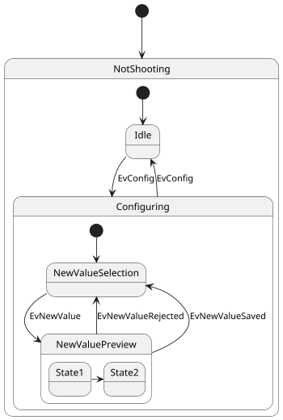

Create a PlantUML diagram for the single-cycle MIPS processor described in VerilogHDL that will be given to you.
Instructions:
- YOU MUST include the following assembly instructions and how they are executed in the diagram: [
LW (Load Word) SW (Store Word) J (Jump) ADD (Add) ADDI (Add Immediate) BEQ (Branch on Equal)
ADDU (Add Unsigned) SUBU (Subtract Unsigned) AND (Bitwise AND) ANDI (Bitwise AND Immediate)
OR (Bitwise OR) ORI (Bitwise OR Immediate) SUB (Subtract) NOR (Bitwise NOR) BNE (Branch on Not Equal)
]
- The diagram should include the following components:
  - Program Counter
  - Instruction Memory
  - Register File
  - ALU Control
  - ALU
  - Control Unit
  - Data Memory
  - Next Program Counter
  - Instruction Memory
– YOU MUST return the full code (I don't have fingers)
- YOU MUST use the following PlantUML diagram syntax
- DO NOT LEAVE any context regarding the actual execution of each instruction
- DO NOT include the VerilogHDL code in the PlantUML diagram
– Use the following PlantUML as an example to generate the diagram
Example:

Note: The provided example is simpler than the diagram you are expected to create. Your diagram should include all the specified components and assembly instructions, and the connections between them should accurately represent the MIPS processor architecture described in the VerilogHDL code.

The verilog code to make the PlantUML state diagram for is:

```verilog
module mips ( input i_Clk, input i_Rst, output [6:0] o_Seg_first, output [6:0] o_Seg_second, output [6:0] o_Seg_third, output [6:0] o_Seg_fourth, output [6:0] o_Seg_fifth); wire [31:0] s_input_program_counter, s_out_program_counter; wire [ 5:0] im_ctr; wire [ 5:0] im_funcode; wire [31:0] im_instruction; wire [31:0] r_wbdata, r_read1, r_read2; wire s_RegDst, s_Jump, s_Branch, s_Bne; wire s_MemRead, s_MemtoReg, s_MemWrite; wire s_ALUSrc, s_RegWrite; wire [1:0] c_ALUOp; wire [3:0] c_ALUcontrol; wire c_zero; wire [31:0] alu_result; ProgramCounter inst_ProgramCounter ( .i_Clk (i_Clk), .i_Next(s_input_program_counter), .o_Out (s_out_program_counter)); InstructionMemory inst_InstructionMemory ( .i_Addr       (s_out_program_counter), .i_Ctr        (im_ctr), .i_Funcode    (im_funcode), .i_Instruction(im_instruction)); RegisterFile inst_RegisterFile ( .i_Clk        (i_Clk), .i_Instruction(im_instruction), .i_RegWrite   (s_RegWrite), .i_RegDst     (s_RegDst), .i_WriteData  (r_wbdata), .o_ReadData1  (r_read1), .o_ReadData2  (r_read2)); ALU inst_ALU ( .i_data1      (r_read1), .i_read2      (r_read2), .i_Instruction(im_instruction), .i_ALUSrc     (s_ALUSrc), .i_ALUcontrol (c_ALUcontrol), .o_Zero       (c_zero), .o_ALUresult  (alu_result)); ALUControl inst_ALUControl ( .i_ALUOp      (c_ALUOp), .i_Instruction(im_funcode), .o_ALUcontrol (c_ALUcontrol)); ControlUnit inst_ControlUnit ( .i_instruction(im_instruction), .o_RegDst     (s_RegDst), .o_Jump       (s_Jump), .o_Branch     (s_Branch), .o_Bne        (s_Bne), .o_MemRead    (s_MemRead), .o_MemtoReg   (s_MemtoReg), .o_ALUOp      (c_ALUOp), .o_MemWrite   (s_MemWrite), .o_ALUSrc     (s_ALUSrc), .o_RegWrite   (s_RegWrite), .o_seg_first  (o_Seg_first), .o_seg_second (o_Seg_second), .o_seg_third  (o_Seg_third), .o_seg_fourth (o_Seg_fourth), .o_seg_fifth  (o_Seg_fifth)); DataMemory inst_DataMemory ( .i_clk      (i_Clk), .i_addr     (alu_result), .i_wData    (r_read2), .i_ALUresult(alu_result), .i_MemWrite (s_MemWrite), .i_MemRead  (s_MemRead), .i_MemtoReg (s_MemtoReg), .o_rData    (r_wbdata)); NextProgramCounter inst_NextProgramCounter ( .i_Old        (s_out_program_counter), .i_Instruction(im_instruction), .i_Jump       (s_Jump), .i_Branch     (s_Branch), .i_Bne        (s_Bne), .i_Zero       (c_zero), .o_Next       (s_input_program_counter)); endmodule
module NextProgramCounter ( input [31:0] i_Old, input [31:0] i_Instruction, input i_Jump, input i_Branch, input i_Bne, input i_Zero, output reg [31:0] o_Next); reg [31:0] sign_ext; reg [31:0] old_alter; reg [31:0] jump; reg [31:0] jump_update; reg zero_alter; initial begin o_Next = 32'b0; end always @(i_Old) begin old_alter = i_Old + 4; end always @(i_Zero, i_Bne) begin zero_alter = i_Zero; if (i_Bne == 1) begin zero_alter = !zero_alter; end end always @(i_Instruction) begin jump_update = {4'b0, i_Instruction[25:0], 2'b0}; if (i_Instruction[15] == 1'b0) begin sign_ext = {16'b0, i_Instruction[15:0]}; end else begin sign_ext = {{16{1'b1}}, i_Instruction[15:0]}; end sign_ext = {sign_ext[29:0], 2'b0}; end always @(posedge i_Jump or posedge old_alter) begin if (i_Jump) begin jump = {old_alter[31:28], jump_update[27:0]}; end else begin jump = jump_update; end end always @(old_alter, sign_ext, jump, i_Branch, zero_alter, i_Jump) begin if (i_Branch == 1 && zero_alter == 1) begin o_Next = old_alter + sign_ext; end else if (i_Jump == 1) begin o_Next = jump; end else begin o_Next = old_alter; end end endmodule
module ProgramCounter ( input i_Clk, input [31:0] i_Next, output reg [31:0] o_Out); initial begin o_Out = -4; end always @(posedge i_Clk) begin o_Out = i_Next; end endmodule
module RegisterFile ( input i_Clk, input [31:0] i_Instruction, input i_RegWrite, input i_RegDst, input [31:0] i_WriteData, output [31:0] o_ReadData1, output [31:0] o_ReadData2); reg [31:0] RegData[31:0]; integer i; initial begin for (i = 0; i < 32; i = i + 1) begin RegData[i] = 32'b0; end end assign o_ReadData1 = RegData[i_Instruction[25:21]]; assign o_ReadData2 = RegData[i_Instruction[20:16]]; always @(posedge i_Clk) begin if (i_RegWrite == 1'b1) begin if (i_RegDst == 1'b0) begin RegData[i_Instruction[20:16]] = i_WriteData; end else begin RegData[i_Instruction[15:11]] = i_WriteData; end end end endmodule
module ALUControl ( input [1:0] i_ALUOp, input [5:0] i_Instruction, output reg [3:0] o_ALUcontrol); always @(i_ALUOp, i_Instruction) begin case (i_ALUOp) 2'b00:   o_ALUcontrol = 4'b0010; 2'b01:   o_ALUcontrol = 4'b0110; 2'b10: begin case (i_Instruction) 6'b100000: begin o_ALUcontrol = 4'b0010; end 6'b100010: begin o_ALUcontrol = 4'b0110; end 6'b100100: begin o_ALUcontrol = 4'b0000; end 6'b100101: begin o_ALUcontrol = 4'b0001; end 6'b101010: begin o_ALUcontrol = 4'b0111; end default: begin end endcase end 2'b11:   o_ALUcontrol = 4'b0000; default: ; endcase end endmodule `timescale 1ns / 1ps
module ALU ( input      [31:0] i_data1, input      [31:0] i_read2, input      [31:0] i_Instruction, input             i_ALUSrc, input      [ 3:0] i_ALUcontrol, output reg        o_Zero, output reg [31:0] o_ALUresult); reg [31:0] data2; always @(i_ALUSrc, i_read2, i_Instruction) begin if (i_ALUSrc == 0) begin data2 = i_read2; end else begin if (i_Instruction[15] == 1'b0) begin data2 = {16'b0, i_Instruction[15:0]}; end else begin data2 = {{16{1'b1}}, i_Instruction[15:0]}; end end end always @(i_data1, data2, i_ALUcontrol) begin case (i_ALUcontrol) 4'b0000: o_ALUresult = i_data1 & data2; 4'b0001: o_ALUresult = i_data1 | data2; 4'b0010: o_ALUresult = i_data1 + data2; 4'b0110: o_ALUresult = i_data1 - data2; 4'b0111: o_ALUresult = (i_data1 < data2) ? 1 : 0; 4'b1100: o_ALUresult = i_data1 | ~data2; default: ; endcase if (o_ALUresult == 0) begin o_Zero = 1; end else begin o_Zero = 0; end end endmodule
module ControlUnit ( input [31:0] i_instruction, output reg o_RegDst, output reg o_Jump, output reg o_Branch, output reg o_Bne, output reg o_MemRead, output reg o_MemtoReg, output reg [1:0] o_ALUOp, output reg o_MemWrite, output reg o_ALUSrc, output reg o_RegWrite, output reg [6:0] o_seg_first, output reg [6:0] o_seg_second, output reg [6:0] o_seg_third, output reg [6:0] o_seg_fourth, output reg [6:0] o_seg_fifth); initial begin o_RegDst = 0; o_Jump = 0; o_Branch = 0; o_MemRead = 0; o_MemtoReg = 0; o_ALUOp = 2'b00; o_MemWrite = 0; o_ALUSrc = 0; o_RegWrite = 0; o_seg_first = 7'b1111111; o_seg_second = 7'b1111111; o_seg_third = 7'b1111111; o_seg_fourth = 7'b1111111; o_seg_fifth = 7'b1111111; end always @(i_instruction) begin case (i_instruction[31:26]) 6'b000000: begin o_RegDst = 1; o_ALUSrc = 0; o_MemtoReg = 0; o_RegWrite = 1; o_MemRead = 0; o_MemWrite = 0; o_Branch = 0; o_Bne = 0; o_ALUOp = 2'b10; o_Jump = 0; o_seg_first = 7'b0001000; o_seg_second = 7'b1111010; o_seg_third = 7'b1111001; o_seg_fourth = 7'b0001111; o_seg_fifth = 7'b0001001; end 6'b001000: begin o_RegDst = 0; o_ALUSrc = 1; o_MemtoReg = 0; o_RegWrite = 1; o_MemRead = 0; o_MemWrite = 0; o_Branch = 0; o_Bne = 0; o_ALUOp = 2'b00; o_Jump = 0; o_seg_first = 7'b0001000; o_seg_second = 7'b1000010; o_seg_third = 7'b1000010; o_seg_fourth = 7'b1001111; o_seg_fifth = 7'b1111111; end 6'b001100: begin o_RegDst = 0; o_ALUSrc = 1; o_MemtoReg = 0; o_RegWrite = 1; o_MemRead = 0; o_MemWrite = 0; o_Branch = 0; o_Bne = 0; o_ALUOp = 2'b11; o_Jump = 0; o_seg_first = 7'b0001000; o_seg_second = 7'b0101011; o_seg_third = 7'b1000010; o_seg_fourth = 7'b1001111; o_seg_fifth = 7'b1111111; end 6'b100011: begin o_RegDst = 0; o_ALUSrc = 1; o_MemtoReg = 1; o_RegWrite = 1; o_MemRead = 1; o_MemWrite = 0; o_Branch = 0; o_Bne = 0; o_ALUOp = 2'b00; o_Jump = 0; o_seg_first = 7'b1000111; o_seg_second = 7'b1001001; o_seg_third = 7'b1111111; o_seg_fourth = 7'b1111111; o_seg_fifth = 7'b1111111; end 6'b101011: begin o_RegDst = 0; o_ALUSrc = 1; o_MemtoReg = 0; o_RegWrite = 0; o_MemRead = 0; o_MemWrite = 1; o_Branch = 0; o_Bne = 0; o_ALUOp = 2'b00; o_Jump = 0; o_seg_first = 7'b0010010; o_seg_second = 7'b1001001; o_seg_third = 7'b1111111; o_seg_fourth = 7'b1111111; o_seg_fifth = 7'b1111111; end 6'b000100: begin o_RegDst = 0; o_ALUSrc = 0; o_MemtoReg = 0; o_RegWrite = 0; o_MemRead = 0; o_MemWrite = 0; o_Branch = 1; o_Bne = 0; o_ALUOp = 2'b01; o_Jump = 0; o_seg_first = 7'b1100000; o_seg_second = 7'b0110000; o_seg_third = 7'b0001100; o_seg_fourth = 7'b1111111; o_seg_fifth = 7'b1111111; end 6'b000101: begin o_RegDst = 0; o_ALUSrc = 0; o_MemtoReg = 0; o_RegWrite = 0; o_MemRead = 0; o_MemWrite = 0; o_Branch = 1; o_Bne = 1; o_ALUOp = 2'b01; o_Jump = 0; o_seg_first = 7'b1100000; o_seg_second = 7'b0101011; o_seg_third = 7'b0110000; o_seg_fourth = 7'b1111111; o_seg_fifth = 7'b1111111; end 6'b000010: begin o_RegDst = 0; o_ALUSrc = 0; o_MemtoReg = 0; o_RegWrite = 0; o_MemRead = 0; o_MemWrite = 0; o_Branch = 0; o_Bne = 0; o_ALUOp = 2'b01; o_Jump = 1; o_seg_first = 7'b1100001; o_seg_second = 7'b1111111; o_seg_third = 7'b1111111; o_seg_fourth = 7'b1111111; o_seg_fifth = 7'b1111111; end default: begin o_RegDst = 0; o_ALUSrc = 0; o_MemtoReg = 0; o_RegWrite = 0; o_MemRead = 0; o_MemWrite = 0; o_Branch = 0; o_Bne = 0; o_ALUOp = 2'b00; o_Jump = 0; o_seg_first = 7'b1111111; o_seg_second = 7'b1111111; o_seg_third = 7'b1111111; o_seg_fourth = 7'b1111111; o_seg_fifth = 7'b1111111; end endcase end endmodule
module DataMemory ( input i_clk, input [31:0] i_addr, input [31:0] i_wData, input [31:0] i_ALUresult, input i_MemWrite, input i_MemRead, input i_MemtoReg, output reg [31:0] o_rData); parameter SIZE_DM = 128; reg [31:0] Dmem[SIZE_DM-1:0]; integer i; initial begin for (i = 0; i < SIZE_DM; i = i + 1) begin Dmem[i] = 32'b0; end end always @(i_addr or i_MemRead or i_MemtoReg or i_ALUresult) begin if (i_MemRead == 1) begin if (i_MemtoReg == 1) begin o_rData = Dmem[i_addr]; end else begin o_rData = i_ALUresult; end end else begin o_rData = i_ALUresult; end end always @(posedge i_clk) begin if (i_MemWrite == 1) begin Dmem[i_addr] = i_wData; end end endmodule `timescale 1ns / 1ps module InstructionMemory ( input [31:0] i_Addr, output reg [5:0] i_Ctr, output reg [5:0] i_Funcode, output reg [31:0] i_Instruction); parameter SIZE_IM = 128; reg [31:0] Imem[SIZE_IM-1:0]; integer n; initial begin for (n = 0; n < SIZE_IM; n = n + 1) begin Imem[n] = 32'b11111100000000000000000000000000; end $readmemb("instructions.mem", Imem); i_Instruction = 32'b11111100000000000000000000000000; end always @(i_Addr) begin if (i_Addr == -4) begin i_Instruction = 32'b11111100000000000000000000000000; end else begin i_Instruction = Imem[i_Addr>>2]; end i_Ctr = i_Instruction[31:26]; i_Funcode = i_Instruction[5:0]; end endmodule
```
